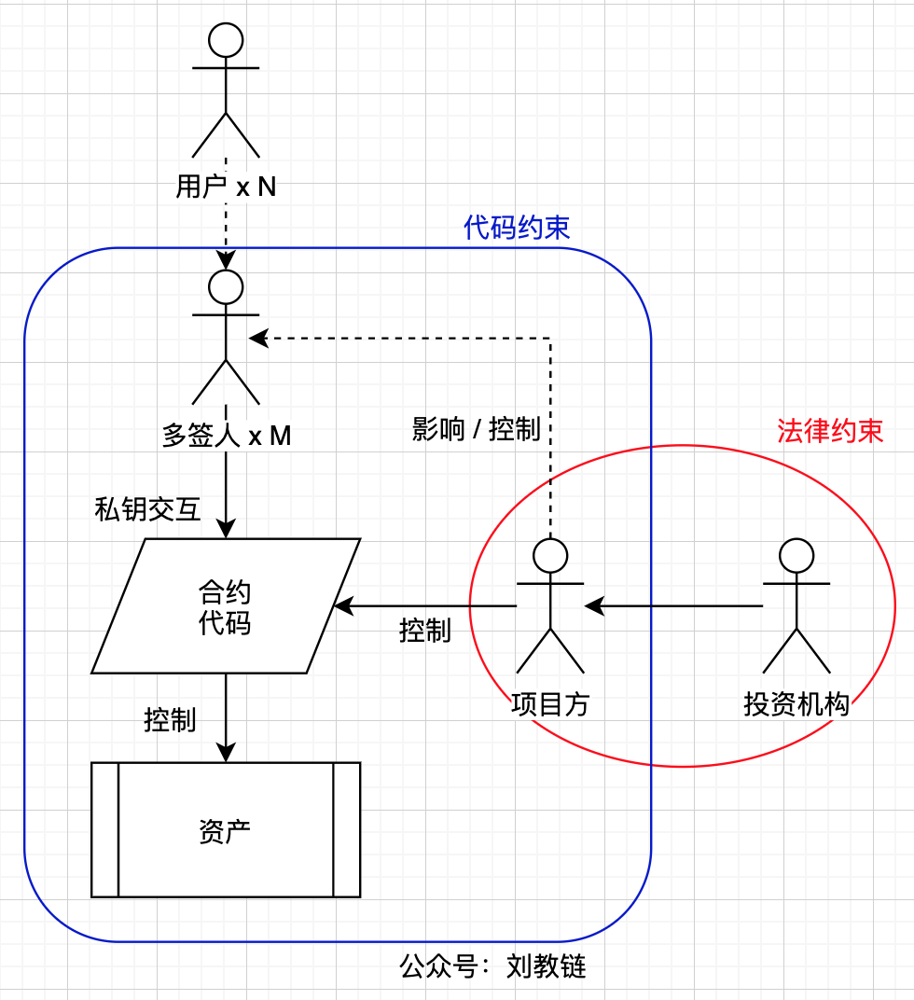

# 区块链的控制反转

控制反转这个词儿来自于计算机软件的一种设计模式，英文称为Inversion of Control，缩写是IoC。教链借用这个术语，来指称在区块链系统中，消除传统的“人控制机器”的控制模式，反转为“机器控制人”的控制反转模式。

掌握了这个思维方法，你就能一眼看出来，一个摆到你面前的web3项目，有没有跑路和暴雷的风险。如果有，会在什么地方暴雷。

比如在教链11.25文章《区块链安全的“微笑曲线”》中所介绍的，为很多所谓web3项目所采用的这种控制模式：

比如我们熟知的稳定币，就是这样的一种控制模式。在这种模式下，显然，全权控制合约的项目方是拥有最高权力的人。

由于链上世界，在不求助于现实世界的情况下，仅靠代码约束，并不足以阻止项目方做恶。

项目方对合约代码的控制权，具体地，还可以进一步分为部署的权力和交互的权力。如果采用不可升级的部署方式，那么项目方无法通过再次部署合约来获得任意权力。

现实情况有时候可能比这个图更糟一些，那就是用户甚至都不能直接和合约交互。有一组多签人，代表用户和合约交互，进而操作合约中管理的资产。如下图：

而这些多签人，很有可能是受项目方影响，甚至是直接控制的一群人或者虚拟身份。

这种情况下，用户一旦把自己的数字资产锁入到项目方提供的合约里，那就是羊入虎口，肉包子打狗。能不能拿回来，全靠项目方的良心了。

在图中，教链使用实线表示实际控制，用虚线表示间接影响。

一旦发生上面的情况，那么用户绝不可以傻傻地考验人性。密码学已经不足以保障用户资产的安全和用户的切身利益，那么这时候就只能求助于外部的信任。这就要求引入现实世界的法律约束，即监管的力量。

在不得不需要依赖信任（trust）的时候，很显然：

* 实名的项目方会比匿名的项目方更为可信
* 有知名投资机构站台的项目方会比普通项目方更为可信
* 受到监管机构监督的项目方会比无监管的项目方更为可信
* 身在国内的项目方比游离在本国法律管辖权范围之外的项目方更为可信

在传统金融或其他行业，建立信任的链条是非常困难和高成本的。不过在web3的世界里，很多时候以上条件都不满足，仍然有大把韭菜和资金飞蛾扑火，这也算是这个行业的早期红利之一吧。

上述情况，都是中心化控制的模式。本质上，是违背区块链去中心化思想的，是传统web2世界控制模式在web3技术上的照猫画虎。

很多的DAO（去中心化自治组织），其核心金库的管理，也大多是这样的控制模式。在这种情况下，确保多签人充分分散，不能合谋，不能被单一主体协调控制，是十分重要的。

如果在所有的控制点上，都充分分散化，那么就倒转了人和机器（代码）的关系，最终实现数字世界的代码约束和控制现实世界中的人的行为 。

实现了这样的控制反转，就能把现实世界中的主体，自然人或者法人，作为区块链自治系统在现实世界中的代理人（Agent），来帮助系统完成对现实世界资源的控制和调配。

还是以比特币为例。我们可以很明显地在BTC系统中找到控制反转的模式，即系统透过矿工实现了对现实世界中电力资源的控制和使用。矿工，就是BTC系统在现实世界中的代理人。教链画了一个图示：

此图展示了BTC系统中的主要控制点和控制关系。其中，蓝色框架内遵从“代码即法律”，实现了精巧的制衡和去中心化，完全靠代码来约束各方的行为，从而消除了对现实世界法律的需求。

在蓝色框架内，用户、开发者、矿工三个群体相互无法直接控制彼此。用户持有私钥控制自己的BTC，但是用户无法控制开发者的开发，也无法控制矿工实施非法获利。开发者拥有代码编辑权限和能力，直接控制代码，但是他们无权强制矿工采用。矿工控制矿机，也就是能量的输入，但是矿工的记账是竞争式的，且账本数据是受到强大能量保护其不可变，谁都无法任意控制BTC。

在这个系统中，矿工是唯一一个需要和外部世界打交道的角色。他们和现实世界的能量打交道，具体的，就是电力，以及提供电力的供应方，即红色框架内的部分。这些现实世界的部分，就受制于现实世界的法律约束。比如矿工和供电方的商业合同，和基建部门的备案审批，等等，都是由现实世界的即有秩序和规则保障的。

但是，现实世界虽然为BTC系统提供了巨大的能量，供其产生受能量保护的数据，但是，现实世界的能量提供方却不能直接控制数据、账本以及BTC。反过来，是BTC系统的规则，在指挥和控制、影响着矿工和现实世界的能量使用。

去中心化运行的代码和机器控制人和资源，而不存在更高一级的人结成利益集团单方面控制整个系统，消除了上一层级的少数人指挥机器对下一层级的多数人实施剥削，这才是区块链的控制反转。

