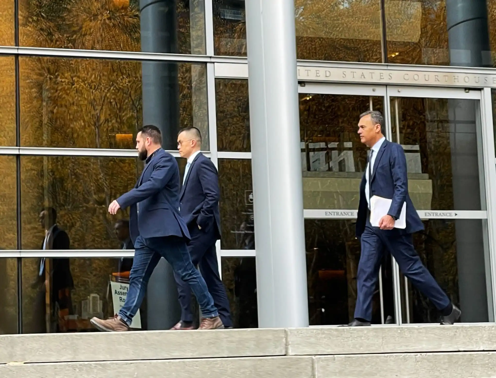
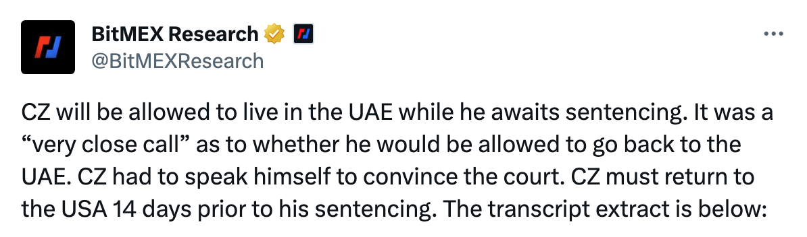
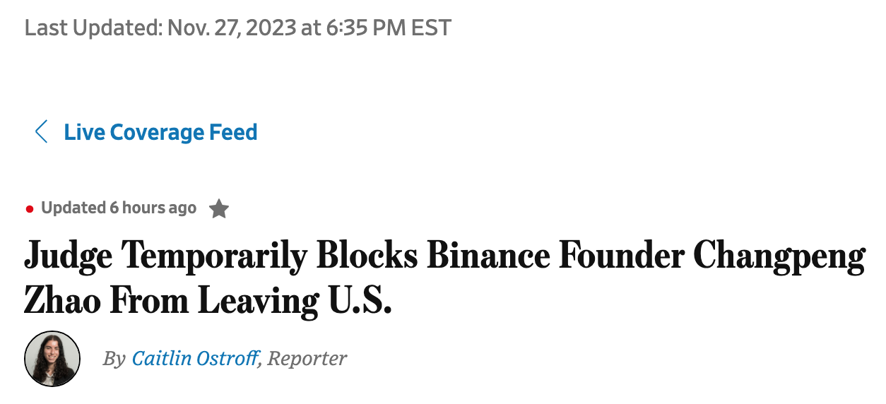

# 长鹏插翅难飞

11月22日，美司法部（DOJ）公开宣布了与FinCEN、OFAC对Binance（币安）的联合执法行动。（参阅刘教链11.22文章《美国鲸吞币安，长鹏认罪伏法》）

同日，Binance创始人cz（赵长鹏）现身西雅图法院。据说他是自己主动去的，法官还表达了对他自愿赴美出庭的感谢。

行业研究机构BitMEX Research发推称，「在等待判决期间，CZ 将被允许居住在阿联酋。在是否允许他返回阿联酋的问题上，可谓 "千钧一发"。CZ 不得不亲自发言来说服法庭。CZ 必须在判决前 14 天返回美国。」

下面两段分别是BitMEX Research援引的法庭发言：

CZ：「法官大人，我只想说一件事。我想了结此事 所以，我想承担责任并在我的生活里结束这一章。所以，嗯，对我来说，这是一个非常简单的，这是一个非常简单的心态。嗯，我以前没惹过麻烦。我从来没有犯罪。我从没进过法院，所以这一切对我来说都是必需的。老实说，来之前我有点害怕。在大多数国家，你去到一个国家，你知道，你不知道会发生什么。因此，我对这次庭审印象深刻，法官大人向我解释了每一个小细节，所有这些都让我很安心。嗯，所以在我来这里之前，那，那不是故意的。所以，嗯，还有关于阿联酋的问题，嗯，有人给了我一个公民身份。我很荣幸地接受了这个身份，但我不想利用这个身份说，嘿，呃，保护你。我不想利用这一点。我不想那样使用文件。嗯，所以我想自己解决问题。所以我有充分的意愿回到这里并结束这个问题，否则我今天就不会在这里。嗯，所以我开始，嗯，问题就在那里。」

法庭：「嗯，这里的主要问题是，你应该住在哪里。我认为每个出庭的人都有潜逃的风险。我所释放过的人中，没有一个不存在潜逃的风险，包括那些比你要面对更多年刑期的人。嗯，但我认为，你的行动也许比你的担忧更能说明问题，你没有义务来到这个国家，但你来了。正如你所说，你的意图是想解决这个案子，而不是逃跑。因此，我认为我们会允许你住在阿联酋，你会住在你自己的住所，并让你的律师知道，在你让你的律师知道之前不要改变。我认为这是一个实际问题，预审办公室可以纠正我。」

按照cz和法庭达成的共识，在认罪、缴纳 1.75 亿美元保释金并以1500万美元现金担保一定会按时出庭参加明年即2024年2月23号的量刑审判之后，cz获释，应当可以被允许自由离开美国，返回阿联酋，并提前14天回到美国参加明年2月的量刑听证并根据量刑结果服刑。

但cz还是把美国想得太好了。

他始料未及的是，权力翻起脸来，那可比翻书还快。

仅仅在6天之后，也就是今天11月28号的早上，WSJ传出消息，法官暂停了22号的上述裁决，阻止了cz离开美国，返回阿联酋。

美司法部检察官认为，cz有不能回到美国的重大风险，他有巨额财产，能够轻松承受超2000万美刀的损失并赔偿他的担保人，而且阿联酋和美国没有引渡条约，这样cz就可以在阿联酋舒适地度过余生。

就这样，在美司法部的敦促下，西雅图地方法院法官 Richard Jones 暂停了前述裁决，该裁决允许cz在保释期间离开美国，并在在明年2月23日之前14天返回美国。暂停命令将一直有效，直到法官就美国检方提出的禁止cz离开美国的动议作出正式决定。

美国，终究不是你cz想来就来，想走就走的。

纵使孙猴子有一日千里筋斗云，也还是逃不出如来佛的五指山。

同日，WSJ亦报道，美证交会（SEC）仍在寻找 Binance 及 CZ 可能通过系统后门操纵平台用户资产的证据。

大鱼既然主动把自己送上门来，那美执法机构们也就毫不客气，关门，扣人，吃干抹净。阿尔斯通高管皮耶鲁齐的《美国陷阱》一书讲述的已经足够明白的了。

没有强大祖国派专机去接，仅靠自己以为已经够硬了的翅膀，却也还是插翅难飞。
