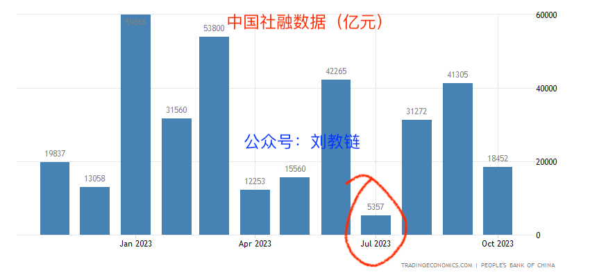
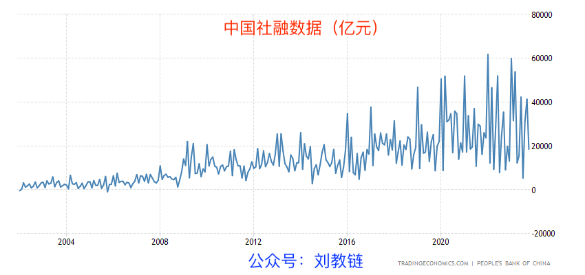
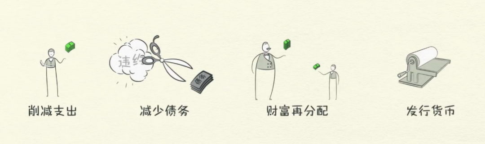

# 资产负债表衰退，还是优雅和谐地去杠杆？

这一年来，不断有业内人士和专家、大V讨论起我国是否正在陷入所谓“资产负债表衰退”的问题。

尤其是7月份社融数据公布的时候，还着实引起了不小的震动。（参考阅读刘教链8.13文章《增速骤降2703亿》）

不过，拉长时间看，这点儿波动并不出奇。

资产负债表衰退（balace sheet recession）这个词儿，最早由生于日本的台湾裔美国籍经济学家辜明朝提出。它用来指一种特别的经济衰退形式，即由于私人部门的高负债导致个人或企业普遍地偿还债务以增加储蓄，而不是消费或投资，进而导致经济增长放缓或下降，发生经济衰退。

提出这种衰退方式，是为了和商品周期低迷导致的经济衰退相区别。资产负债表衰退是债务周期驱动的，纯粹是借钱过度了，进入到了被迫去杠杆的阶段，靠一根根脆弱的竹竿（杠杆）支撑起来的经济就随着撅折的竹竿轰然坠落。

据信，日本自1990年起长达几十年的衰退，以及美国在2007-2009年的金融危机，都属于这种衰退方式。

通俗地说就是，满社会的人们都觉得自己早些年借钱欠债太多，每月还债付息压力太大，于是不约而同地、主动或被迫地选择了节衣缩食、量入为出的生活方式或经营方式，结余则都拿去偿还旧债，以求降低还债压力。但是，人们突然从借钱花变成省钱还债，居然导致了经济的衰退，这就是所谓的资产负债表衰退。

这个问题对依然保持中华传统美德的国人而言，听起来有那么一点儿不可思议。节衣缩食、量入为出，勤俭节约、注重储蓄，这不正是咱文化中的优良品质么？

为啥到了经济学家嘴里，全社会人人都秉持优良品质，结果却被认定为是造成经济衰退的罪魁祸首了呢？

那么你说，到底还要不要传统美德和优良品质了？

关于这个原因，桥水基金的创始人达里奥在他的科普视频《经济机器是如何运行的》里面介绍过。没看过的读者可以看看刘教链8.23文章《中国去杠杆》。

原因就是，一个人的支出是其他人的收入。大家都舍得不花钱了，就导致所有人都感到赚钱变得困难了。

另一个重要的原因是，现代法币基本都是债务货币的形式。也就是说，你拿资产去银行抵押，银行就可以基于该资产的估值来创造货币。比如，你抵押了房子，银行印出了钱，开发商拿到了钱。（参考阅读刘教链8.27文章《许家印钞机》）

你获得了债务，开发商获得了钱，银行获得了生意。

你的债务就是银行的金融资产。银行可以把这些金融资产打包卖给理财和信托公司。它们再把这些金融资产分拣，重新切分组合，包装成华丽的高收益理财产品，卖给兜里有仨瓜俩枣寻求保值增值的中产或富人。（参考阅读刘教链8.4文章《2300亿的大雷，爆了》）

一环套一环，整个链条上，各个环节都是等着赚钱的，只有背负债务、定期还本付息的你是为他们提供收益和利润的。

你偿还的本金，会和它所对应的等额债务抵消，然后二者一起消失在资产负债表上。你偿还的利息，转化为上述链条各个环节的收益。

债务货币的特点就是凭空创造，凭空消失。它的整个生命历程，从创造到消失，就是为了把利息 —— 你的劳动汗水所凝结的产物 —— 带走，带给无数因此而受益的人。

你说老子不玩了，要把债务统统还清。那么，你还清了多少债务，就消灭了多少钱。比如，你一把拿出100万，还清了100万的债务。那么，资产负债表上就从本来有100万债务的金融资产，biu～地一声消失掉了。资产消失了。同时，社会上可流动的货币，也永远少了100万。换句话说，这100万也随着债务的消失一起消失地无影无踪了。

而所有等着享受你辛苦劳作供奉30年利息的各个环节上的人，大家都不开心。

社会上可流动的钱少了，自然钱就更紧张、更难挣了。本来开心地享受你利息供奉的一大票有钱人，自然也就因为你节衣缩食、攒钱还债，而少了那么一点收益。

如果更多的人还清债务呢？比如，如果有10万人各还掉100万债务，那么1000亿资产、1000亿的钱就会人间蒸发。

资产和负债减少了，资产负债表的规模自然就“砰”、“砰”地不断缩小。社会上钱越来越少，大家都感到钱越来越难赚。资产缩水甚至暴雷，人们感到自己更穷了，于是更加不敢花钱。于是经济就陷入了低迷乃至于衰退。

但是，因此而指责老百姓削减支出、防御性储蓄，不花钱更不敢继续借钱，那是少数经济学研究者丧了良知。

去杠杆周期，是回归传统美德的时代。

在飞机下降的时候，重要的不是大喊“飞机正在下降”，说的好像别人都不知道飞机正在下降似的。重要的是，要找到办法让飞机重新拉升。而拉升飞机的，肯定不是乘客，而是机长。

达里奥给出了四个办法：

和高唱资产负债表衰退的那些人比起来，在达里奥的办法里，削减支出恰恰是排在第一位的操作。

人们既然已经对高杠杆、高债务不堪重负，却还要拿着资产负债表衰退作为道德大棒来指责人们不积极消费、不积极借贷，这有何意义，又有何居心？

这第二招就是削减债务。看到了吧，换掉债务就是在削减债务。这在达里奥看来也是天经地义而且是正确的办法。

当然，债务货币在数学上就不可能还清全部债务。因为每1元债务，对应1元钱。而要还清这1元债务，却需要还会这1元钱还要额外加个利息。设社会总体债务为A，那么钱的总量也为A，如果要把债务全部还清，却总共需要偿还A + B的钱，其中B是利息。可见，从数学上就注定了，债务货币在货币完全消灭之前，都不足以还清全部债务。也就是说，应偿货币总量恒大于既有货币总量。

因为还不清，所以就必然在边际上，有人要借新还旧。杠杆越加越大，到了一个程度再也加不上去，债务周期就见顶了。

而削减债务这个办法，指的并不是还清债务，而是合理合法地勾销掉债务。

非法地勾销债务，那叫赖账不还。合理合法地勾销，办法就多了。比如展期，原来30年的债务，现在延长到100年还，等等。

第三个办法叫做财富再分配。重要的是，方向，合理合法地把钱从多的地方、从有钱人手里向少的地方、向穷人手里再分配。

通货膨胀加直升机撒钱也许是个有趣的路子。因为你不能直接把钱从别人兜里掏走，那么就多印一些，然后按人头平均分发给所有人。

比如老王有1个亿，另外有99999个张三是穷光蛋，每人只有1元。老王和张三的贫富差距是1亿倍。多印1个亿，平均分给这10万人，每人分得1000元。

再分配之后，老王有1亿零1000元。而张三们每人有了1001元。老万和张三的贫富差距缩小到了约10万倍。

如果多印100个亿，每人发10万呢？老王1亿零10万，张三10万零1元。贫富差距进一步缩小到约1000倍。

这个办法，接近于近年来多有耳闻的UBI（Universal Basic Income，全民基本收入）。

按照社保账户发放，每人每月发个几千块钱满足基本温饱，有利于提振经济和社会和谐，这就是UBI的理念。

UBI这其实有点儿共产主义“按需分配”的意思了。既然每人每月都需要这么多钱维持基本生活，那就无条件给每个人发放。

当然，现在的主流方案可能还是社会主义“按劳分配”的思路。即，印钱搞一些大工程什么的，让大家去干活，然后凭劳动和本事把这些钱赚走。

不过，靠投资的方式去分配，还是会产生债务，以及投资收益的问题。投下去1万亿，还是要收回来1万亿加上受益。于是还是会有上面说的 A + B 恒大于 A 的问题。除非我们可以忍受这些投资项目不盈利，不赚钱。

最后一个办法也是必须要做的事情就是印钱了。因为通缩意味着钱也就是流动性蒸发了，水干了，那就需要放水、降雨。

印钱不难，难得是发钱，即怎么把新增的货币以某种合理的方式有效地分配出去。

央行能印钱，财政能花钱。所以美国的办法是，美联储负责印钱，财政部负责花钱。

积极的货币政策意味着宽松货币和放水，但是放出来的水容易堵在金融系统里空转。

积极的财政政策意味着立项花钱，开凿河道，把水引到该去的地方。

如果是UBI式的全民发钱，那就是普降甘霖。

达里奥相信，只要控制得当，印的钱、放的水刚好能够把去杠杆所导致的通缩消失的钱的窟窿给填满，那么就可以实现优雅的平衡，也就是和谐的去杠杆，经济得以软着陆，然后待大家的资产负债表修复之后，飞机重新起飞，经济再次复苏，走向下一次繁荣。

