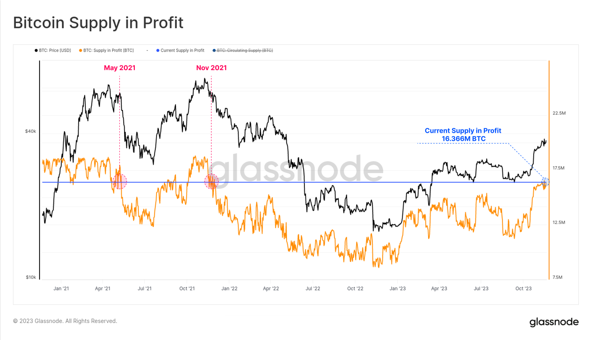
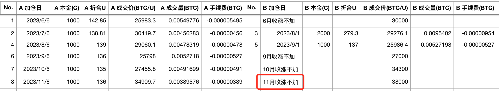
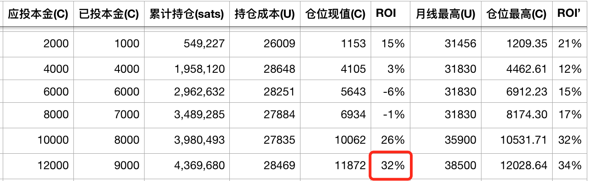
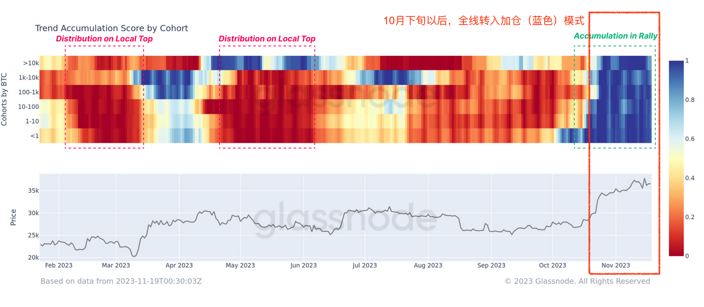

# 【实盘实证】十年之约#12：熊市坚持加仓可以摊低成本 #

一转眼已是2023年最后一个月。BTC从1月1号开盘价16.6k起，开启了今年的征途。到今天12月1号，BTC摸上38k。38k除以16.6k等于2.29倍。

对于没有仓位的人来说，这仿佛还是寒冬刺骨的漫漫熊市。但是对于有仓位且坚持“八字诀”不断满仓的人而言，今年的确走出了一个复苏的气象来。

从Glassnode的数据来看（下图），且按照37.9k计算，当前处于盈利状态的BTC数量已超过1636.6万枚，这相当于整个流通量的83.6%。

换言之，坚守到今天，83.6%的BTC仓位都是盈利的。

这意味着，有仓位者，即有80%以上的概率回到水上，开始自由而畅快地呼吸；无仓位者，仍是两手空空，焦虑之情莫可名状。

回看上图，同样处于这个比例的盈利比例，分别是在2021年的5月份和11月份。彼时BTC约在50k上方。

今天，BTC尚不足40k。这说明什么？说明BTC的持有者在熊市仍在加仓，因而摊低了持仓成本。当市场回升至38k时，就有与50k相仿比例的仓位回归盈利状态。

微策略（Microstrategy, MSTR）就是一个逢跌加仓、摊低成本、扭亏为盈的知名案例。

今天，12月开启，11月结束，又到了「十年之约」实证计划执行的日子。今天这篇，是第12篇实证笔记。

先回顾一下11月的数据：O 27k H 36k L 26.5k C 34.3k。

11月收涨，所以我们继续跳过这一次加仓。

按照38k计算，从6月份启动计划以来，累计加仓8次，目前收益率（ROI）为32%。

回过头看，要感谢8、9月份的回调和低迷，提供了降低成本的机会。

所以，当有一个计划的时候，你就不会纠结于一时之涨跌。

市场也总是会在你刚刚下场的时候给你一个下跌。你需要笑对亏损，知道风雨之后，便见彩虹。（温习刘教链2021.6.22文章《行到水穷处，坐看云起时》）

市场起起落落，如人生浮浮沉沉，都是常态。重要的是有内心的坚持，良好的心态，不以物喜，不以己悲。涨了鼓掌，跌了加仓。（温习刘教链2021.8.8文章《涨了鼓掌，跌了加仓》）

10月下旬市场开启这一波行情以来，从小虾米到巨鲸，全线都在加仓。这一点从下图可以清楚地看到。

是现在37k-38k加仓更香，还是8、9月份25k-30k加仓更香呢？如果后者更香，那么8、9月份跌落的时候，为何不加呢？

市场的问题很复杂，也很简单。只是需要仔细想一想，找出自己内心笃定的答案。

参考阅读：
《八字诀 · 十年之约》计划开启

