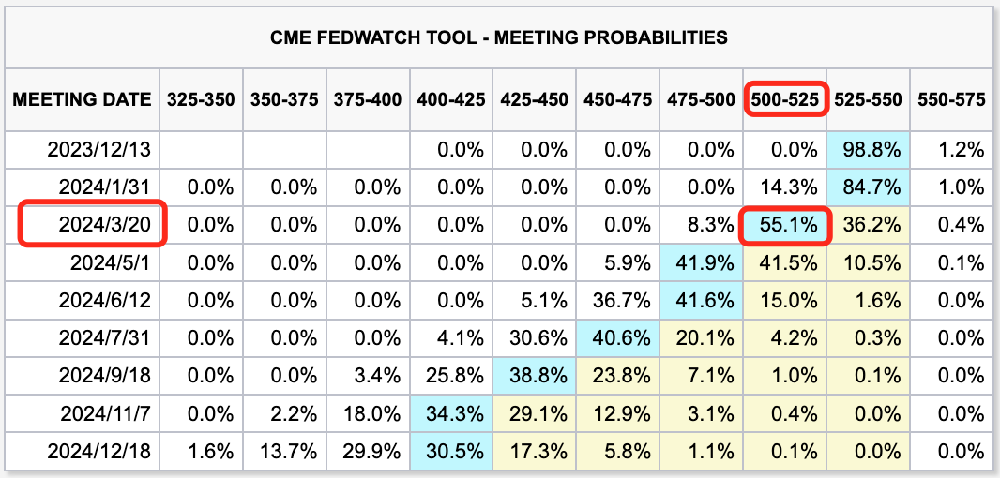
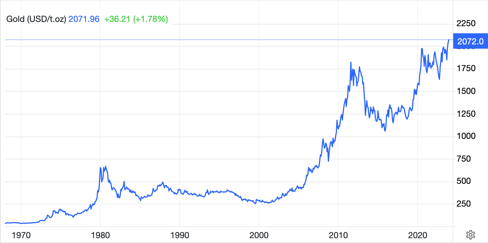

# 市场反对鲍威尔，大饼迫近三万九

号外：教链内参12.1《美联储预期控制失败，黄金再攀历史新高度》

* * *

周五，鲍威尔出席佐治亚州亚特兰大斯贝尔曼学院举行的炉边谈话并发表了开幕致辞。市场摩拳擦掌，期待着鲍威尔透露出来的一丝风向。

绝唱。市场对鲍威尔的公开发言给出了自己的理解，并用实际行动进行了表达。大饼（BTC）一度向上迫近39k的新高度。

那么，在短短数分钟的简短发言里，鲍威尔到底讲了什么呢？下面我们就来听一听他的演讲全文。

* * *

开幕致辞

杰罗姆·鲍威尔主席

在佐治亚州亚特兰大斯贝尔曼学院举行的炉边谈话上的讲话

感谢盖尔（Gayle）校长，感谢您邀请我今天来访。我很幸运能有一位非常杰出的斯贝尔曼学院1986届毕业生和德尔塔-西格玛-希塔（Delta Sigma Theta）成员--我的美联储同事丽莎·库克（Lisa Cook）--陪同我从华盛顿来访。没有什么比库克理事等杰出女性的成就更能证明斯贝尔曼学院的历史遗产了。斯佩尔曼促进 STEM（科学、技术、工程和数学）教育的传统是这一传统的一部分。库克理事的研究突显了 STEM 教育在培养个人成为发明家和创新者方面的关键作用，这些发明家和创新者能够创造出丰富我们的知识体系、提高生产率并提高生活水平的想法[1]。

我期待着我们的对话，我想我可以通过谈论美联储促进经济健康发展的行动，以及这些行动与在座学生可能提出的关于未来的问题之间的关系，来确定对话的框架。例如，我相信学生们都想知道，当你们完成学业后，你们将进入一个怎样的就业市场和经济环境。

国会赋予美联储最大限度就业和稳定物价的双重任务目标。这两个目标都是健康经济的重要方面。国会还赋予美联储不受直接政治控制的宝贵独立性，使我们能够在不考虑政治事务的情况下追求这些目标。民主社会中的其他主要中央银行也拥有类似的独立性，这种制度安排在产生更好的政策结果以造福公众方面有着良好的记录。

首先谈谈我们的最大就业目标，我很高兴地说，从许多方面来看，劳动力市场的状况非常强劲。几年前，随着大流行病的消退和经济的重新开放，职位空缺的数量大大超过了可以工作的人数，造成了普遍的工人短缺。如今，劳动力市场的状况依然非常强劲，经济正在恢复工人供需之间的平衡。经济创造新工作岗位的速度依然强劲，并已放缓至更可持续的水平。这种逐步放缓的部分原因是美联储努力减缓经济增长，以帮助降低通货膨胀。在大流行病期间，工人供应量急剧下降，但随着人们重新加入劳动力大军，以及移民人数恢复到大流行病之前的水平，工人供应量已经反弹。部分由于劳动力的增长，失业率在今年下半年有所上升，但仍保持在 3.9% 的历史低位。25 至 54 岁黄金工作年龄段的女性参与率增长尤为强劲，今年早些时候飙升至历史新高，目前仍远高于大流行前的水平。工资增长率仍然很高，但已逐步向与 2% 的物价通胀率更一致的水平迈进，随着通胀率的下降，实际工资也在重新增长。

在低于 2% 的水平运行了十多年之后，美国和世界上许多其他国家的通胀率在 2021 年急剧上升[2]。高通胀给所有家庭都带来了巨大的困难，对于那些最无力支付食品、住房和交通等必需品的高昂费用的家庭来说，更是雪上加霜。从 2022 年初开始，我们采取了强有力的应对措施，提高了政策利率，缩减了资产负债表规模，以帮助经济放缓，降低通货膨胀。在截至 10 月份的 12 个月中，通货膨胀率已降至 3%，但剔除能源和食品价格（这些价格往往波动较大）后，我们所说的 “核心”通货膨胀率仍为 3.5%，远高于我们 2% 的目标。

在截至 10 月份的 6 个月中，核心通胀率的年增长率为 2.5%，虽然过去几个月通胀率的下降值得欢迎，但如果我们要实现 2% 的目标，就必须继续取得进展。高通胀最初源于非常强劲的需求与大流行病限制的供应之间的碰撞。供求状况的正常化在迄今为止的通货紧缩中发挥了至关重要的作用，过去两年中货币政策和整体金融状况的大幅收紧也是如此。[3] 我们所采取的有力行动已使我们的政策利率进入了限制性区域，这意味着紧缩的货币政策正在对经济活动和通胀施加下行压力。人们认为，货币政策对经济状况的影响是滞后的，我们紧缩政策的全部效果可能尚未显现。我们对通胀的有力回应也有助于维护美联储来之不易的公信力，确保公众对未来通胀的预期保持稳定。在如此迅速的情况下，FOMC 正小心翼翼地向前迈进，因为紧缩不足和过度紧缩的风险正变得更加平衡。[4]

随着大流行病对需求和供应的影响不断减弱，经济前景的不确定性异常高涨。与大多数预测者一样，我和我的同事们预计，随着大流行病和重新开放的影响逐渐减弱，以及限制性货币政策对总需求的拖累，明年的支出和产出增长将放缓。[5] FOMC 坚定地致力于在一段时间内将通胀率降至 2%，并在我们确信通胀率正在向这一目标迈进之前保持限制性政策。现在就满怀信心地断定我们已经采取了足够严格的政策立场，或猜测何时可能放松政策，为时尚早。我们准备在适当的时候进一步收紧政策。

我们将根据收到的全部数据及其对经济活动和通胀前景的影响以及风险平衡，逐次开会做出决定。

这就是我和我在美联储的同事们正在努力实现的目标的概述。如果你是学生，底线是我们在降低高通胀方面取得了相当大的进展，同时保持了强劲的劳动力市场，为新毕业生提供了大量机会。失业率略有上升，但从历史标准来看仍然很低，而且从许多方面来看，现在是开始职业生涯的大好时机。你们很快就会面临挑战性的抉择，决定从事什么职业，为哪些公司和机构工作。你们中的一些人将成为企业家。你们已经做出了一个非常正确的决定，那就是来到斯贝尔曼。无论出现什么机遇和挑战，教育仍将是成功的关键。高等教育是一种投资，而不仅仅是金钱的投资。你们投入时间和精力，获取知识和技能，为成功就业做好准备。你们的成功将使经济更加强劲。就美联储而言，我们将尽最大努力促进经济发展，为你们提供成功的最佳机会。盖尔主席，下面请您讲话。

参考资料：（略）请参阅美联储官网 https://www.federalreserve.gov/newsevents/speech/powell20231201a.htm

* * *

虽然鲍威尔的讲话中依然有诸如「“核心”通货膨胀率仍为 3.5%，远高于我们 2% 的目标」、「猜测何时可能放松政策，为时尚早」、「准备在适当的时候进一步收紧政策」等偏鹰派的表达，但是，市场却不再吃他这一套。

就在鲍威尔讲话之后，市场提高了对明年3月份降息的押注概率。现在这一概率已超过55%！直白的说，就是市场认为明年3月份开启降息有超过一半的可能性。

另外，市场预期明年1月份有很大概率现货比特币ETF会获批上市。

请注意：BTC产量减半事件将在明年4月份确定性地发生。

市场不是傻子。当市场敢于和鲍威尔主席作对时，那必是市场嗅到了，美联储已败的味道。

于是市场狂欢。黄金创下1933年罗斯福6102法令之后90年以来的历史新高。比特币也趁机迫近39k。

扩展阅读：
* 《黄金，黄金》了解1933年罗斯福6102法令
* 《人造繁荣：财富大转移》《隔山打牛：金融大崩溃》《华山论剑：最后的决战》三部曲
* 《美联储的绝唱》回顾7月加息的案发现场
* 《美联储的加息游戏Game Over》再看10月初关于美国内超额储蓄冬季耗尽的观点

