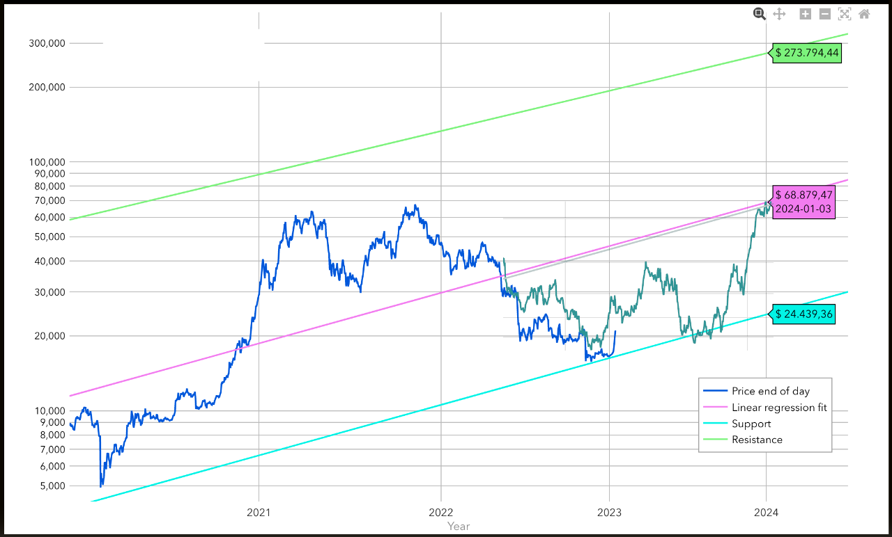

# 四万的黎明静悄悄

号外：教链内参12.2《「BTC流向富人、crypto流向穷人」辨析》

* * *

不知不觉地，BTC已悄然摸上39.8k，距离4w刀仅有半步之遥。

这是黎明前的拂晓。

拂晓朔风悲，蓬惊雁不飞。
几时征戍罢，还向月中归。

这里的黎明静悄悄。

斯人已回，无语凝噎，只因没了仓位。

长长的波谷，只为再给没上车的人一个缘分，也为仓位成本高的人一个降低成本的机会。

「曾经有一份2万刀以下的大饼摆在我的面前，我没有珍惜，等到失去的时候才后悔莫及，人世间最痛苦的事情莫过于此。如果上天能够给我一个重新来过的机会，我会对那个大饼说三个字：“八字诀”。如果非要给持有大饼加上一个期限，我希望是，一万年。」

八字诀曰，坚持定投，逢跌加仓。

以趋势论，这一轮新牛市从2022年底触底之后就已经开始了。

1.6w刀的时候不知不觉。快4w刀时后知后觉。

教链曾说，天黑就出发。

「如果天黑就出发，越走天越亮，谁都会有信心。」

牛市途中，亦非坦途。

常常不乏40%甚至50%的回撤。

可是4w刀了，回撤40%便是32k，纵令回撤50%也不过20k。

去年底，教链展望2023，到年底时，25k乃是底部。

教链在1月份画了一个呼吸理论的图线。

2021-2022水上吸入多少，2022-2023水下就要呼出多少。

上图中绿色图线其实是2021-2022的牛市走势线颠倒过来放到水下而已。

实际上，上半年冲高没有4w那么高，年中回调也没有2w那么低。

实际走势更和缓。

曲线边际不影响积分面积。我们只要看呼吸气量，也就是面积对比。

呼气呼的差不多了，年终就要快速浮向水面。

呼气还有余量，那就年内还不会那么快到达甚至突破水面。

2024年初，预定的产量减半带来的供应冲击，即内因，和预计年初的ETF通过，以及一再提前预计在春天开启的美联储降息，即外因，相互叠加。

通常的认知，以为外因主导内因。

知晓矛盾规律，便知内因决定外因。

世事无常，亦无善恶、无利弊。因人有心，而心有欲，故生常，生善恶，生利弊。

于是老子说，“故常无欲，以观其妙；常有欲，以观其徼”。

于是阳明说，“心外无理，心外无物”。

内因便是常，是决定善恶、利弊的决定量。

无常遇一常或为善，遇另一常则或为恶；遇一常或化为利，遇另一常则或化为弊。

无常还是那个无常，而决定无常是善是恶，是利是弊的，却是那个常。

无常是变量，是英文variable。常是不变量，是英文constant。

无常不可测，而常可把握。

每21万个区块，区块奖励（即产量）便减少一半，就是BTC之一常。

心之生常，非心与欲可改变、影响、扭曲它，而是可以认知它。

知常而作，乃是认识世界并付诸实践的正确方法。

如老子所云，“夫物芸芸，各复归其根”，天下东西这么多，都有他们的根本逻辑，“归根曰静，是谓复命”，寻求到根本逻辑和不变量，这叫做回归本质，“复命曰常”，回顾本质就叫做常，“知常曰明”，认知到常就叫做明智，“不知常，妄作，凶”，对常没有认知，就胡乱操作一气，一定是凶险的。

