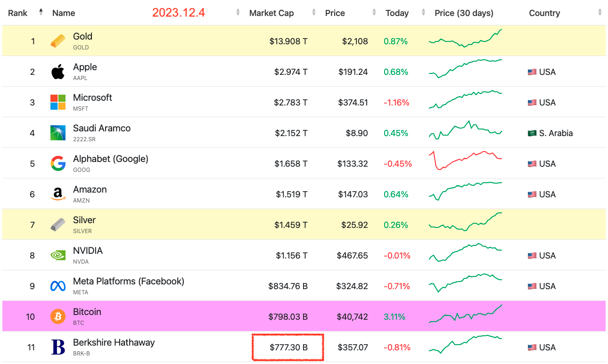
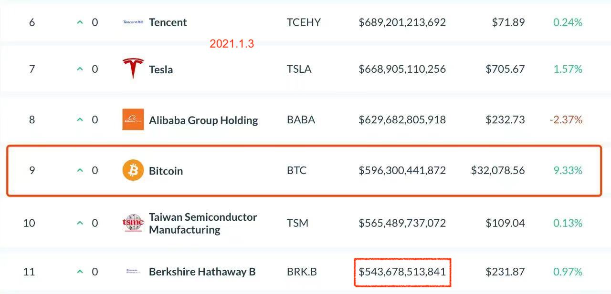

# 比特币鲜衣怒马

隔夜，比特币再上4万刀。市值7980亿，再度超越巴菲特的伯克希尔·哈撒韦的市值7773亿，位列全球十大资产。

忆往昔，峥嵘岁月。比特币首次超越巴菲特还是在2021年12周岁生日时。据刘教链2021.1.3文章《站上3万刀，超越巴菲特：12岁生日快乐，比特币！》记载，彼时彼刻，初上3万刀的比特币，市值5963亿，超越市值5436亿的伯克希尔，跻身全球十大资产。

时隔三秋，再相逢，物是人非。比特币还是那个比特币，伯克希尔却已不再是那个伯克希尔。

就在一周前，巴菲特的亲密搭档，伯克希尔的灵魂人物，查理·芒格，那个生前最讨厌比特币的人，撒手人寰。（参考阅读刘教链2023.11.29文章《查理·芒格：从40岁到99岁，从6万到26亿》）

所有人都会死去。无论他是讨厌比特币的，还是喜爱比特币的，无一例外，都终将死去。相对于人有限的生命，比特币接近于永生。

吾生也有涯，而知也无涯。

朝菌不知晦溯，蟪蛄不知春秋。与比特币漫长的生命相比，人的一生，就像朝菌、蟪蛄一般短暂，如刹那烟火。

芒格讨厌比特币，比特币却不讨厌芒格。待到芒格已经不能再继续讨厌比特币了，比特币依然不讨厌芒格。这就是比特币最强大的地方。

海纳百川，有容乃大。壁立千仞，无欲则刚。

三秋之短，如隔一日。一日之间，伯克希尔市值增长了43%，而比特币的市值增长了34%；伯克希尔的股价增长了54%，比特币的价格增长了27%。

巴菲特曾批比特币不分红。其实伯克希尔也（几乎）从不分红。这使得直接比较二者具备了基础条件。

推算一下，伯克希尔的股数从23.4亿下降到了21.8亿，这显示出巴菲特的操盘手法是回购拉高股价，和既得利益者分享收割而来的利润。

而比特币的数量从1859万增长到了1959万，很明显，比特币的策略是按照中本聪预定的规则增发扩容。共识扩散是其价值基础，没有中心化的收割和利润再分配。

经过上一轮周期，比特币已然比肩美股。

下一轮周期，比特币将超越美股，剑指黄金。目前二者市值比，黄金/BTC，约为17倍。

依《刘教链2022年终复盘展望报告》推算，17、8倍，30万美元一枚BTC，总市值6万亿美元，两倍于美股之冠苹果公司的3万亿，约为黄金一半，可谓比肩而立。（注：该报告写于2022年12月初，彼时BTC价格约17k）

若按照当前40k计算，17、8倍就是70万美元左右一枚BTC，总市值将于黄金旗鼓相当。估计这是至少需要两个周期的事了。

在脱离美股、追赶黄金的阳关大道上，比特币鲜衣怒马，一骑绝尘。

