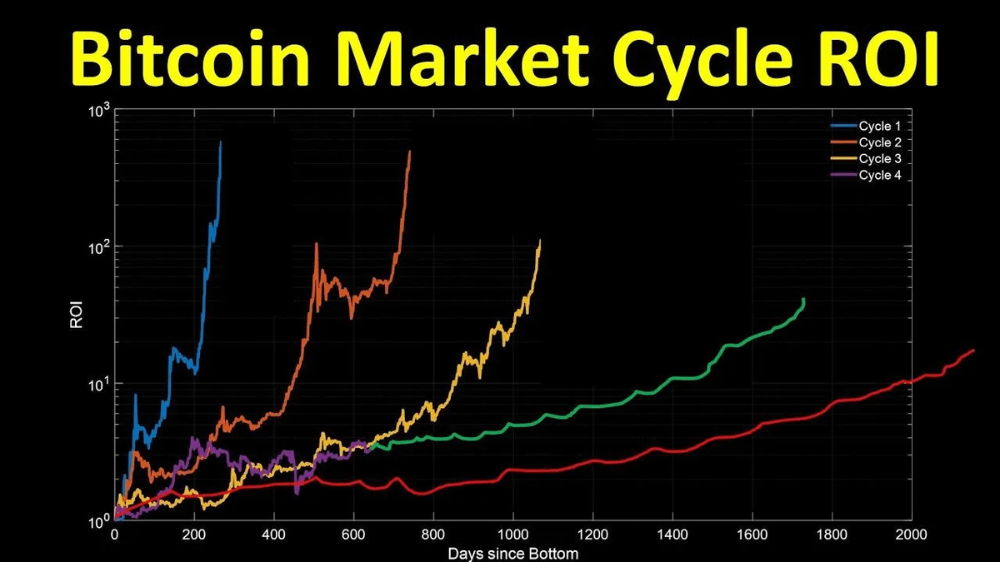
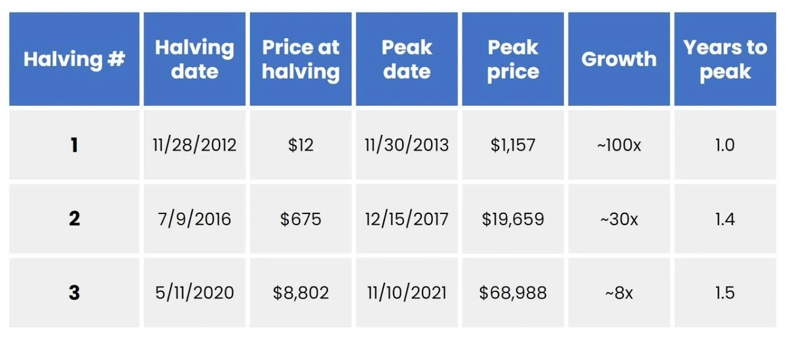
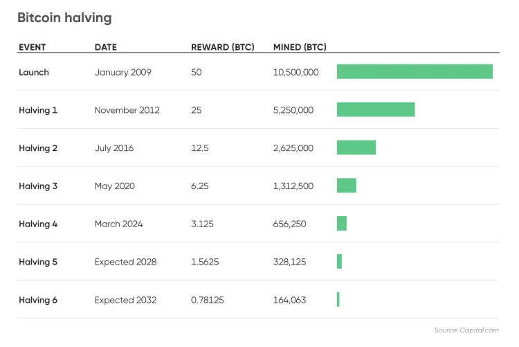
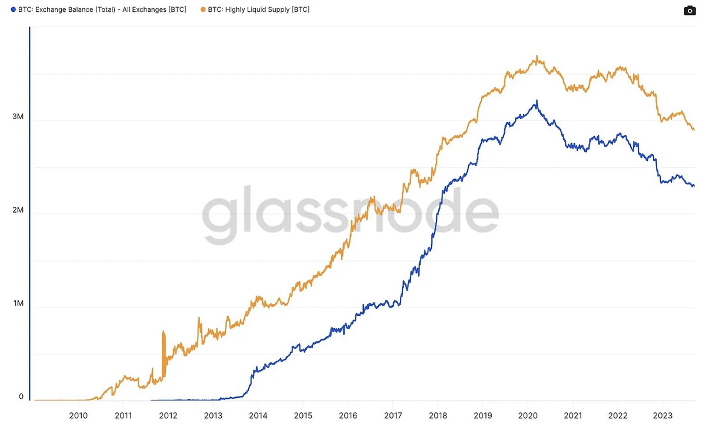
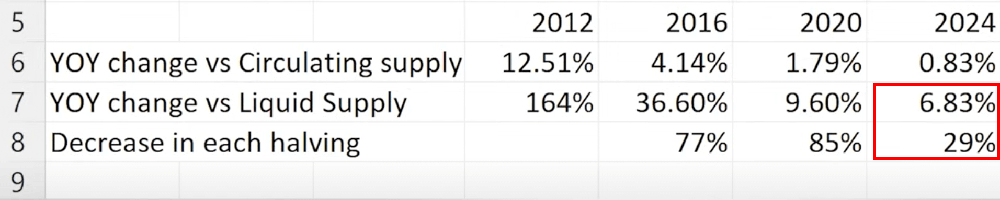
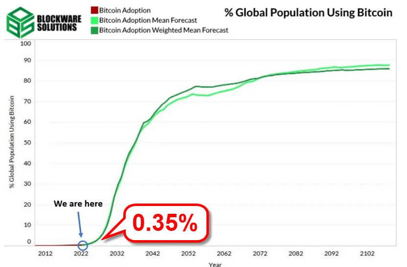
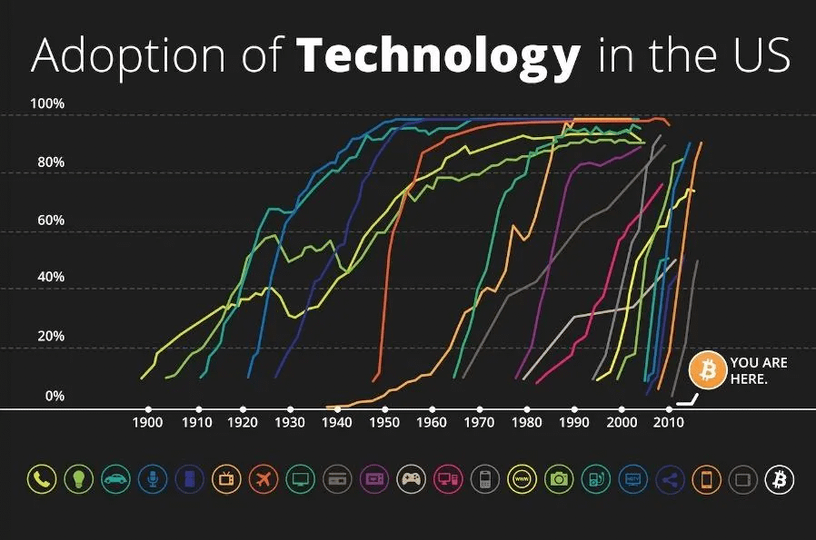

# 2024减半之辩：涨幅消退或者超级周期？

号外：教链内参11.4《突破4w，萨尔瓦多扭亏为盈》

* * *

随着BTC（比特币，昵称大饼）再次站上4万刀并一度突破42k，市场忽然活跃开来。

教链在上一轮周期划的3万刀牛熊分水岭，是属于行内人的心理门槛。加密行内人的画像大致如此：重仓大饼，永不离场，持续加仓。

以强劲态势突破4万刀，才会引起泛财经圈层自媒体的关注和传播。相比于行内人核心圈层，他们已经属于外围。当涟漪传播到了这一层，就会引起曾经了解或者观望过但未及涉足的人的重新关注，甚至会收到来自于他们的问候，问是否现在可以进场。

待到突破前高，即2021年11月6.9万刀，就会引起更为广泛的关注和传播，从而会有更多人杀回来，并且会有懵懂小白开始向里面冲，被蓄谋已久的老镰刀守株待兔。

观察2011、2013、2017、2021前4个周期，会发现其牛市涨幅曲线呈现渐次衰退之势。（如下图）

把2020、2016、2012过往三次产量减半时价格和其后牛市顶部价格对比，可得下表：（来自推友Jesse Myers）

于是，很多人就会观察到一个所谓“涨幅消退”的规律：

2013年，100x。2017年，30x。2021年，8x。

于是很多人可能会总结归纳了，2025年，涨幅会继续下降，预期也就是15w刀左右。推友Luke Mikic如是说。

但是，Luke Mikic发现了两个因素，可能导致这一所谓规律会面临失败。也就是说，2024年的减半，将是与以往几次非常不同的一次减半事件。这一次，有可能开启比特币的超级周期。

这两个因素的分析，以及超级周期的看法，和教链此前的一些观点不谋而合。下面我们展开说说。

* * *

第一个因素是，囤积效应的出现。

通常认为，产量减半带来的供应冲击（Supply Shock）效应在衰减。

众所周知，在中本聪最初设计BTC的时候，确定了每个区块产出50个BTC、每21万个区块（大约4个自然年）产量减半的设计。

就S2F（存量增量比）的角度而言，产量减半会直接导致S2F的倍增，从而带来稀缺性的突然提高，这就是供应冲击。

根据设计，BTC的产量初期特别高，后期迅速减小。到现在总量2100万BTC已经产出了1950万左右，也就是93%左右都已经生产出来了。

这样一来，从名义数量和比例上看，每个产量减半周期的剩余增量越来越小，相对于庞大的存量而言比例越来越小，因此影响也会越来越小。

但是，2020年作为一个转折点，BTC开始持续流出CEX即中心化交易平台。这是过去十几年都未曾发生过的现象。

数据的背后究竟是何原因？也许是越来越多的用户学习并掌握了自行使用私钥保管BTC的方法。抑或是机构大量参与，而机构在去中心化自托管方面有更为成熟的经验。

总之，这已经成为过去几年一个不容忽视的趋势。

如果我们认为，把BTC放在交易所里就是时刻准备卖出的，而提到冷钱包里则更大程度是长期囤积，那么，由此可以推论，相比于名义上的流通供应量，实际的流动性供应量将会显著小于名义供应量。

推友Luke Mikic做了一些初步计算，推算出2024减半效应的冲击力相较于上一次将不会衰减80%那么多，而是仅仅会减少30%左右。

他把这个叫做“双重减产”。教链给这个效应起了个名字叫做“囤积效应”。

只买不卖的囤积者越多，BTC的稀缺效应和供应冲击就越强。这里的“卖”是指为了投机即高卖低买为目的的“卖”，不指补充日常消费准备金即卖掉不再买回的“卖”。

关于2024年这一次减产，有一个最大的不同是，此次减产将导致BTC的S2F硬度超过黄金。关于这一点，教链曾在2023.2.17文章《2024奇点将至：人类尚未准备好迎接S2F大于100的巨硬资产》中有过论述。

量变引起质变。此前的4次减产只是预言。2024这一次，可能是一次相变！

* * *

第二个因素，则是创新渗透率爆发。

上图是BTC全球用户占人口比例。红色是过去15年的历史发展数据。绿色是根据创新渗透率发展规律所预测的用户增长曲线。

可以看出，虽然BTC已经取得了跻身全球市值前十资产的初步成功（参考阅读刘教链12.4文章《比特币鲜衣怒马》），但是，从创新渗透率来看，目前全球人口仅有0.35%接触到了它。

我们还处于非常非常非常早期的阶段！

未来二十年，才是BTC渗透率爆发的剧变二十年！

换个视角，对比一下工业革命以来其他科技产品的渗透率爆发曲线（美国市场）：

比特币依然非常非常非常早期。

这一见解，和教链早在2020年12月19号文章《好戏才刚刚开始》里所阐述的观点颇为契合。

有朋友总说，现在BTC已经那么贵了、现在上车已经晚了之类的话。这只是因为视野不够高、看得不够远。

教链2020年12月25日发文说，《我们正处于比特币百年长牛的伟大历史进程之中》。

而这个进程才刚刚开始。

这几年进场的所有囤饼人，其实都是早早期和早期参与者。

亲自参与、亲身经历、亲眼见证一项划时代伟大科技发明的创新爆发，目睹全世界几十亿人（包括自己）将因此受益，这不也是一件仅次于中本聪发明它这般意义非凡的事情么？

超级周期即将开启。教链亦曾称之为“第二周期”。（参考阅读教链内参9.18《第二周期，超乎想象》）

2024，必不同凡响。

