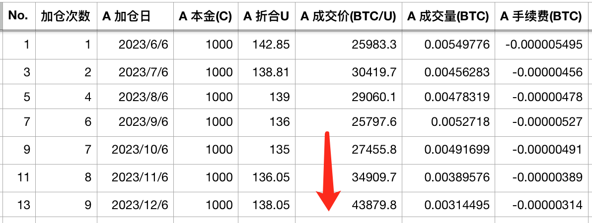
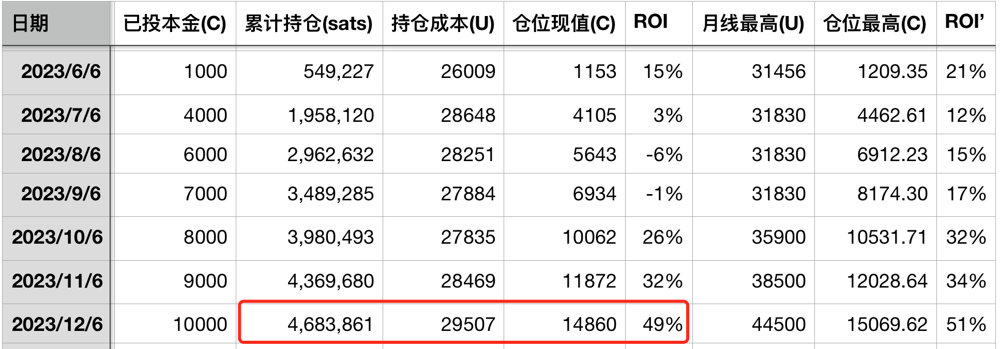
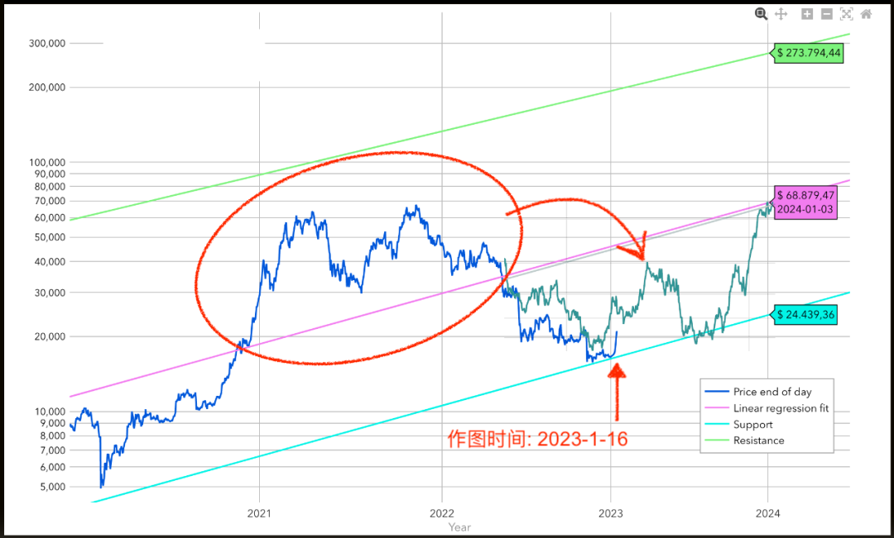
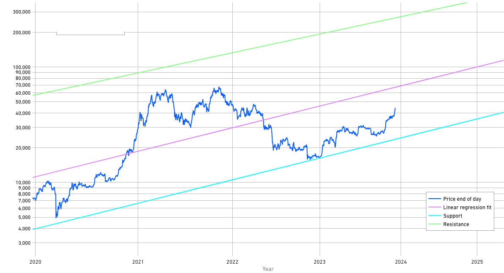

# 【十年之约#13】比特币在呼吸 #

号外：教链内参12.5《后悔药是一味毒药》

* * *

亲爱的朋友，设想在2022年初BTC 4万刀时，你因看涨而坚定持有，结果却迎来了下半年的技术性探底，你会如何面对？是后悔没有4万抛售，还是继续逢跌加仓？

如今BTC已重回4万刀，在“地图全开”的情况下，不难回答，当然是继续加仓抄底，因为抄到就是赚到。一波探底，只是降低了加仓的难度，摊低了持仓的成本。

但是，想象不等于实战。回看过去一年半的实际操作，我们不难对自己的坚定意志和实战能力有一个客观的评估和认知。

认清自我，认清现实，非常重要。

* * *

不知不觉已经到了2023年最后一个月的6号，十年之约实证计划的第13次报告。本次属于“坚持定投”时间，所以我无脑市价单加仓一笔，记账如下：

回顾表格，最近三个月以来，这加仓价格从2字头、到3字头、现在已是4字头。不胜唏嘘。

此次加完，持仓468w聪。持仓成本也在迅速升高。按加仓价计算，暂时ROI浮盈49%。6月到12月，半年。这半年，是出人意料的半年。尤其是4季度，是出人意料的4季度。

BTC果然在年底开启了上冲。这似乎是在印证年初1月份时教链提出的关于「呼吸理论」的假说。教链在2023.1.16文章《比特币2023价格前瞻》中，第一次以文字形式提出这个理论猜想，并做了这样一个图（此图来自于1月16号文章）：

图中蓝色曲线是当时已知的BTC历史价格曲线。曲线终点是2023年1月16号。而那段灰绿色曲线，是教链把2021年牛市的走势曲线，也就是图中红圈圈出的蓝线，复制，粘贴，旋转，放到了紫色回归线下方。

不是说2023年的走势一定是要严丝合缝按照灰绿色曲线来走，而是观察它和紫色回归线所围的面积（数学上称之为“积分”）。

形象地讲，教链的「呼吸理论」，就是把牛市的走势图倒过来。BTC的呼吸，好比你喘气。牛市吸气，熊市呼气。大概这意思。画上面图的时候是2023年年初。要把2021牛市的气都呼净，看起来就是年底就冲前高。实话讲当时笔者自己也是不敢相信年底会如此快速上冲。因此，才会在1月16号文章中自问：“我们可以看到，按照现在的熊市进程，仅用2023年一年时间，可能就会把整个吸入量呼出完毕，那么我们难道要在2024年就进入下一轮牛市吗？”

现在看起来，还真的开启了年底的快速上行。仿佛BTC是在蛙泳，之前牛市吸的一口气，在水下已经呼出将尽，便要急迫地上浮，把头抬出水面，吸一口新鲜空气一般。

及至4月份BTC突出3万刀，即教链所画牛熊分水岭时，教链便在4月12号发文《要冲就冲前高》。

* * *

时至今日，12月6号，我们来回顾一下，BTC这一年的真实走势。

两图对照，实际走势，2022下半年跌落的更多，2023上半年回升未及4w刀，仅达到3w刀，因此，2022下半年和2023上半年的蓝色实盘曲线积分面积，要大于灰绿色倒置曲线的这一段积分的面积；而2023年下半年仍在上台阶，一直位于25k-30k区间，未曾跌落至倒置曲线低至2w刀这么低的位置，这使得这一段实盘积分面积要小于倒置曲线的积分面积。

从直观上估计，上述两部分此消彼长，抵消一下，呼吸的量能就大致是相当的。这样一来，在最后的4季度，选择按照倒置曲线也就是灰绿色曲线迅速上浮，呼尽最后一口气，浮出水面，就是一个大概率的选项。因为很可能，BTC的肺里，已经没有更多的气可以呼出了，所以必须快速减小与紫色回归线所围的积分面积，也就是，快速向紫色回归线靠近。

而好巧不巧，2024年底、2025年初的紫色回归线高度，恰好是前高6.9w刀左右。这就是“要冲就冲前高”的由来。

为什么会在普遍认为的“牛市年”，即2025年，尚未到来之际，就要去冲击一下前高呢？对此我只能说，还不是因为2021年的牛市高点，也就是所谓的“前高”，没有充分推高至价格走廊的上限，而是走了一半多，就被打下来，又走了一次，然后能量衰竭，这就形成了一个奇特的跨周期大横盘 —— 以3w刀为中枢，上至6w+、下至1.5w（在对数图上是对称）的这样一个“大横盘”。

市场上常流传一种说法叫做，横有多长，竖有多高。如果我们拉远视角，把上一个牛市和这个熊市纳入到一个大横盘中来观察，就会发现，有关于即将到来的超级周期的一些盘面依据。

