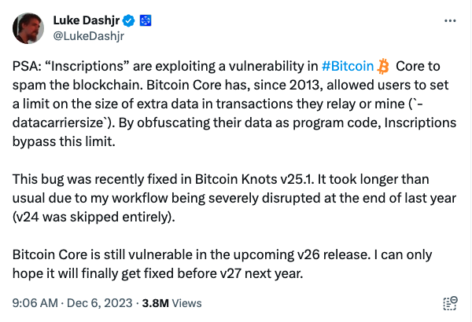
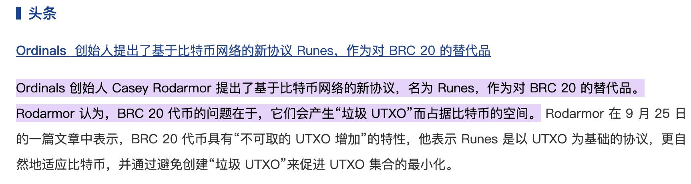
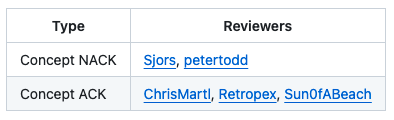

# 他想要杀死铭文

号外：教链内参12.6《从ordi、doge看黄金分割0.618之妙》

* * *

隔夜最热闹的事情就是“比特币核心”开发者Luke Dashjr的“一推激起千层浪”了。



翻译一下Luke说的是，“铭文”滥用了“比特币核心”的脆弱性，向区块链发送“垃圾邮件”。“比特币核心”（客户端），自2013年起，允许用户自行设置他们（的节点）转发或挖矿的交易中附加数据的尺寸限制（-datacarriersize参数）。铭文通过把数据混淆为代码，绕过了此项限制。（注：有人可能会质疑Luke写的参数有问题，那是这人不懂技术，别理他就是）

消息伴随着牛市温度燃起的热情迅速传遍世界的各个角落，并迅速形成了站队和相互攻讦。

铭文Meme代币ordi应声暴跌。

更有矿池迅速站了出来，对Luke的言论进行反击，代表矿工对开发者表示了鄙视和嘲讽。大致意思是说，比特币升级需要矿工投票，因此是矿工说了算，开发者说了不算。潜台词就是，开发者算个屁。的确，若把比特币比喻为一个数字国家，那么掌握算力的矿工就好比握有枪杆子的军队，而开发者不过是敲键盘写代码的柔弱书生罢了。

古语说得好：秀才遇到兵，有理说不清。掌握枪杆子的军阀，根本就懒得和手无缚鸡之力的文人和老百姓讲道理。恰恰是因为这个道理，一个真正为广大普通人长远利益服务的民主“国家”，必须要以文御武，用笔杆子约束枪杆子，用制度（代码）约束暴力（算力）。

比特币也不例外。如果矿工搞割据，就会军阀化。一个矿工利益集团“说了算”的比特币，必定会走向灭亡。如果将来哪一天，矿工利益集团“篡权夺位”成功，我大概会清仓全部的比特币，因为其基本面已经遭到了最为严重的破坏。

* * *

不同于很多人的理解，开发者其实根本没有任何能力“强迫”任何人做任何事情。

无论Luke Dashjr的想法好还是不好，对还是错，他都无法“强迫”任何人接受他的观点，也无法“强制”任何人使用他的代码。

开发者所能够依赖的办法，只有两个：一个叫做自由，另一个叫做民主。

以过滤铭文这个事情为例：

所谓“自由”，就是开发者需要做到，软件里有这么一个功能，可以让一个普通的节点，也能通过简单的配置项或者开关参数，自由地选择过滤铭文或者储存铭文。

所谓“民主”，就是开发者需要通过赋能用户上述选择权，从而实现人人愿意都可以自行决定，到底是在自己的计算机上耗费这么大的空间来保存这些对自己没啥用的铭文数据，还是把它们统统删除以节约磁盘存储空间，从而实现最为广泛的民主自决。

认清了事情的本质，就会发现，讽刺的是，那些攻击Luke Dashjr是为个人私利，妖魔化开发者约束矿工是政治迫害，试图以矿工集团利益为由阻挠更广泛的用户节点获得自由的选择权以及广泛的民主自决权，诸如此类的扣帽子、批倒批臭的种种言行，恰恰暴露了当前部分人私利至上、党同伐异的本性，因此，比特币绝不能将领导权交予这类人手中，比特币的未来绝不可以被这种人裹挟。

* * *

有的人，惊呼比特币竟然要对数据进行“审查”了。词汇总是充满了感情色彩，从而令人想入非非。

Luke Dashjr的补丁，只是把早已有之的对比特币脚本OP_RETURN附加数据大小限制，应用到对taproot脚本所携带的数据上面去而已。可以认为，这是一种类似于“垃圾邮件过滤”的机制。而比特币对“垃圾邮件”的判定很简单，就是看数据尺寸。太大，就是问题。

毕竟，中本聪早年就说过，为什么选择ECDSA签名而不是RSA签名呢？因为后者比前者的数据尺寸要大一倍。中本聪说，如果选择大尺寸的RSA，那么比特币系统就不可行了。


上图是中本聪于2010年1月29日在论坛上的发言。其中对比RSA和ECDSA两种签名算法时，他是这么说的：「不是可执行文件大小的问题，而是数据大小的问题。 我认为，如果区块链、比特币地址、磁盘空间和带宽要求都大一个数量级，那（比特币）就变得不切实际了。」

铭文所采用的Ordinal协议，把数据嵌入到代码里（开头Luke所说的“混淆成代码”），伪装成代码的样子，混进了比特币的区块链里：

例子：
```
OP_FALSE
OP_IF
  OP_PUSH "ord"
  OP_PUSH 1
  OP_PUSH "text/plain;charset=utf-8"
  OP_PUSH 0
  OP_PUSH "Hello, world!"
OP_ENDIF
```

而在开发者们为比特币引入Taproot脚本扩展技术时，忽略了这样一种“滥用”，导致协议可以嵌入任意尺寸的数据，直至把区块塞满！

所以Luke才说，这是一个“bug”。

* * *

在比特币的区块链上嵌入数据，有三种方法。

第一种，是在生产出新区块时，把数据写入区块头。显然，这个方法只有矿工才有机会做到。

当年，中本聪在创世区块里写入了泰晤士报头版头条的标题，就是采用的这个方法。

有一些无知之人瞎说什么中本聪当年就是用的铭文技术，纯属胡扯。

第二种，是在每一次交易，也就是转移比特币，或者从底层技术上说，销毁一个UTXO并创建一个新的UTXO时，在比特币脚本的OP_RETURN指令后面附加一小截数据。

如果有兴趣挖掘历史的读者去回顾一下OP_RETURN的发展史，就知道，当年也是开始未加特殊过滤限制，导致了一定的滥用。甚至有人把child porn嵌入到比特币里面去了。于是有了后来对OP_RETURN尺寸的约束、限制和过滤。

第三种，才是如今铭文所采用的数据嵌入技术，也就是把数据塞到Taproot脚本代码里。

这个能力，是在2021年底所谓Taproot技术被引进比特币以后才得以实现的。关于Taproot，可以回顾一下刘教链2021年11月15号文章《Taproot已激活：不是比特币进化慢，而是我们进化慢》。

* * *

从比特币到所谓BRC-20，其实存在着两层“滥用”。

第一层是ordinal协议对Taproot脚本嵌入数据能力的“滥用”。这是Luke批评的点。

第二层是BRC-20约定规范对于ordinal协议的“滥用”。可能很多炒BRC-20的人还不知道，ordinal协议的原创发明者，Casey Rodarmor，就十分反感和反对BRC-20。因为他希望ordinal协议能被用于铸造数字艺术品，而不是炒币。



Casey认为，BRC-20代币的问题在于，它们会产生“垃圾UTXO”而占据比特币的空间。

不只是节点要浪费磁盘存储这些数据，普通用户也会因为炒币者拥堵了区块链而不得不支付更为高昂的转账手续费、提币手续费。

但是，造化弄人。BRC-20炒起来，比数字艺术品更热闹。

* * *

在数学的严格意义上，炒BRC-20是个负和游戏。所有炒家的总盈利必然是负数，也就是亏损掉支付给矿工的手续费。

把BRC-20的盘子进一步细分，分为操盘的庄家，喝汤的打手，以及跟风的韭菜。

为所有人贡献利润的，就是属于99%的跟风的韭菜。是他们的亏损，成为矿工、庄家和打手的收益。

此处就形成两个既得利益集团：矿工利益集团，以及盘子利益集团。

炒铭文所给矿工带来的高昂手续费收入，便是盘子利益集团对矿工利益集团上缴的一种“贿赂”。

因此，这也就是两大利益集团相勾连，对比特币造成的腐蚀和败坏。

两大利益集团联合起来，意图推翻文官集团（开发者）的领导。

核心开发者想做的事，在这个比喻之下，就好比是“反腐”。

反腐这事儿，宜早不宜迟。迟了，就会陷入常凯申当年的二难境地。


* * *

那么核心开发者们准备什么时候动手呢？

从github PR#28408 (https://github.com/bitcoin/bitcoin/pull/28408 )来看，其实Luke Dashjr早在今年9月5号就把补丁代码提交给核心开发者们进行审议了。

Issue显示，除Luke本人外，目前支持该补丁的有3位，反对该补丁的有2位，如下表所示：



因此，估计合并是大概率的了。

本来还想把他们的精彩发言辑录一下的，但是本文篇幅已经太长了，暂时就先略去这一章节吧。

按照Luke的说法，目前该补丁已经进入了非核心的客户端Bitcoin Knots v25.1版本。而所谓官方的核心客户端，可能赶不上即将发布的v26版本合并该补丁了。他期望明年v27发布之前能够修复这个问题。

* * *

如果你赞成Luke，或者你想节省自己的云服务器成本，那么目前可以选择使用Bitcoin Knots v25.1版本客户端，明年Bitcoin Core v27发布后，如果合并了该补丁，便可以换用Core v27客户端。

铭文一扫光，磁盘省钱真是香。

从更大的意义上讲，更小的全账本尺寸有助于降低运行全节点的门槛，从而扩大了去中心化的程度。如果普通人被剥夺了运行全节点的能力，那么民主的障碍和门槛也就提高了。少数矿池垄断了账本数据，民主可能也就渐渐消亡了。

你觉得是矿工说的算吗？矿工就能强迫你必须帮他存储铭文数据吗？并不是。

你的磁盘你做主。

这才是民主。

