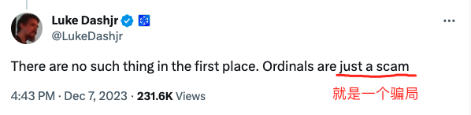
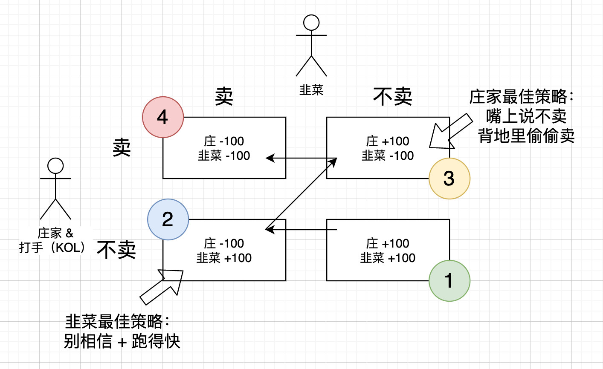

# ordi的博傻共识

ordi是一个Meme，又称模因币。

模因币是空气币的一种。一种非常纯粹的空气币。

纯粹到剥离了一切有形和无形的价值，只剩下一个价值：炒作价值。

空灵到极致。十分有助于掏空你的钱包，洗净你的灵魂。

炒作价值，那是站在韭菜的身份上讲的。

换到庄家的立场，就叫做割韭菜的价值。

它是一把锋利的镰刀。

是刀，就有风险。一个不小心，就会割到自己。

它是一件皇帝的新衣。

媒体、大V、KOL、身边的朋友，都迫不及待地、兴高采烈地告诉你，这件皇帝的新衣有多么漂亮，多么受人喜爱。

可不巧，这一次，有一个小孩，非要当众大喊一声：皇帝光着腚！

没有人喜欢真相。于是群起而攻之。

但是他们忘记了，镰刀永远不可能代表多数人。

这是数学的铁律。

在一个零和游戏甚至是负和游戏中，一个人收割赚一百倍，就需要上千颗韭菜被割亏损才能满足。

99%、99.9%、99.999%以上的人注定亏损。

那么他们为什么会在局部时空之内感觉赚钱了？

因为市场给他们制造了一个幻觉，估值幻觉。

你有100万枚代币筹码，每枚市场价50刀，那么你就会感觉自己有5000万刀，富得流油。

但是这只是一个幻觉罢了。

也许，边际成交量只有1万枚代币。庄家只需要用50万刀资金做市，就可以把价格托在50刀。

如果我们画一个“囚徒困境”的博弈图，那么就可以看到，在第1阶段，大家都不卖，于是就制造了巨大的都在赚的假象。

但是，如果你想把100万枚全抛掉，想换成5000万刀，那是不可能的。

进了赌场，上了牌桌，想下桌走人，怎么可能那么容易？

庄家通过媒体和打手操纵韭菜的心理和欲望，并配合做市资金拖住市场，拉出趋势，将韭菜的共识维持在第1阶段。

不过，韭菜中有聪明者，蠢蠢欲动。

如果随着价格拉高，有韭菜偷偷抢跑，那么庄家就要亏损。当然，大部分亏损还是由没跑的韭菜承受了，庄家只需要分担一点点。

庄家会通过媒体释放利好，通过打手四处散播喊单信息，并通过快速拉升，让抢跑下车的韭菜懊恼不已，重新上车。这样熬过第2阶段。

进入第3阶段，见韭菜的共识越来越强，庄家就会开始考虑出货事宜。

否则，纸包不住火，到第4阶段，共识开始无法继续维持，大破裂来临，所有人夺门而出，形成连环踩踏，庄家辛苦一场，还不一定把做市、操盘的本钱赚回来，那这场局就白做了。

毕竟，庄家手里的筹码量，那是天量。必须趁韭菜信仰最坚、共识最强、接盘最踊跃的时候，完成筹码的换手。

庄家出货，总是先松后紧。

在主升浪中持续出货，但以不破坏主升浪为要点。这需要出货和市场推广精密配合，让接盘资金进入量能够足以支撑庄家出货以及在边际上做市拉盘。

等到了最后关口，眼见韭菜的共识即将面临破裂，关键是新上当的韭菜越来越少，接盘资金就要枯竭，此时庄家就会毫不留情地把货全部派发。

如果庄家还没有出完货，因为外部不可控因素导致变故，此时就会暴露其吃相。

首先是稳定韭菜的心理。派出打手，到处传播一些阴谋论，比如，这次爆出负面、市场暴跌，就是庄家为了洗筹，把不坚定的韭菜和“纸手”洗出去，然后轻车好上路，继续拉盘，星辰大海。

这就是三十六计的“偷梁换柱”。把坏事说成好事，把负面说成正面，把打压说成保护，把暴跌说成洗盘，……

其次是歪曲、造谣，欺骗韭菜。比如这一次，Luke Dashjr说了一句“不必消灭全部的铭文就可以有利于BTC”，被华语行业媒体和KOL纷纷解读成Luke Dashjr向伟大的铭文妥协投降。制造托底反弹，同时派出大量KOL也就是打手们四处炫耀，快来看呀，看我在暴跌到XX时抄的底，立赚xx%，真TM香！

同时，配合发动大V开始写各种小作文，现身说法、掏心掏肺地告诉韭菜们，他们是如何如何情比金坚、坚定持有，并对天发誓，将永远持有，骗人是小狗！

本来高位套牢，正准备认亏割肉的韭菜们，一看领头羊这么感人肺腑，而且抄到就是赚到，感情、金钱双丰收，于是也停下了跑路的脚步，回身重新杀回市场。

庄家可不是傻子。这时候不跑，更待何时？赶紧把货全都交给这些被骗回来的韭菜。

这一招，就是三十六计之“暗渡陈仓”。当面一套，背后一套。嘴上说不卖，背地里偷偷清仓。

第三，则主打一个推卸责任。出几个钱，买一些水军，引领亏钱的韭菜们去骂Luke Dashjr，把市场暴跌、韭菜亏损的罪魁祸首之名安在那个喊出皇帝光腚的小孩头上。可怜的韭菜们，被庄家割了还帮他们骂人。骂完之后，下次继续上庄家的当。

这第三招，就是三十六计第11计“李代桃僵”。

庄家出完货，哪管身后洪水滔天。何况，滔天的洪水，爆亏的戾气，全都被祸水西引，脏水全都泼到了吹哨人开发者的头上去了。

剖开本质，这种所谓韭菜的共识，不过是博傻共识，搏一搏看看究竟谁是那个没跑了的傻子的共识而已。

当博傻共识遇到囚徒困境，其大崩裂就是一件必然发生的结局了。

不要寄希望于金鱼的记忆。韭菜不死，博傻不止。

年年岁岁花相似，岁岁年年人不同。野火烧不尽，春风吹又生。

但是BTC，不应成为这样种韭菜、割韭菜无尽轮回、肥了庄家的土壤。大概，这就是Luke Dashjr虽千万人吾往矣的初心吧？
