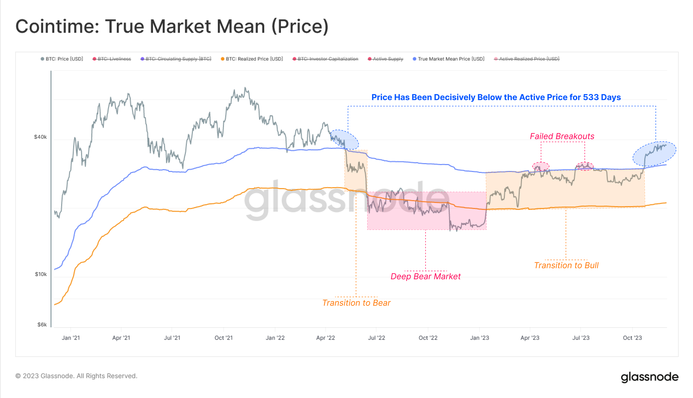
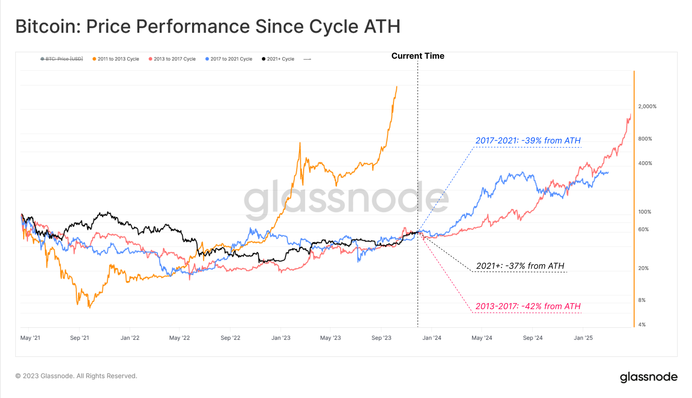
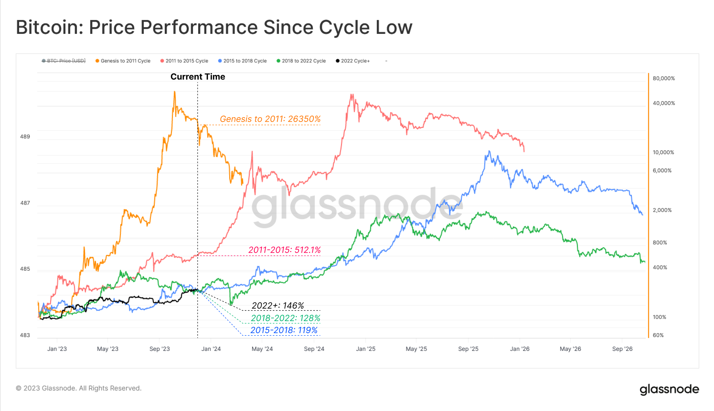

# 这一次，走哪个剧本？

号外：教链内参12.8《隔夜，突生变数》

* * *

随着BTC坚定地站在44k上方，并对45k跃跃欲试，仿佛一夜之间，无人再怀疑BTC是否已经有效突破牛熊分界线，把阻力位反转为支撑位的问题。教链所说的牛熊分界线，即是在2021年上一轮牛市时所画的30k分界线。

这一支撑位在2021年年中得到了市场的检验。当2022年中有效跌落，并将该支撑位反转为阻力位时，我们说，市场已经进入技术性熊市。直到现在，当BTC似乎是站上了40k+，我们也大致可以讲，市场终于突破了该阻力位，走出了技术性熊市。

事实上，牛熊划分本就不拘一格。各人有各人的见解和定义，这也造成了很多时候的鸡同鸭讲，对牛弹琴。看cointime（币时）的指标，以“已实现价格”和“真实平均价格”为双轨，把2022年5-6月划为牛转熊过渡期，把2022年7月到12月划为深熊，把2023年1月至10月划为熊转牛过渡期。

是的，如教链说过多次的，一切技术指标都是滞后于市场价格的。当盘面给出确认信号时，便宣告了上一个阶段的结束。知行合一，知道了再动手，是远远不够的。我们要在获得信号之前就实施行动。在天黑时就出发。在熊市中加仓。在市场给出牛市信号前就充满信心。这就叫左侧操作。

追高加仓的右侧操作者是追牛的夸父。逢跌加仓的左侧操作者是射熊的后羿。

夸父终究没有追上太阳，累死在追逐的途中。后羿最终还是成功把八个太阳射落，把风调雨顺带回来人间。

随着BTC越过40k，年内对美元表现已逾140%，成为2023年表现最佳的全球资产之一。而且，BTC今年的表现也超过了黄金，对黄金涨超106%，可谓远远跑赢黄金。

那么站在展开新画卷的新起点上，这一次，BTC又要走哪个剧本呢？

如果把市场从每次周期高点（ATH）开始的走势叠在一起，我们得到了ATH-ATH走势图如下：

上图中，橙色是2011-2013周期，红色是2013-2017周期，蓝色是2017-2021周期，黑色是2021至今的当前周期。

可见，从一个高点走向另一个新高点，周期所用的时间是莫测不定的。2013-2017比2011-2013要长得多，而2017-2021又比2013-2017要短一些。

于是我们在上一轮看到了周期延长论，但是在缩短的周期面前已经破产。现在我们又看到了周期缩短论。按此观点，市场要在2024年就触及新高，并可能更早结束牛市。

如果走2013-2017的剧本，新高将最高达到接近2000%的前高，也就是69k x 20等于惊人的138w刀。不知这是否超出了在座所有人的想象力。

而如果走2017-2021的剧本，那么新高将达到接近前高的400%，也就是69k x 4等于27w刀。这似乎更容易以为我们贫乏的想象力所接受。

我们还可以把周期按照另外一个视角来切分。以周期熊市低点作为分割点，得到Low-Low走势图如下：

从图中看起来，市场已不可能走创世周期，即2009-2011周期。也不太可能走2011-2015周期，毕竟目前表现差距太远。如果要达到2011-2015的高度，那么需要达到相当于熊市低点16k的40000%以上，即超过16k x 400 = 640w刀。

如果走2015-2018周期，那么新高应达到大约16k x 10000% = 16k x 100 = 160w刀。

而如果走2018-2021周期，那么则应为16k x 2000% = 16k x 20 = 32w刀。

其实，我们都知道，历史总是在重复，但却从不会简单重复。

这一轮周期，也必定会走出其独特的风格和不一样的剧本。
