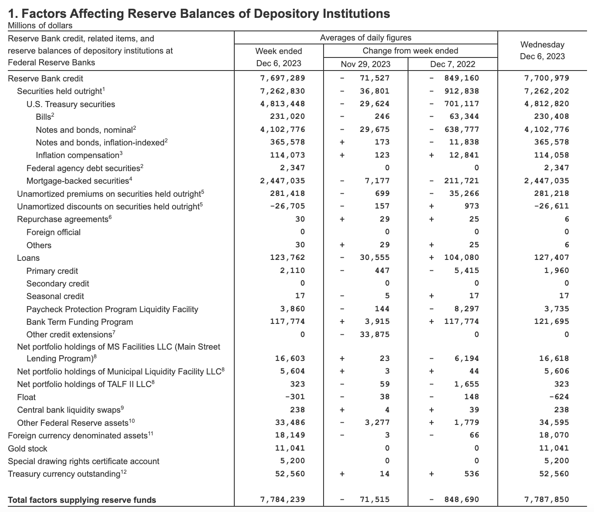
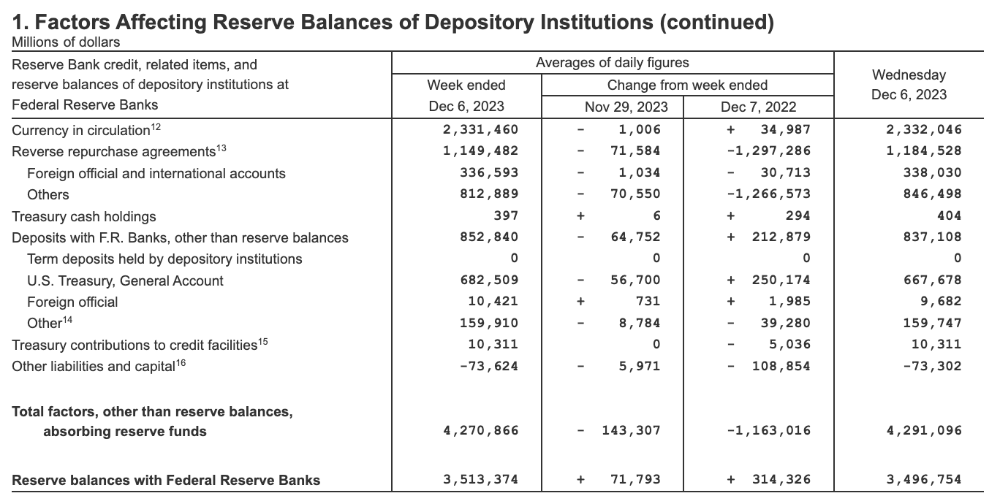

# 美联储的“真相”

号外：教链内参12.9《山寨的春天》

* * *

美联储的一举一动，已经俨然是整个世界经济、金融的最举足轻重、最重大的宏观事件。

其全球无与伦比的影响力和事关每个人钱袋子的千钧之重，让美联储主席甚至美联储理事的每一次讲话，每一句话的遣词造句，都被全世界的财经媒体放到放大镜下面良久审视，试图从诸如“期待”和“认为”这样的用词差异中，寻找到影响市场未来趋势的蛛丝马迹，以及决定自己仓位盈亏的财富密码。

这显然是一种被绝对权力PUA到极致的斯德哥尔摩症候般的过度敏感和神经质。

特别是，如果你是在尝试跳出它的无上权柄所圈画的游戏规则，进入另一个游戏，那么很显然，你不可能对美联储亦步亦趋。

要建立对美联储的批判性眼光，就要跳出对它绝对权力的顶礼膜拜，从更为宏观的视角，深挖它的本质，探寻它的秘密，揭示它的真相。

于是我们就要先好好看一看，美联储的资产负债表。

说来有趣，在美联储的官网上，导航栏菜单里并没有给出一个入口，可以直达资产负债表。找到资产负债表的操作相当隐晦：你需要反常规地直接点击菜单名“Monetary Policy”（货币政策），而不是在下拉菜单中寻找菜单项。点击后你会进入一个完全不同的页面。在这页面的底部中间，就可以找到“Federal Reserve Balance Sheet”（美联储资产负债表）。

这是 2023.12.6 的最新数据披露：

资产项：

负债项：

数据表格看得眼花缭乱。教链把它按照“几何画法”画成了下图：

作为一个中央银行，美联储的资产负债表也是没有所有者权益的，因此其总资产等于总负债。这个数字目前是不到8万亿美元。也就是我们常说的资产负债表规模。

我们通常所说的“扩表”就是指扩大这个规模，而相应的，“缩表”就是指缩小这个规模。

早在今年10月31号的时候，教链写过一篇《央妈的“秘密”》，给大家拆解过咱们央妈的资产负债表结构。相对于央妈而言，美联储的资产负债表就显得更加简单 —— 特别是，资产端。

* * *

美联储的资产端特别“单纯”：93%以上的资产就是美债和MBS。其中，大约三分之二是美债，三分之一是MBS（房地产抵押贷款）。

相传在2008年次贷危机之前，美联储是只囤美债的。但是次贷危机的时候，各大银行搞了太多的房地产债券，底层人民一断供，资产要崩盘了，于是美联储就下场吸收这种债券，就此成了常规操作。

另外就是大家听说过今年初的美国银行业危机，硅谷银行等一些中小行也学美联储囤美债，自以为如此安全的债券应该毫无风险。结果呢，美联储加息，美债价格跌破面值，搞得这些中小行资不抵债，纷纷破产。（参考阅读刘教链3.12文章《美联储的官员们，都在坐等出事！》，3.29文章《暴跌99%》，9.23文章《敲山震虎：论硅谷银行的倒掉》等）

那么为什么这些“资不抵债”的债券，美联储吸收过来，就不会暴雷呢？

这便是美联储无限钞能力的最大秘密之一。

当然，这其实是公开的秘密。

债券在别人的资产负债表里，要按照市场价格计价。比如面值100刀的2年期美债，如果是在硅谷银行手里，当市场价跌到98刀，资产价值就缩水为98刀，不足以支撑100刀的负债，于是就发生了资不抵债的问题。

可是同样是这面值100刀的2年期美债，如果是放在美联储手里，那就大不一样了。美联储可以忽略一切市场价格，直接按面值100刀簿记这项资产，永不缩水。这样，美联储就永远可以用它来支撑100刀美元的发行。美元是美联储的负债。100刀恒等于100刀。资产恒等于负债。

房子也是一样。50万刀30年期的房贷，放在别人手里，如果贷款出现风险，其债券市场价是要缩水的，因为存在无法全额回收的风险。而一旦被美联储拿来，神奇的一幕发生了，美联储可以忽略一切市场定价，其实也就是忽视了一切市场风险，直接按照50万刀来簿记这项资产，并以此为支撑发行50万刀美元出来。50万刀恒等于50万刀。资产恒等于负债。

现在你可以掂量掂量，美联储表内的这高达近7.3万亿刀的资产，究竟有多少泡沫，又有多少水分，以及多少真材实料了。

于是乎，和解决次贷危机类似，解决银行业危机，只要“发明”一个工具，把银行的美债资产吸收到美联储这里，资不抵债就被解决了。这就是BTFP（银行短期融资计划）的本质原理：银行把不足值的美债交给美联储，美联储按足值入表，发行等值美元还给银行，银行的美元资产就和负债相等了，资不抵债神奇地消失了！

目前，BTFP大概有1177亿刀的规模，不大。主要是，只要不挤兑，这个问题其实并不致命。银行捧着美债还能吃高息，何乐而不为呢？

剩下的资产项都比较琐碎了，就不必一一列举。

需要注意的是，关于黄金，其实美联储是进行了相反的簿记策略 —— 按照远低于市场价的价格来入表。关于低估黄金价值的问题，在刘教链11.14文章《美国究竟持有多少黄金？》一文中有详细的解读。

如果还原为目前市场价格约2000刀来计算黄金的价值，那么该项资产将膨胀到约5220亿刀，占比也上升到约为6.7%。

* * *

美联储的负债端相比之下则稍微有那么一点点复杂。

主要负债项是：流通美元，RRP（隔夜逆回购），存款（主要是TGA即财政部存款），以及最大头的联储银行准备金。

其中联储银行准备金约3.5万亿刀占比45%，以及流通美元（美联储直接印的美元，即M0）约2.3万亿占比30%，是最大的两项负债。

我们知道，美联储是一个私人机构，不接受美国政府的领导。它由多家地方联储银行联合成立，并轮流担任理事，共同开会决策重大的货币政策。

美联储为这些联储银行放在这里的准备金支付多少利息呢？

根据上个月，也就是今年11月份最新一次的议息会议纪要，目前准备金利率是5.4%。这称之为IORB。

也就是说，每年美联储要支付给这些联储银行们高达3.5万亿 x 5.4% = 1890亿美刀的利息。

美联储本身又不赚钱，那么这些利息用什么支付？当然就是用资产的利息收入，也就是美债的利息收入来支付咯。

而美债的利息又是从哪里来呢？主要就是美国政府的税收。

看一下美国财政部网站就知道，2023财年的税收大概是4.44万亿刀，平均到每个月就是3700亿美刀。嗯，差不多半个月的财税收入，都直接上交给了这些联储银行老爷们。

有一个公开的知识是，美联储的盈余会全部上缴给美国政府。啊，好一个大公无私的非盈利机构。

而同样是公开的秘密则是，美联储作为一个管道，把从美国民众头上征收的税（主要是直接税），经税务局、财政部，借助美债这个资产以及IORB这个工具，上供给了私人银行家们。美联储在这个意义上，就是金融利益集团的抽水机。

* * *

除此之外，RRP也就是隔夜逆回购是另一个比较重要的操控市场的工具。关于RRP，刘教链今年8.29文章《美联储养虎为患》中有一些初步解读。而关于repo（回购）和RRP（逆回购）的技术操作，则在刘教链10.4文章《美联储世纪大裁员》中有所介绍。

从表中数据可知，目前RRP在美联储表中占据第三大的规模，大约是1.15万亿刀。

而这一部分，美联储也是要付利息的。付多少呢？

根据11月份的议息会议纪要，目前隔夜逆回购利率被定在5.3%的水平。

也就是说，相当于单利每年付出去1.15万亿 x 5.3% = 609.5亿美刀的利息。

比上面上供给储备银行的利息要少，大概是其1/3左右。

这部分主要是给了商业银行。而商业银行主要是通过货币基金吸储放在这个工具里。所以，最后是流向了理财人士。

按照BitMEX创始人Arthur Hayes的看法，如果隔夜逆回购里的流动性出逃，而美国财政部账户（TGA）的余额却没有增加，那么这部分流动性大概就是跑去追逐更高收益的产品去了。这可能也是我们今年看到随着隔夜逆回购规模的持续降低，BTC持续走高的背后原因之一。

* * *

好了，经过这么一番拆解，你应该更懂美联储一些了。尤其是，它是如何靠着巧妙的会计操作，上演“帽子戏法”；同时，伪装成一个非盈利机构，向私人银行家手里输送财富的。

有一些真相并不美好。它向我们展现了这个世界的冷酷。但是，了解真相、知道真相，是逃离被收割命运的第一步。当越来越多人觉醒，也许世界将会变得不同。

正如登月的阿姆斯特朗所说的：这是你的一小步，但也是人类的一大步。

