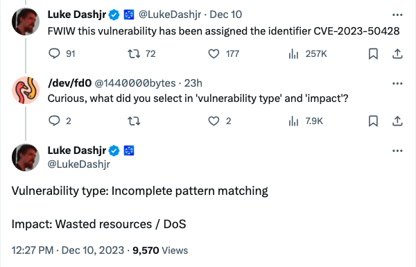
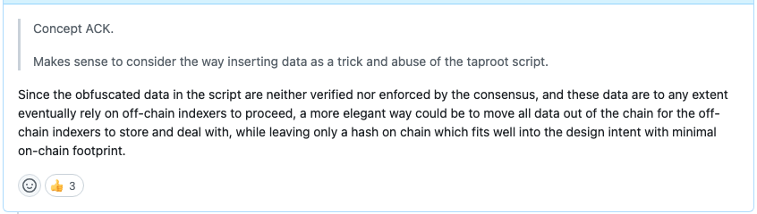

# 向比特币核心铭文漏洞提交了意见

号外：教链内参12.10《铭文已被CVE和NVD漏洞数据库收录》

* * *

有关比特币铭文协议的危机还在继续发酵。10号，该协议所依赖的底层技术漏洞已经被CVE漏洞库分配了正式编号：CVE-2023-50428。这意味着，有关于该技术漏洞，在安全风险方面已经取得了初步共识。

有关围绕铭文协议的争论，还不了解情况的读者可以温习一下教链12.7文章《他想要杀死铭文》来快速回顾以下此事的来龙去脉。

在CVE中，对该技术漏洞描述为，通过把数据混淆为代码（例如，通过OP_FALSE OP_IF），绕过了数据载荷的尺寸限制，如2022、2023年铭文对该漏洞的广泛滥用所示。

所以，铭文只是该漏洞的一个“用例”。这个漏洞，本质上是关乎于是否容忍把大量不会得到执行的数据，塞进脚本代码，然后刻入到区块链上面去的问题。

因此，Luke Dashjr给这个技术漏洞分类的类型是「不完善的模式匹配」，漏洞影响则是「浪费资源以及拒绝服务攻击」。

在Luke Dashjr向Bitcoin Core提交的有关修复该漏洞的PR下面，笔者也给出了如下意见：

「由于脚本中的混淆数据既没有经过验证，也没有通过共识来执行，而且这些数据在任何程度上最终都要依赖链外索引器来进行，因此一种更优雅的方法是将所有数据移出链外，让链外索引器来存储和处理，同时只在链上留下一个哈希值，这非常符合设计意图，同时将链上占用的空间降到最低。」

该意见的意思是，把完整数据放在链上，得到链上共识保证的只有数据的完整性，而这一点只需要用一个小得多的哈希就可以做到，同时，把完整数据嵌入，并不能摆脱对链外索引器以及社会共识的依赖，也就不能带来精简架构的好处，因此，把完整数据外移到链外，更符合架构设计原则。

我想，这一架构设计原则或许也是比特币的设计理念之一，那就是，比特币的链只应作为共识的载体，而不应作为全尺寸数据的载体。如果能在不破坏链上共识的情况下，最小化链上数据的尺寸，比如能用哈希值就不用全数据，那么就是符合这一设计理念的。

这一理念，把比特币和BSV、FIL、ICP等致力于把自己变成“云存储系统”的区块链项目泾渭分明地区分开来。

毕竟，共识的价值要远高于普通数据的价值。

比特币的链，只保存最浓缩、最精华的部分。

Ordinal协议和铭文，只需要变更一下技术方案，铭文2.0，就可以很好地和比特币这一理念相兼容。

其关键组件，就是一个能够存储铭文数据并进行索引的去中心化、分布式标准化索引器（indexer）。

与其较劲，或者陷入情绪之中，不如抓紧研发铭文2.0。谁先搞出来，也许就抢占了时代变局下的先机。
