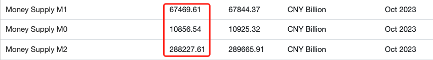
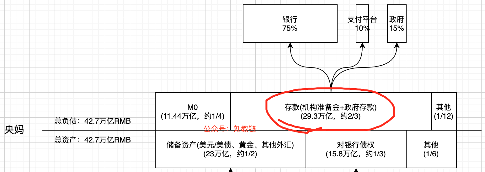
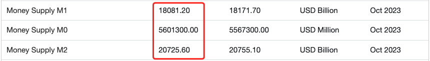
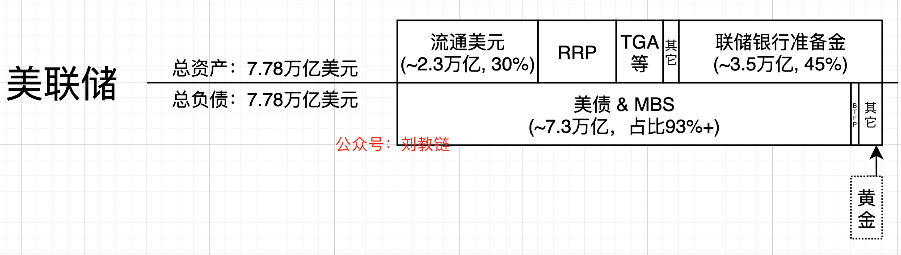

# M0 M1 M2 M3

号外：教链内参12.11《美联储会议前夕，市场飞流直下》

* * *

前天教链写了一篇拆解美联储资产负债表的文章，《美联储的“真相”》。文章发出后，有朋友探讨货币理论中的有关货币分层的问题。即，所谓的零级货币、1级货币、2级货币、3级货币，分别用符号M0、M1、M2、M3来表示。M应该是Money（钱）的首字母。

其实，钱这个东西，很平常又很深奥，甚至有些神秘。我们天天都能见到，天天都在用它，但是深究起来，却越想越不明白，有些问题，甚至超出了语言的表达能力。

就像另一个特别常见的东西，光。普通到天天能见到，深奥到教授都未必能彻底理解。光是粒子，是波，是电磁波，有波粒二象性，具有参照系无关的恒定速度，静止质量为零，是虚粒子，是规范波色子，…… 光到底是什么？一两句话根本无法解释清楚。

钱也是如此。钱是什么？货币又是什么？钱是货币么？money和currency有什么不同？note是什么？cash又是什么？

BTC是什么？它是money么？是currency么？是cash么？中本聪在白皮书标题里给它的定义是一种点对点的cash，电子现金，又意味着什么？

教链曾认为，链上的BTC是M0，即零级货币。这个比喻准确么？

CBDC也是M0。但是M0和M0，是一样的M0么？并不是。

如果我们去看书上对于M0、M1、M2、M3的定义，可能会越看越糊涂。

我国的定义大致如下：M0 = 现金流通量；M1（狭义货币）= M0 + 活期存款（企业活期存款+机关团体存款+农村存款+其他存款）；M2（广义货币）= M1 + 准货币（单位定期存款+居民定期存款+其他存款+证券公司客户保证金+住房公积金中心存款+非存款类金融机构在存款类金融机构的存款等）；M3 = M2 + 金融债券+商业票据+大额可转让定期存单等。

美国的定义：M0 是流动性最强的货币供应量，包括流通中的硬币和纸币以及其他易于兑换成现金的资产。

M1 = M0 + 处于美国国库、联邦储备银行和存款机构库存以外的通货+非银行发行的旅行支票+商业银行的活期存款（存款机构、美国政府、外国银行和官方机构的存款除货币供给外）减去应收现金项目和联邦储备存款+其他支票存款（OCDs），包括可转让支付命令（NOW）和存款机构的自动转账服务（ATS）账户、信用合作社股金提款账户和储蓄机构的活期存款。

M2 = M1 + 储蓄存款（包括货币市场存款账户）+小额定期存款（10万美元以下的定期存款）减去个人退休金账户（IRA）及自由职业者为退休而进行的存款+货币市场共同基金份额减去IRA及自由职业者为退休而进行的存款。

M3 = M2 + 私有机构和大公司的定期存款+海外流动货币+可支付证券。

可见，其实它们不过是一些人为的划定，而且不同国家，不同标准，划分和定义的方法也有所不同。

我们还是来通过数字对比，找寻一下它们的身影罢。

先看我国。2023年10月数据。M0 = 10.8万亿RMB。M1 = 67.4万亿RMB。M2 = 288.2万亿RMB。

对照一下刘教链公众号2023.10.31文章《央妈的“秘密”》中央妈的资产负债表，可以看到，M0的规模差不多就是央妈表内的“货币发行（Currency Issue）”项目的数值。

可以看到，在我国，只有央妈亲自印的钱，才是M0。其他银行印的，不算。而在美国，就不一样了。

美国。2023年10月数据。M0 = 5.6万亿USD。M1 = 18万亿USD。M2 = 20.7万亿USD。

对比一下刘教链公众号12.10文章《美联储的“真相”》里美联储的资产负债表。

我们就惊奇地发现，美元M0不仅仅包含美联储表内的“流通美元”，而且包含各联储银行的准备金。这和咱们就很不一样了。

看起来，咱们央妈真的像是银行们的妈妈，而美国的各地方联储银行，则更像是美联储的爸爸们。

另外一个发现就是，美元M2和M1的量居然是同一个数量级，根本没有超出多少。这个问题的根源在于，美联储对M2的定义，极大地限缩了。比如，只有10万美元以下的定期存款才会被计算进M2。

因此，要看美元的广义货币量，就不能只看M2，而是需要看M3。可惜的是，美联储从2006年起就不再公开M3数据。美联储最后一次公开美元M3货币总量约为103万亿美元。

说回教链对于BTC如何套用上述货币分层理论来描述的看法。

首先，链上BTC肯定是M0。像持有纸钞一样真实的是，人人都可以通过私钥来持有链上BTC，并且可以确信它“真实”存在。与现代央行不同的是，M0 BTC不是由资产负债表里的资产来背书和支撑的，而是由对电力能量的消耗凝结而成的。

M0 BTC也就是零级BTC，才是“真正”的BTC。

然后，如果你把BTC充值到一些中心化平台，比如CEX交易所，那么，在链上你已经失去了对BTC的所有权，而你所获得的，只是平台在App上给你展示的一个存款余额的“数字”而已。这种放在平台上的、随时可以提走的BTC，大致相当于M1。

M1 BTC不是真正的BTC，而只是一个记账数字。我说M1 BTC的时候排除了M0 BTC。

如果定义 M1 = M0 + 记账的BTC。那么我们可以看到，M1 >= M0。

这就很有趣。市场上流通的BTC居然会比真正链上存在的BTC数量更多。原因就是平台有可能只保留部分BTC应付提币，而把其他BTC挪作它用。

比如经典案例就是2022年的FTX平台，把大量BTC等用户存款挪用到其对冲基金名下，但是不幸都爆仓了，于是最后出现财务亏空，挤兑暴雷。

那么如果平台是通过设计“理财产品”让你存入BTC，然后合理地挪用呢？那么这种情况可以视作是M2的衍生了。

这个时候连环套娃：张三在某CEX平台把1个BTC存入李四的理财产品，APR 3%；李四把这个BTC转存入王五的理财产品，APR 5%，李四吃2个点；王五又把这个BTC转存入赵六的理财产品，APR 8%，王五吃3个点；赵六再把这个BTC存入钱七的理财产品，APR 10%，钱七吃2个点；……

在这个套娃过程中，M1 BTC始终只有1个，而M2 BTC = 套娃层数 x M1 BTC数量。如果最初张三存在CEX平台的1个BTC其实也早已被挪用走了，那么其实这个链条上的所有人，就是在玩一个循环付息的游戏。只要最后一环还能按时付息，整个系统就能维持运转而不崩盘。但是一旦最后一环出了问题，违约，或者跑路，那么整个链条就连环爆雷。

就像2022年爆出的另一案例，Gemini和Genesis的恩怨情仇。Gemini高息揽储，交给Genesis理财，结果上游暴雷，Gemini卖给散户的理财产品本金都难以收回，造成了巨大的纠纷。

真正是，你看上了我的高息，我看上了你的本金。

在纸钞广泛使用的年代，人们很容易知道，自己持有的是不是M0 —— 纸钞（cash）就是M0，把纸钞存到银行，银行给我一个记账，就不是M0。但是现代社会，高度电子化之后，我们已经很难分辨，也很难直接持有M0了。

那么，BTC就是在电子时代直接持有M0的一个解决方案。你总是可以用私钥来验证你的所有权。我想，这也是中本聪使用cash（现金），或者更具体的，电子现金，这一直指本质的称呼，来定义BTC的缘故吧。

