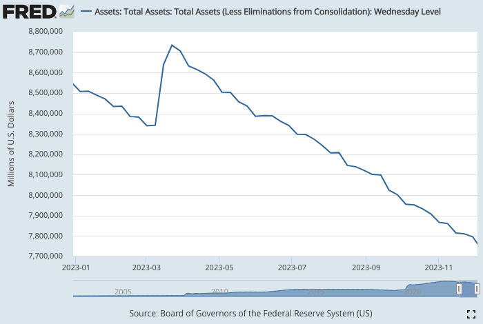
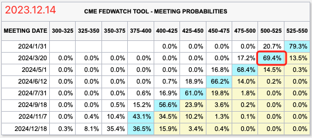

# 美联储靴子落地

号外：教链内参12.13《重磅报告，即将出炉》

* * *

隔夜，为期2天的美联储2023年度最后一次议息会议落幕。会后声明老调重弹，会议决议不出所料，不加息，维持5.25-5.5不变。继续按照每个月600亿美债和350亿MBS的速度削减资产负债表。

这一年来，缩表与牛市齐飞，秋水共长天一色。一年来，这表从8.5万亿美刀缩到7.8万亿美刀，BTC的价格从16-17k升至目前的42-43k。

早在7月27日，教链在美联储7月议息会议决议继续加息之后，撰文称之为《美联储的绝唱》。

8月19日，教链撰文《央行：美联储加息接近尾声》，介绍了央妈对于美联储本轮加息周期行将结束的同样预判。

8月21日，教链撰文《人造繁荣：财富大转移》，指出美国“三高”（高利率、高通胀、高增长）其“疾在腠理”，这“腠理”，就是美接连两届政府“直升机撒钱”在美国民间形成的“超额储蓄”。文章指出，这一超额储蓄耗尽的时间“大约在冬季”。

9月19日，教链撰文《隔山打牛：金融大崩溃》，指出随着美联储的失败，站在隔山打牛统一阵线的囤饼者，“将通过手中资产的大幅上涨而受益”。

10月5日，教链撰文《美联储的加息游戏Game Over》，指出9月不加息之后，11月、12月今年最后两次议息会议也很可能无法继续加息。美联储终将“食言自肥”。

隔夜，美联储主席鲍威尔承认，经济正在放缓，利率已到达或接近峰值，降息开始进入视野，不应等到通胀降至2%才开始降息，那就太迟了。美联储会议点阵图暗示2024年将降息3次。分析师认为，美联储“鸽”的毫不含糊，明年不可能再有任何紧缩，而不是像他们此前所表达的那样还会又紧缩措施。

CME市场押注显示，明年3月份降息25bp的概率已高达69.4%。

靠吃补品补起来的“虚胖”，终究是虚假的经济繁荣。人要想健康、壮硕，那就要合理膳食，锻炼身体，总靠嗑药吃补品，是不成的。

直至最后一刻，还有斯德哥尔摩症候患者，幻想着美联储鲍威尔会给市场降息预期予以沉重一击。

可惜，形势依旧比人强。物质力量终究还是碾压了主观意愿。批判的武器终究是抵不过武器的批判，而能够摧毁物质力量的，只有物质力量，而不是嘴炮。

美联储靴子落地，鲍威尔向市场低头，美元环流行将逆转，资本的盛宴，又要开席了……

