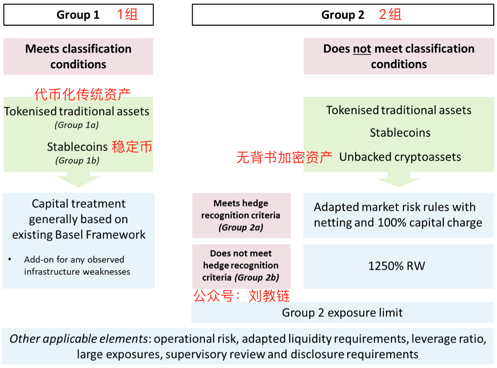

# BIS：各国央行自2025年起将获准配置不超过2%的比特币

号外：教链内参12.16《警惕！ICP末日战车启动》

* * *

日前，有网友传，国际清算银行（BIS）发布了有关允许成员央行自2025年1月1日起加密资产暴露的标准。依据该标准，各央行将可获准配置不超过2%的比特币或其他加密资产。该标准文本将很快纳入巴塞尔框架（Basel Framework）。

事实上，从BIS官网下载的报告原文可知，这份标准的发布时间是一年前，也就是2022年12月份。报告原标题是，《巴塞尔委员会关于银行监管：加密资产暴露的审慎处理》（Basel Committee on Banking Supervision: Prudential treatment of cryptoasset exposures）。

详细去看，BIS并未规定具体的资产名称，而是划分了两个分类：1组和2组。如下图：

1组要符合一些条件，比如基础风险测试，赎回风险测试，等等。具体的，在60.8至60.19条款进行了列举，总共包含4大类条件。需要全部满足才可以进入1组。

「分类条件 1：加密资产是：(i) 一种代币化的传统资产；或 (ii) 具有一种稳定机制，可始终有效地将其价值与传统资产或传统资产池（即参考资产）挂钩。」

「分类条件 2：加密资产安排所产生的所有权利、义务和利益在资产发行和赎回的所有司法管辖区都有明确规定，并可依法强制执行。此外，适用的法律框架可确保结算的终局性。银行必须对加密资产安排进行法律审查，以确保满足这一条件，并应要求向监管机构提供审查结果。」

「分类条件 3：加密资产的功能及其运作网络，包括其所基于的分布式账本或类似技术，其设计和运作足以减轻和管理任何重大风险。」

「分类条件 4：执行加密资产赎回、转移、存储或结算终结，或管理或投资储备资产的实体必须： (i) 接受监管和监督，或遵守适当的风险管理标准；以及 (ii) 制定并披露全面的治理框架。」

由于加密原生资产比如BTC很难满足全部上述条件，因此不太可能会被分入这一组。1组包括的加密资产，也就主要是两种：1a，代币化的传统资产；1b，稳定币，其实也就是法币的代币化。

2组则除了包含不能满足规定测试条件的代币化传统资产及稳定币之外，还可以包含所谓无背书的加密资产（Unbacked cryptoassets），这就可能包含BTC及其他加密原生资产。

由于风险定义不同，那么对两组资产要求的风险覆盖策略也不一样。

我们重点关于一下第2组。

如果2组资产能够满足对冲识别条件，那么可以被划为2a，适用「经调整的市场风险规则，包括净额结算和 100% 资本费用」；否则就被划入2b，需要使用额外1250%的风险加权资产来覆盖这一风险敞口。

对2组资产的配置比例的标准意见是不超过1%。如果超过了1%，那么就需要对超出部分适用2b的加权风险覆盖要求，并最终不得超过2%。如果超过2%，那么将需要对全部资产进行加权风险覆盖。

举个例子，假设某成员国央行有10万亿美元1层资本（Tier 1 capital）。那么它可以配置最多1000亿美元的BTC（假设BTC符合2a标准），这已经相当于目前BTC总市值的约1/8。如果该行想配置2000亿美元的BTC，那么对于超出的1000亿美元BTC，需要划拨1.25万亿美元的1层资产（比如，美债？；）来进行加权风险覆盖。

至于央行们为什么有动机、有必要去配置BTC，教链早在今年（2023年）1月5号的时候就写过文章介绍过，哈佛大学的研究论文，感兴趣的读者请移步阅读：《论文导读：哈佛博士论证央行囤比特币的意义和建议》《对冲制裁风险：央行储备中的加密货币（1-4节）》《对冲制裁风险：央行储备中的加密货币（5-7节）》《对冲制裁风险：央行储备中的加密货币（第8节及附录）》

最后，在本篇文章结束之前，再和大家简单介绍一下，这个BIS国际清算银行的由来，以及目前的成员。BIS是由英法德意比日等国与美国的摩根银行、花旗银行，根据海牙国际协定于1930年成立的国际银团，后演变为各央行合作的国际金融机构，总部设在瑞士巴塞尔，目前发展至60个成员央行或金融管理当局，它们是：

阿尔及利亚、阿根廷、澳大利亚、奥地利、比利时、波斯尼亚和黑塞哥维那、巴西、保加利亚、加拿大、智利、中华人民共和国、哥伦比亚、克罗地亚、捷克、丹麦、爱沙尼亚、欧元区（欧洲中央银行）、芬兰、法国、德国、希腊、中国香港、匈牙利、冰岛、印度、印度尼西亚、爱尔兰、以色列、意大利、日本、韩国、拉脱维亚、立陶宛、卢森堡、马其顿、马来西亚、墨西哥、荷兰、新西兰、挪威、秘鲁、菲律宾、波兰、葡萄牙、罗马尼亚、俄罗斯、沙特阿拉伯、塞尔维亚、新加坡、斯洛伐克、斯洛文尼亚、南非、西班牙、瑞典、瑞士、泰国、土耳其、阿拉伯联合酋长国、英国、美国。

