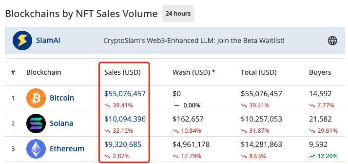
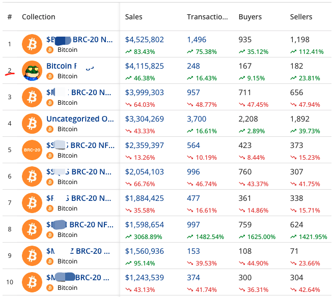
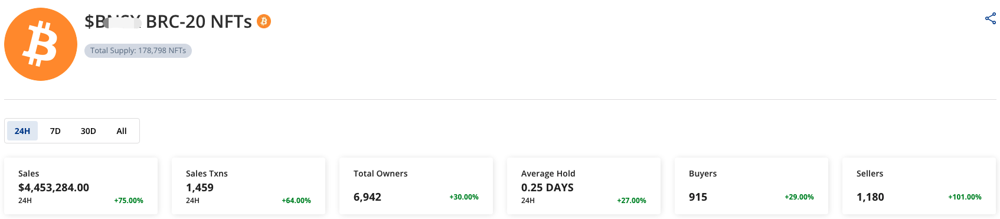
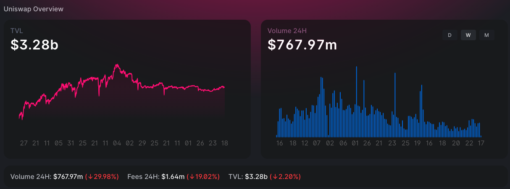

# NFT交易量，比特币反超以太坊？

号外：教链内参12.17《老OG不被割的妙招》

* * *

有网友发现有人在大谈一张来自CryptoSlam的统计数据图表。

图表中展示的24小时NFT交易量，比特币链上有5500w刀，而以太坊链上只有932w刀。

且慢。想一下教链说过的：统计数据会说谎。

深究一下，就会发现，所谓比特币链上的NFT交易量，绝大部分（90%以上）都是由同质化的所谓BRC-20代币的高频换手所带来的。

上图是集合的成交量排名。前10名都是比特币链上的铭文。但是，定睛一看，除了排在第2的是一个NFT铭文，其他的都是同质化代币铭文，也就是BRC-20。

点开排名第一的代币铭文，看一下更详细的数据。

可以看到，也就是1000个地址在那里换手，而且换手速度特别快，平均持有时间只有0.25天！一天转手4个人（地址）！

我们可以想象得到，这是一场多么惊心动魄的击鼓传花。人人都知道传到自己手里的是烫手山芋，巴不得一有机会就赶紧传给下一个。

学生时代教室里玩击鼓传花的一幕彷佛重现脑海中。老师站在讲台，以板擦敲击黑板，节律均匀而紧促。同学们站在教室里，传递着一个黑板擦。老师敲击声戛然而止，板擦在手的同学就要被罚上台表演。所有人都紧张地快速传递着黑板擦，一拿到手就赶紧传出去，一秒都不敢在自己手里多停留。

同质化代币（Fungible token）的意思，就是根本不需要在意这一个和另一个有什么区别。那么，铭文的序数编号，于它而言并无必要性。其他在比特币链上铸造同质化代币的协议，就不需要进行编号，便是这个无必要性的佐证。

在本质上，BRC-20是对同质化代币的并不高级的模仿。从功能上看，它假装自己是同质化的，却要打包装进非同质化的筐里面出售；它不能细分，无法作为通常意义上的同质化代币来支付；它不智能，缺乏可编程能力。有18位精度小数、带智能合约的ERC-20，显然实用性会更强一些。当然，图灵完备的智能合约带来了复杂性和无尽的漏洞，让初级市场感到厌倦，所以向铭文回归，是货币智能化方向的一次反向运动，出乎包括对智能合约孜孜以求的以太坊创始人Vitalik Buterin在内诸多行业领军者意料之外。

所以，恰当的比较对象应该是以太坊链上的ERC-20交易量。

我们都不需要统计以太坊生态的所有交易，只需看一下最大DEX协议Uniswap的数据就好了。

可以看到，Uniswap目前总流动性是32.8亿刀，过去24h交易量约为7.7亿刀。这就是10倍以上的差距了。

在上任何餐桌之前，都最好搞搞清楚，这一餐究竟是谁买单。如果搞不清楚，那很可能就是要你自己买单。而如果是自己买单，那么这海天盛筵规模越大，场面越红火，浪费越铺张，你这个买单者最后要从紧巴巴的兜里掏出来的钱也就越多。

与其请别人吃海天盛筵，还不如一开始就吃碗泡面。

