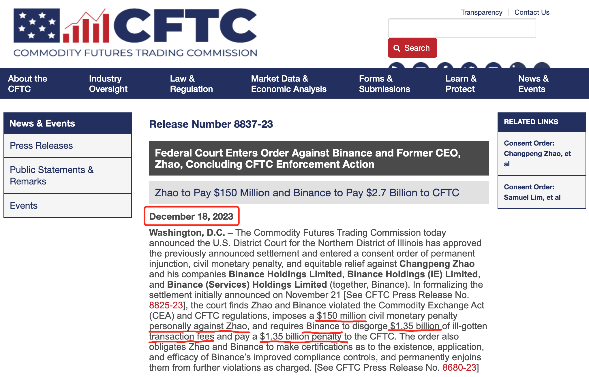
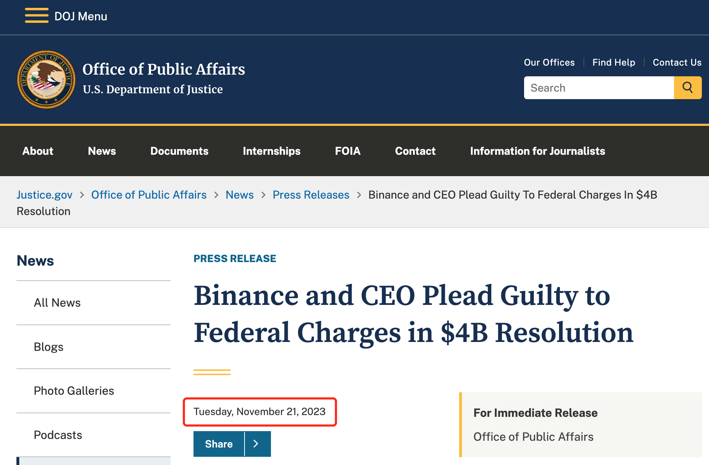
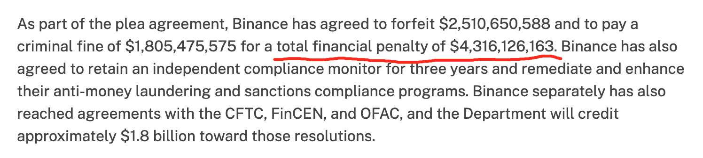
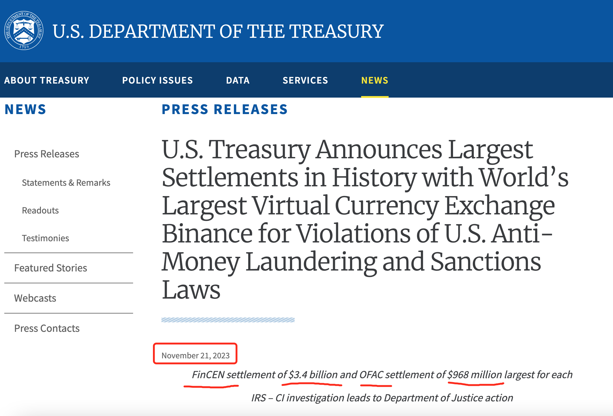
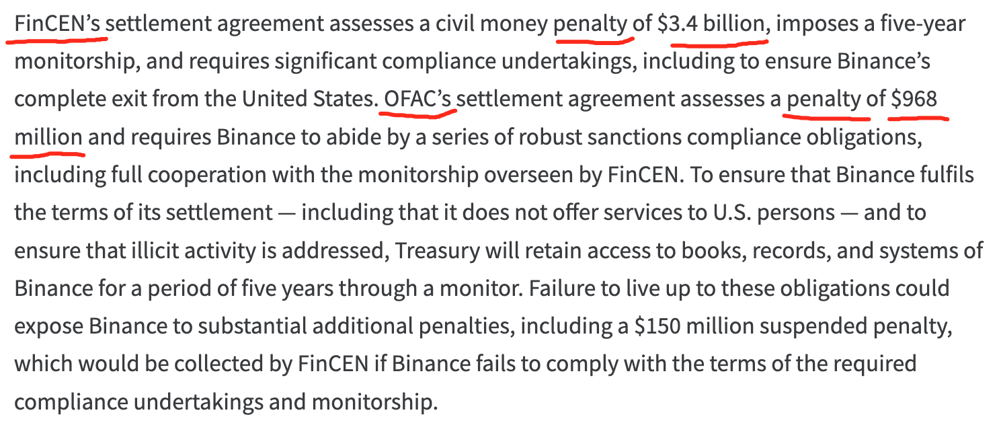
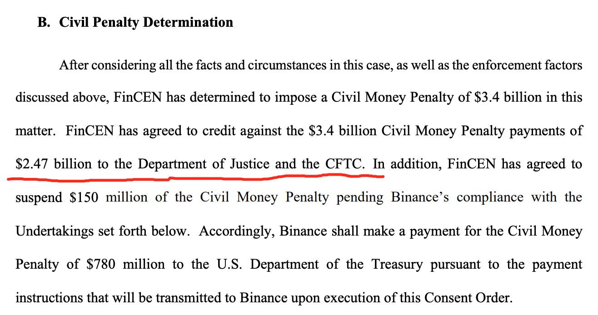
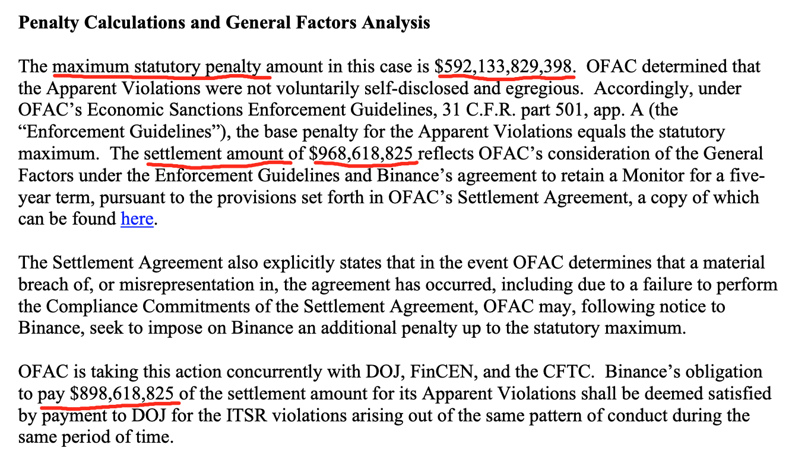

# CFTC咬下币安长鹏28.5亿美刀肥肉

号外：教链内参12.19《现货ETF近在咫尺》

* * *

人在美国、没上了飞机的前币安CEO赵长鹏（江湖人称cz）迎来了2023年年尾的第一个“好”消息：18号，美国商品期货交易委员会（CFTC）在官网公告，伊利诺伊州北区法院批准了此前11月21号与币安及cz的和解协议。

这意味着CFTC抢先SEC（美证交会）把肥肉咬到了嘴里！

那么这块肉有多肥呢？根据CFTC的公告，cz个人将向CFTC支付1.5亿美刀的罚款，而币安公司则需要“吐出”13.5亿美刀的交易手续费“不当得利”，并额外追加13.5亿美刀的罚款给CFTC。也就是说，公司27亿，cz个人1.5亿，总共28.5亿美刀。

13.5亿美刀“不当得利”“吐出”给了CFTC，就不能再“吐出”给SEC，这不就是CFTC抢了先么？SEC估计有点儿小小沮丧吧？

读过此前11.22号教链文章《美国鲸吞币安，长鹏认罪伏法》的朋友可能还记得，当初美国司法部（DOJ）的公告中，说的是罚款43亿多美刀。

具体的数字是：$4,316,126,163。

那么，这一次CFTC咬到嘴里的27亿美刀，和11月份认罪的43亿美刀，是什么关系？

我们再来看一下美国财政部当时的公告：

按财政部的说法，FinCEN和OFAC这两个下设机构，将分别拿到34亿美刀和9.68亿美刀。34亿加上9.68亿，这就已经是43.68亿美刀了。

看公告的具体措辞，34亿和9.68亿，都是罚款（penalty）。这加起来就已经是美司法部公告43亿还要多一点点了。难道CFTC的和解罚款真的全是另外单罚的？

部分媒体也有这么讲，这么算的，于是说币安迄今总共被罚了43亿（财政部FinCEN+OFAC罚没）加上27亿（CFTC罚没）等于70亿美刀。

不过，事实却并非如此；或者说，并不准确。

如果我们去翻阅一下FinCEN的Consent Order 2023-04号文件第59页，就会发现，FinCEN会把罚没的34亿美刀中的24.7亿美刀转移支付给美司法部和CFTC。FinCEN自己留了多少呢？34亿减去24.7亿等于9.3亿美刀。

那么美司法部要从这里面分多大一杯羹呢？

让我们再重新看一下前面美司法部的公告。在描叙43亿美刀的拆分时，美司法部的拆分方式是25亿民事罚款和18亿的刑事罚款（criminal fine）。在段落尾部，美司法部也坦诚他们将获得18亿美刀的“收入”。

如果美司法部分走的18亿美刀完全来自于FinCEN抢的34亿刀所切出来的24.7亿刀，那么给CFTC剩下的就只有24.7亿减去18亿等于6.7亿刀了。

那么OFAC抢到手的那9.68亿美刀呢？让我们再仔细读一读OFAC的文件。

在OFAC 11月21日的执法文件里，第5页进行了罚金的计算。首先，我们可以看到，OFAC声称，法定最高罚款上限高达5921亿美刀！而后，OFAC给出了和解罚款的金额约9.68亿美刀。0.16折的巨大折扣，惊不惊喜，意不意外？

关键是OFAC还在第三自然段说了一嘴，如果币安向美司法部支付8.98亿刀，是可以算作付清了这部分和解金的。这么理解的话，OFAC自己其实只留了9.68亿减去8.98亿等于0.7亿刀。打了个酱油？

如果美司法部从OFAC这里切走8.98亿，从FinCEN就只需要切走18 - 8.98 = 9.02亿刀。

FinCEN切出来的24.7亿刀，减去9.02亿刀给美司法部，那么就能剩下24.7 - 9.02 = 15.05亿刀给CFTC。

这基本上和18号CFTC公告的与币安的13.5亿刀的和解罚金差不多。另外一半13.5亿刀，那不是罚金，而是“吐出”的“非法所得” —— 不应该赚的交易手续费。

不过，你可能对于15亿刀和13.5亿刀不能严丝合缝地吻合起来感到不满意。这个我也没办法，因为他们给出的数据口径都是分散的，没有一个完整的财务报表。美司法部公告里的43.16亿刀和财政部公告的43.68亿刀其实就已经对不太整齐了。

总结一下。美司法部牵头财政部和CFTC的执法行动，罚款43亿刀，最终一顿内部倒手之后，“分赃”的大致情况是这样的：美司法部拿走18亿刀，财政部共拿走10亿刀（其中FinCEN 9.3亿，OFACE 0.7亿），CFTC拿走15亿刀。18 + 10 + 15 = 43。

随后呢，CFTC这边又和币安继续和解嘛。让币安吐出来交易手续费的“非法所得”，和罚金大概是一般多，最后凑了个27亿刀。又从cz个人那里榨出来1.5亿刀。在43亿刀分赃之外，CFTC大概又多搞到手小15亿刀吧。

综上，经过一番辛苦考证，我们大概可以推算出，币安和cz到目前为止总共被敲出来43 + 15 = 58亿美刀了。

接下来，不知道还有哪路神怪要来分食一口肉呢。SEC目前盯了这么久，还没有吃到一口，是不是已经心急如焚了呢？

人被困住，落马平阳。秃鹫老鹰它不是一只，而是一群。喂饱一只，还有下一只。

被捆仙索五花大绑、动弹不得的cz，只能乖乖地呆在美国，刀俎鱼肉，任人宰割。

延伸阅读：
《长鹏插翅难飞》
