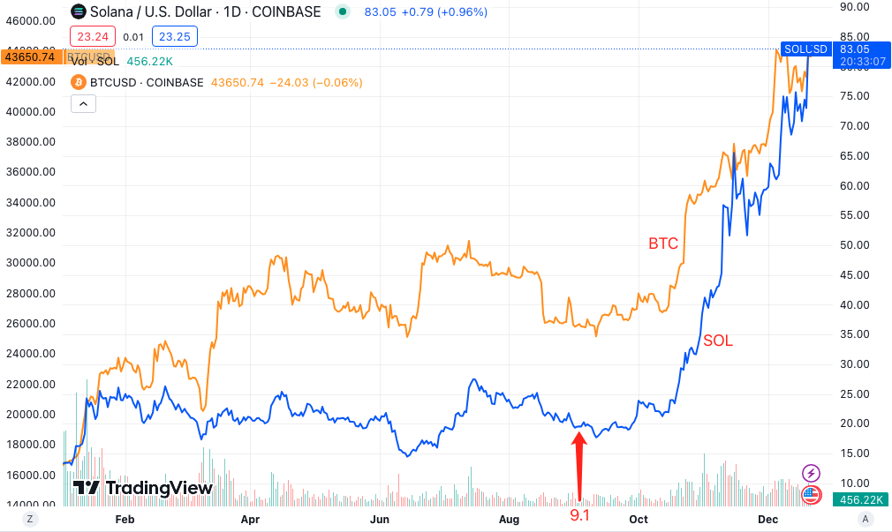

# Solana拉盘出信仰

号外：教链内参12.20《Messari看空以太坊，ETH/BTC再创新低》

* * *

忽如一夜春风来，千树万树梨花开。就在ETH对BTC汇率再度跌破0.5低点时，关于Solana (SOL)将在本轮周期超越以太坊(ETH)的呼声鹊起。

甚至于，连一定程度上代表了西方加密投资机构主流意见的投研机构Messari在其年终报告里，也强烈表达了看好Solana、看空以太坊的观点。

这就有点儿让ETH的坚定持有者心有忐忑、砰砰乱跳了。

不必先听这些唱多者头头是道的分析和理由。只需要拉出SOL这一年的走势来：

上图，蓝色曲线是SOL/USD。教链还放了橙色曲线BTC/USD作为参照。

看图说话，一眼就能看到两个结论：

第一，SOL这一年的表现，从始末两端来看，追上了BTC。

第二，相比于BTC，它SOL是先躺了大半年，然后从9月份才开始奋起直追。

有没有前瞻指标？有的。翻开教链内参9.1《SEC前主席称，批准BTC现货ETF是不可避免的》，内参第2条提到，著名DeFi项目MakerDAO创始人Rune Christensen发表了一篇文章《探索以 Solana 代码库分支作为 NewChain》，其中谈到，Maker希望基于Solana来构建其“终局”阶段的基础设施，并认为Solana的技术堆栈是最有前途的。

看过这篇内参以及后续内参的朋友还记得，当时此事还惹起了一个不大不小的风波。因其评价Solana比以太坊更好（Maker目前构建于以太坊上），遭到了以太坊创始人Vitalik Buterin的驳斥，逼得MakerDAO创始人Rune Christensen出来向Vitalik表示歉意，说了一堆和稀泥的话。这些都在内参里有所追踪。

然后我们就看到了，争议渐渐平息之后，Solana就开始了它气贯长虹的拉盘。从9月11号局部低点17.72，一直猛拉到现在12.21号的82.99，升幅+368%，追上了BTC。

韭菜常说，拉盘即正义。

Vitalik在嘴上逼得Rune表态道歉了。但是很显然，站在Rune一边的资本势力，用做多SOL/USD、同时做空ETH/BTC，表达了对Vitalik的“正义反击”。

可是Rune Christensen刚刚通过2023年上半年艰苦卓绝的斗争，把资本从Maker清理了出去，自己重新掌控了Maker项目呀。（参阅教链内参8.1《交易平台ZT Global疑似跑路，不是你的私钥，不是你的币》中提到a16z、paradigm等机构大户纷纷清仓MKR的事）

所以是哪些大资本站在了Rune一边，明牌翻转为暗牌。

再捋一下时间线：8月，机构清仓MKR。9月，Rune挑战V神，提出SOL比ETH更好。10月-12月，机构暴力拉盘SOL。12月，Messari发布研报，大力唱多SOL、唱衰ETH。

清仓MKR，让Rune获得独立身份，是不是为其站在技术角度挑战Vitalik更添几分公道，更能笼络人心呢？这样，至少你不能批评Rune唱多Solana、暗贬以太坊是“受a16z、paradigm的指使”了吧？

9月Rune公开挑战V神，投石问路的时候，SOL还在低位躺平，被经历过2021年牛市还有所记忆的人怀疑这个当年的「宕机链」到底行不行，不会是来搞笑的吧？也有人质疑Rune的专业性，为何选择Solana这么一个明显具有中心化缺陷的技术。

但是，很多人始料未及的是，这不过是一个精心布局的一环。醉翁之意不在酒，而在拉盘也。

所以，当10月、11月、12月机构资本暴力拉升SOL之后，所有的质疑、顾虑都消失了，取而代之的竟完全变成了对SOL的坚定信仰，对SOL即将flip ETH（掀翻ETH）的坚定信仰。

这样一来，当12月份Messari在其研报里浓墨重彩，书写SOL掀翻ETH的叙事的时候，怀疑者寥寥，而深信者众了。

