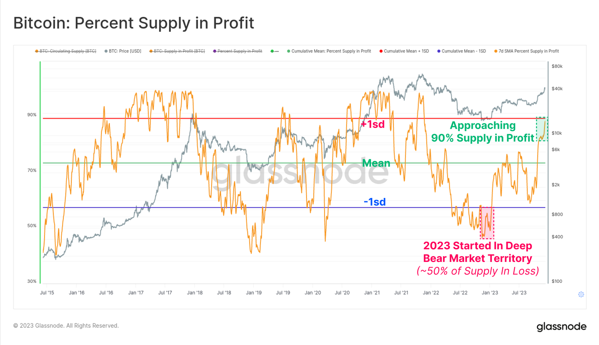
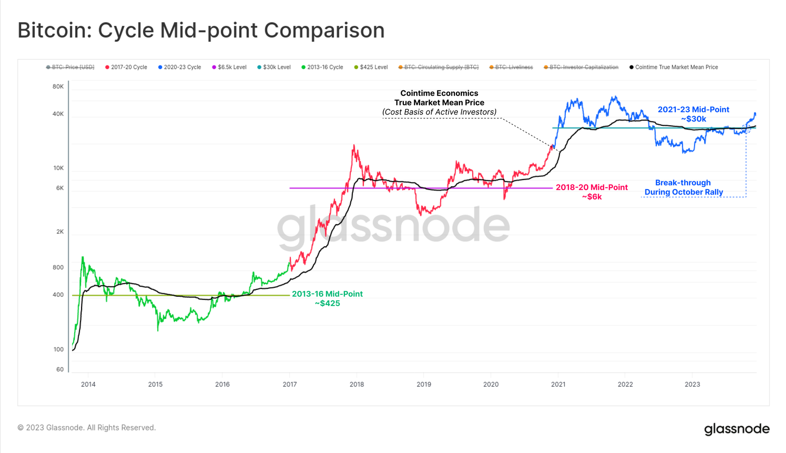
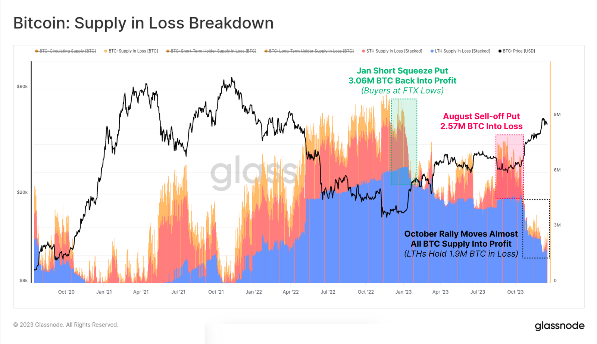
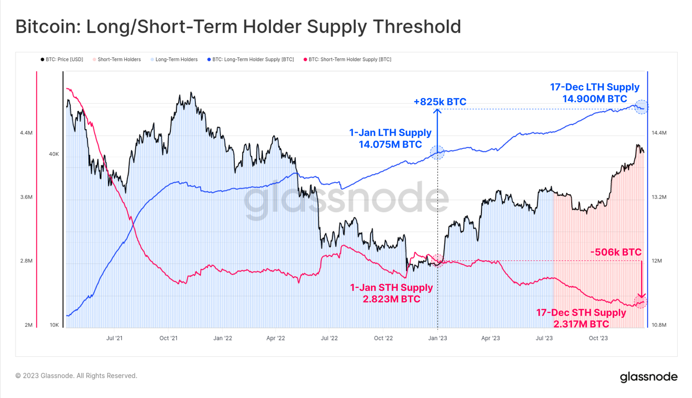

# 近9成BTC已盈利

号外：教链内参12.21《说说DePIN赛道及其底层逻辑》

* * *

随着BTC进入4万-5万刀区间，近9成BTC已经处于盈利状态。

现在，盈利BTC数量占比已经接近历史均值上偏1个标准差的距离。这一方面说明了近期BTC持续上行，将大部分持有者送上了盈利的快车道；另一方面，也预示着不久将来可能降临的向均值的修正和回归。

图里的数据已经明明白白地显示，均值在70%以上，而即使是下偏1个标准差，也在50%以上。这意味着，在大多数的时间，大多数的BTC（超过半数）都是盈利的。

BTC大多是盈利的。区别仅仅在于，BTC在谁的手里。在谁手里，谁就享有这份盈利。持有BTC是重要的。重要的事情是持有BTC。

胜率为王。巴菲特说过：最重要的事情是不要亏损。

BTC大多是盈利的。这就使得投入BTC比起来投入山寨或者土狗的“一将功成万骨枯”，完全不同。作为一个普通人，投入BTC，你有超过50%的概率获胜；而投入山寨或土狗，你可能只有万分之一的概率获胜（成为“万骨枯”的概率远远大于成为“一将功成”）。

拜10月份以来对关键阻力位3万刀翻转之后的迅速拉升所赐，上百万枚BTC因此得以扭亏为盈。

长期持有者（LTH）自2021年10月以来保持“钻石手”，持续积累的趋势越来越强。而短期持有者（STH）的“纸手”则在2023年4月份之后陷入不断丢失筹码的困惑之中。甚至比2022年11-12月最低至16k时还要困惑 —— 从数据看，那个时候的绝对熊市底部，短期持有者反而在勇敢抄底，小幅增持。

不过短期持有者们也是相当聪明的一个群体。他们自2021年7月份牛市中途下行之后，在整个下半年二次走高，以及2022年上半年不断走低时，一直没有加仓，很是沉得住气。

从2023年初以来，短期持有者们已经累计抛售了愈50万枚BTC。

与之相对的，长期持有者们则累计增持了超82万枚BTC。

