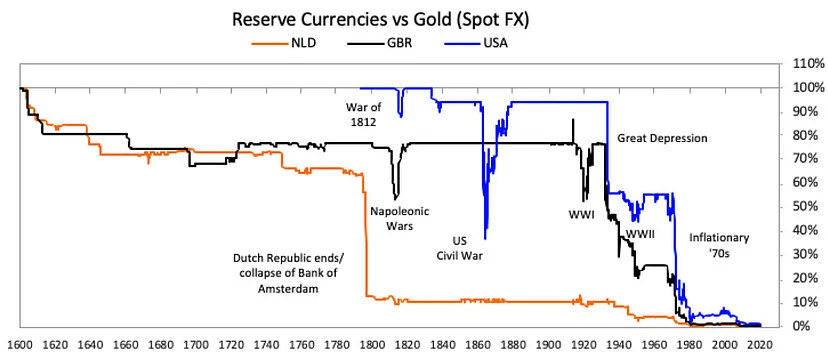

# Arthur Hayes点评美联储降息、比特币ETF、许可式DeFi和RWA

号外：教链内参11.23《囤饼十年老司机》

* * *

日前，BitMEX创始人Arthur Hayes发表了一篇博文，文中对美联储本轮加息降息、比特币ETF、许可式DeFi（去中心化金融）以及RWA（现实世界资产）进行了辛辣点评。全文很长，教链通读后将其核心观点提炼出来，并对点评进行了点评，以供读者快速了解。

* * *

一、关于美联储降息

在Arthur Hayes看来，美联储迅猛加息，以及在降息上踟蹰，背后的原因皆是两个字：政治。

美国最大的政治，或者说美国总统最大的政治是什么？连任。

为了连任，拜登政府不惜排净美国的国家石油战略储备，来打击油价，抑制“为了安抚平民而印制的巨额货币”而导致的“40 多年来最大的通货膨胀”。

因此，拜登和耶伦给鲍威尔施压，要求美联储配合加息。于是鲍威尔创造了自1980年沃克尔加息之后最快的加息。

现在，为了进一步刺激经济，让金融资产持有人满意，需要鲍威尔宽松金融。于是鲍威尔暂停加息，并在本年度最后一次议息会议后，意外传出降息的鸽声。“金融资产价格上涨，直到美国陷入衰退或者通胀回归。” 鲍威尔明知这结局，却必须配合拜登，并期待通胀不会在2024年11月大选之前卷土重来。

读到这里，教链想补充的是，红海生变数。这世界往往就是，树欲静而风不止。

恰如Arthur Hayes文中说的，“帝国衰落的原因已经由几十年前制定的政策铸成定局。”

* * *

二、关于比特币ETF

正在大家都在为即将通过的比特币现货ETF摩拳擦掌、满怀期待时，Arthur Hayes语出惊人，称“从根本上讲，如果由传统金融资管公司管理的ETF太成功，将彻底摧毁比特币。”

他的论证很有趣：他认为，黄金、纸币等物理货币，其性质是天然的。黄金埋在地下几百年还是黄金。但是，比特币是人类有史以来的第一个必须有流动性才能存活的资产。

到2140左右，比特币的区块奖励完全归零之后，矿工将仅仅依靠转账手续费来维持矿机的运行。如果比特币被囤积不动，那么矿工就只能收到很少的手续费，无力负担就会关机，比特币网络就死了，比特币也就消失。

这是一个很有趣的推理。之所以教链觉得有趣，是因为仔细想想，这个推理和我们通常所说的鼓励HODL的精神恰恰是完全相反的。

问题是：如果HODL会损害比特币的存在，那么为什么还要鼓励HODL？我们岂不是应该鼓励大家多多换手吗？

教链认为，Arthur Hayes在这里是存在着严重的逻辑缺陷的。他虽然通过对比BTC和其他风险资产的回报情况，得出BTC最佳的结论。他也能通过对美元体系的批判，而得出BTC是对抗法币贬值的利器。但是，他对HODL损害BTC的观点，却暴露了他的认知缺陷。这个认知缺陷，可能会导致他在对待山寨币的问题上踩坑。

其一，黄金的价值属性是社会属性。黄金的物理原子不变，并不代表其社会属性不会发生变化。如果失去他所谓的流动性，那么黄金的社会属性恐怕也会消失，价值归零。

其二，流动性是比特币的边际价值。BTC唯一具有垄断性的、第一性的价值转移场景就是向矿工支付安全费用。边际支付规模越大，而边际流通数量越小，单价才越高。转移1万枚BTC以向矿工支付1亿美刀的安全费用，此时BTC边际定价1万刀。转移1000枚BTC向矿工支付10亿美刀的安全费用，BTC的边际定价就提高到了100万刀。

可见，最终，是愿意为安全买单的用户们，决定了分子；是HODL囤积，决定了分母。分子越大，分母越小，相除的结果也就越大。

* * *

三、许可式DeFi

许可式DeFi英文是Permissioned DeFi，展开就是Permissioned Decentralized Finance。

本身把许可和去中心化放在一起就挺违和。

Arthur Hayes主要批评的是，错过了Uniswap、dYdX、Compound、Aave的机构们，决定投资一些“看上去很相似、听起来很性感”的类似项目。

他提醒投资人们，不要成为此类项目治理代币的接盘侠。

* * *

四、RWA

RWA的英文全称是所谓的Real World Assets（现实世界资产）。

Arthur Hayes清醒地认识到：一切依赖于现实世界法律的资产代币，都是无法规模化的。去中心化的区块链的使用成本比中心化的互联网平台要“贵得多”，原因就在于前者脱离了对国家的依赖，这是一种必要的代价。

他举了房地产REITs（房地产投资信托）为例。其实中心化资产的金融化，中心化机构就做得很好了。叠加一层代币化，付出更高的成本代价，却并不能得到去中心化的好处，实在是没有什么意义。

他的建议是：谨慎购买这些低流动性的RWA代币。比购买RWA代币更愚蠢的，是购买发行RWA代币的平台的治理代币。

当然，他也谈到了以美国短期国债为底层资产的RWA代币。这方面Maker跑得最快最成功，教链多次在内参里说过。

这类资产的意义是让crypto持有者可以享受美国国债高息的利益。

但是，他也指出了教链此前讲过的一个显而易见的问题：当美债降息后，收益便可能翻转，甚至陷入亏损。

因此，Arthur Hayes认为，如果你想押注利率，为什么不去直接做多或做空利率相关的ETF呢？

更加愚蠢的做法，当然仍然是购买此类RWA项目的治理代币了。

* * *

最后，让我们以Arthur Hayes放的这张荷兰（橙色）、英国（黑色）、美国（蓝色）法币以黄金本位计价的价值变动图来作为结束吧：

就像他所说的：储蓄BTC的最佳时间是十年前，其次就是现在。

