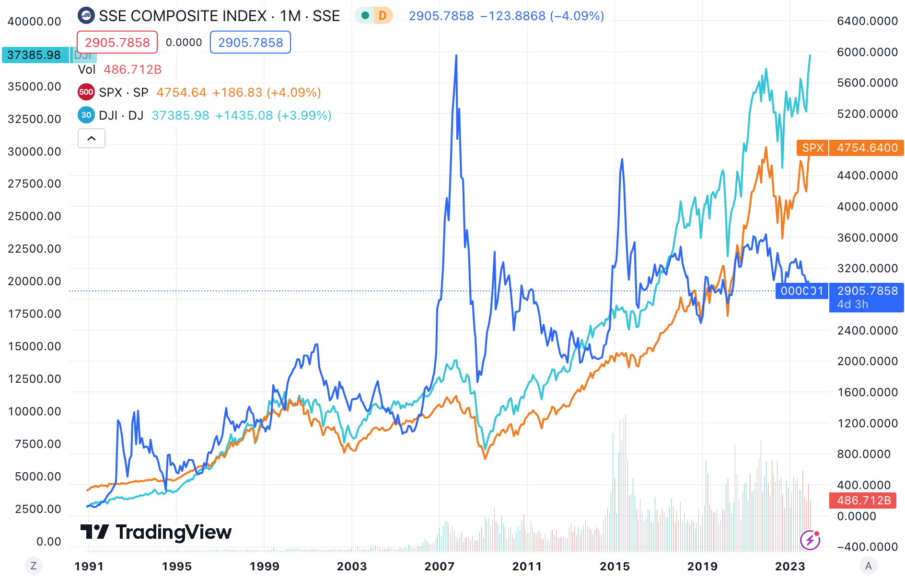
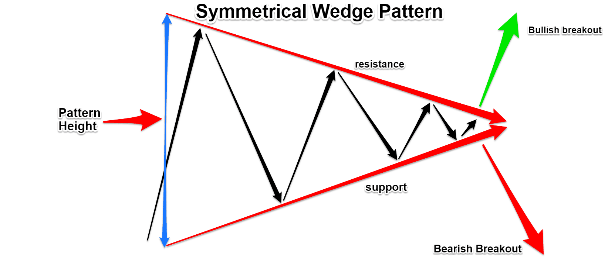
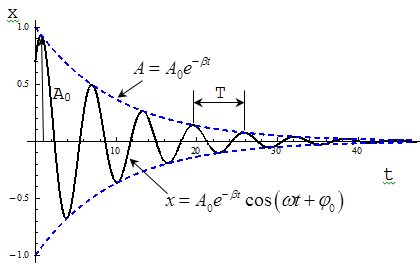

# 上证指数跑赢标普500和道琼斯，真的吗？

号外：教链内参11.24《年度私董会干货总结》

* * *

「如果一项资产价格下跌不足以吸引你购买更多，那么这项资产并不适合你。」—— 刘教链

近日，一篇“为上证指数正名”的文章火爆了股圈。骂声一片，是可以想象到的。

不过，抛开情绪，这篇文章有一个关键技术性错误，和一个不算太错的结论。

先说一个关键的技术性错误。

原文章计算了美国道琼斯工业指数（DJI）自发布日1896.5.26至今127年，从40.94点到37404.35点，涨幅913倍，CAGR（复合年化增长率）5.5%；又计算了美国标普500指数（SPX）自基日1928年至今96年，从10点到4746点，涨幅474倍，CAGR 6.6%；再对比一下咱们大A的上证指数（SSE）自基期1990.12.19至2023.12.21，从100点到2918点，33年涨幅28倍，CAGR 10.8%，于是得出结论：

从CAGR来看，上证指数的增长速度是道琼斯工业指数的2倍，是标普500指数的1.6倍。

大A妥妥跑赢美股大盘。

错误在哪里？期限错配。你不能拿道琼斯127年的CAGR，标普500 96年的CAGR，和上证指数33年的CAGR来交叉比对。

那么需要怎么修正呢？改为同期对比就好啦。

好了，教链把1990.12至今三个指数的图线给拉出来了：

凭直觉一眼看过去，好像SPX和DJI都比SSE跑得快、跑得高。但是且慢，还是仔细计算一下数字为好：

区间起点1990.12.3: SSE 127, SPX 330, DJI 2633

区间终点2023.12.25: SSE 2905 +21.8%, SPX 4754 +13.4%, DJI 37386 +13.2%

很显然，近33年的数据无误地表明，SSE的确跑赢了SPX和DJI。

这是为何文首我们说原文章关于上证指数胜过美股大盘的结论不算太错的原因。

至于其他一些批评原作者的理由，诸如质疑早期指数成分少，或者早期股民很少之类的理由，实属牵强附会，不值一提。

那么，为什么很多A散今年以来尤其是年底这几个月如此不爽呢？这种情绪压力甚至已经外溢到加密圈了。在12.24教链星球私董会上，就有不止一位朋友问教链，是不是可以抛股或者卖基来追饼？

其实能问出这样的问题，本身就说明了一定的问题。

为什么2022年BTC暴降70-80%的时候没有人会问这个问题？为什么2023年BTC翻倍了开始有人问这样的问题了？

比较心和嫉妒心，是诸多A散不爽的短期诱因：自己手里拿着窝头，一看别人在吃泥巴，也不觉得心里苦；转年一看，当年吃泥巴那个居然开始吃龙虾了，再看看自己就雪啃的窝头，心里就开始羊驼奔腾了。

高贵的白头鹰吃大肉，可以忍；不入法眼的饼子吃龙虾，扣上不合法、不道德的帽子，可以装作看不见；可连鄙夷日久的小日子、阿三哥都吃上白米饭，就雪啃窝头的A散就有些忍无可忍了。

主要还是形态惹的祸。

对散户而言，“突破前高”是一个神奇的咒语。突破前高，星辰大海。

回头看，上证指数的历史高点还在16年前的2007年。

当年5、6千点高位进场的A散，又有几个能坚持16年，却能依然面对不到3000点的指数，云淡风轻，坚持加仓？

而反观SPX和DJI，它们的形态就控制得比较好。一路震荡向上，中途没有高耸入云的“凌绝顶”。

从2007到2023，大尺度上，SSE走出了一个很明显的楔形收敛形态。

楔形（Wedge）是技术分析中常见的一种技术形态。常见的有上升楔形和下降楔形。而SSE这个，既不是上升楔形也不是下降楔形，而是接近于对称楔形。

在楔形收敛的尾部，就是变盘的时刻。从图上看起来，这个时刻可能已经不远了。

相比于楔形，教链更喜欢用物理学里面的阻尼震荡（damping）来理解这种形态。

市场波动的本质是空头力量和多头力量的此消彼长，重复博弈。高点是多头的能耐，低点是空头的水平。随着战争的消耗，双方日渐疲惫，便逐步震荡收敛于一个均衡位置。目测图中这个均衡位置大致就是3000点左右。

均衡的达成之时，便是均衡被打破之日。旧周期、旧形态结束，新周期、新形态开始。

突破楔形向上，便是走牛，走牛则必将新均衡拉升至更高的位置。突破楔形向下，便是走熊，走熊则必将新均衡压降至更低的位置。

突破的方向是跨周期的。跨越周期，在更长的尺度上，便是宏观总体运势。

若相信总体运势向上，便逢跌加仓。

若不相信，那就应该反思一下，当初进场是不是投机心作祟。今日之亏损，就是市场对这一投机心的惩罚。有几分投机心，便遭几分惩罚。

剩下的，只有一个字 —— 熬。进场前就应该至少做好熬20-30年的心理准备。

但记得，人生苦短，30年只争朝夕。

