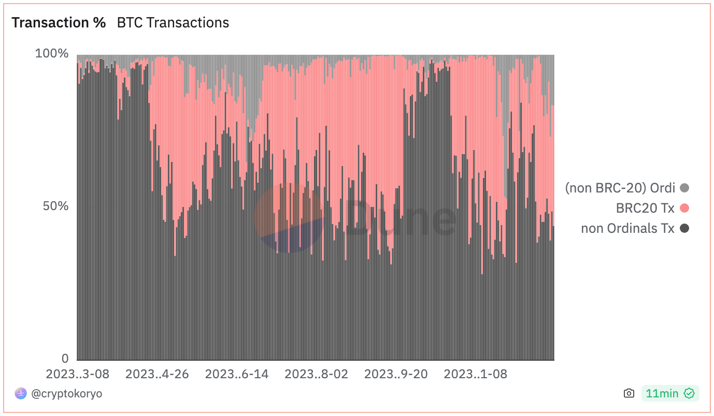
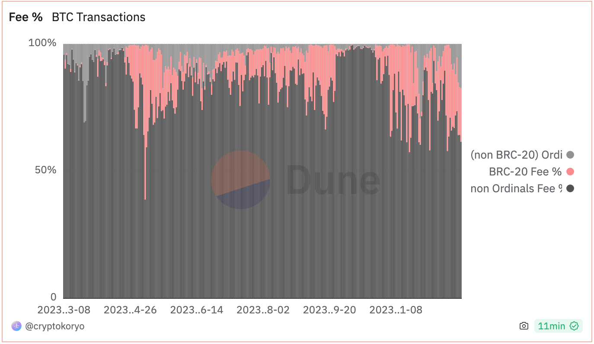

# 铭文杀死比特币

号外：教链内参12.25《铭文火爆会改变BTC叙事，从而导致现货ETF受阻吗？》

* * *

随着圣诞节BTC（比特币）横盘43k，铭文又开启了新一波的狂欢。当BTC拉高横盘时，便会出现资金外溢的轮动效应。此时恰逢欧美假期，行业亦无新热点，主要由华语圈推动的铭文便继续了它的表演，势要让下车的和没上车的韭菜内心FOMO，上车接盘。

此情此景，却不由让人心中生出一丝忧虑。

下面两张图，第一张是铭文在BTC链上交易中的比例，第二张是铭文贡献的手续费收入比例。

可以看到，BTC链上的铭文交易比例已经超过50%，其中BRC20接近35%；而铭文交易贡献的手续费接近40%，其中BRC20超过20%。

由于铭文占用的是隔离见证区域的存储空间，所以它享受的是折扣费率。数据表明，铭文正在用折扣费率，挤占了正常交易的空间，导致正常交易的手续费变得更加昂贵和不可忍受。

更大的危机是，如果任由铭文交易挤占正常的BTC转账交易，那么当铭文交易占据压倒性主导地位之后，BTC就要“变了颜色”：从“电子黄金”和价值存储、价值交换媒介的叙事，悄然演变为“支票簿”和刻录费用（gas fee）的新价值范式。

巴菲特的批评之声言犹在耳。早在2014年时，巴菲特就曾表示：远离比特币，那只是一种幻觉。在我看来，认为它具有巨大内在价值的想法就是一个笑话。对比特币估值就像试图对银行签发的支票进行估值——根本毫无意义。

巴菲特的话有道理的地方在于：如果BTC只是支票簿的价值，而不是支票上面写的美元的价值的话，那么BTC的确可以算是一文不值。

傻子都知道，那张支票的纸并不值几个钱，人们想要的，是支票上面写的美元。

BTC之所以今天如此值钱，高达43000美刀，总市值超过8500亿美刀，超过巴菲特的伯克希尔·哈撒韦公司的市值，并不是因为BTC是一家出售支票簿的公司的价值，而是支票簿上所写的美元数字的价值。

如果，比特币系统自带的这个电子支票簿，也叫做区块链，上面写的不再是BTC，而是各种五花八门的token代币，那么，BTC就将最终沦落为一家出售支票簿的公司。我不知道这样的公司能值几个钱，但很可能会远远低于8500亿美刀。

铭文运动，已经演变为一场将要掘掉比特币价值根基的“颜色革命”。

如果铭文交易的手续费占比继续提升至主导地位，矿工将会完全被收买，成为捍卫这一运动的同盟军。从那一刻起，可能就无力回天了。

价值范式的变化，价值叙事的消失，必将导致BTC估值的严重下降。现货ETF也没有必要上市，因为不可能为一家支票簿公司单立一支ETF基金，机构资本撤出，BTC一落千丈。

BTC老炮手里的资产严重缩水，购买力严重下滑。铭文为何要在BTC生态击鼓传花？看中的不正是老炮们手里价值不菲的BTC接最后一棒么？现在老炮们资产缩水，最后一棒也接不动了。击鼓传花者如鸟兽散，转去其他生态炒作新盘子去了，留下一地鸡毛的BTC风中凌乱。

BTC矿工因为BTC的价格崩溃和投机热钱的离开而严重下滑，入不敷出的矿工只能纷纷关停机器，BTC全网算力大跌，网络安全性大跌。当然，求仁得仁又何怨，支票簿又不是电子黄金，本也不需要那么巨大的算力来维持。价格下跌-算力下跌-估值下跌，死亡螺旋开启。

华尔街和聪明的资本发现，如果比谁是更好的支票簿技术，显然，拥有低碳金融结算层叙事的以太坊，才是天选之子。孙子兵法说，先为不可胜，而待敌之可胜。以太坊，终于等到了比特币堡垒被从自己内部攻破的那一天。以太坊趁势反攻，一举超越比特币。

于是，比特币终成弃子。

铭文杀死了比特币。
