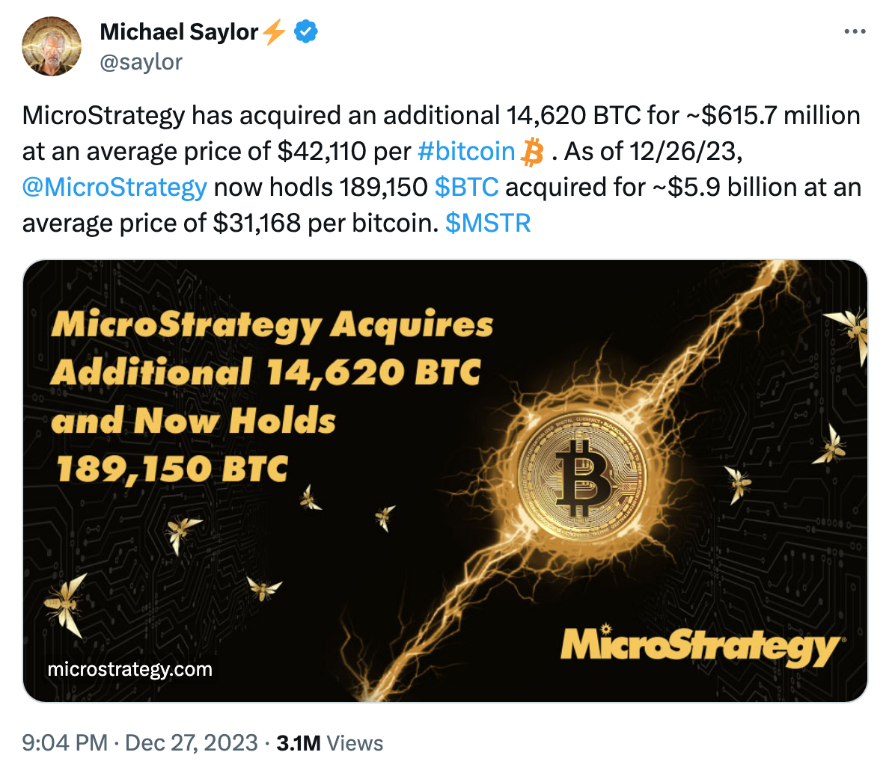
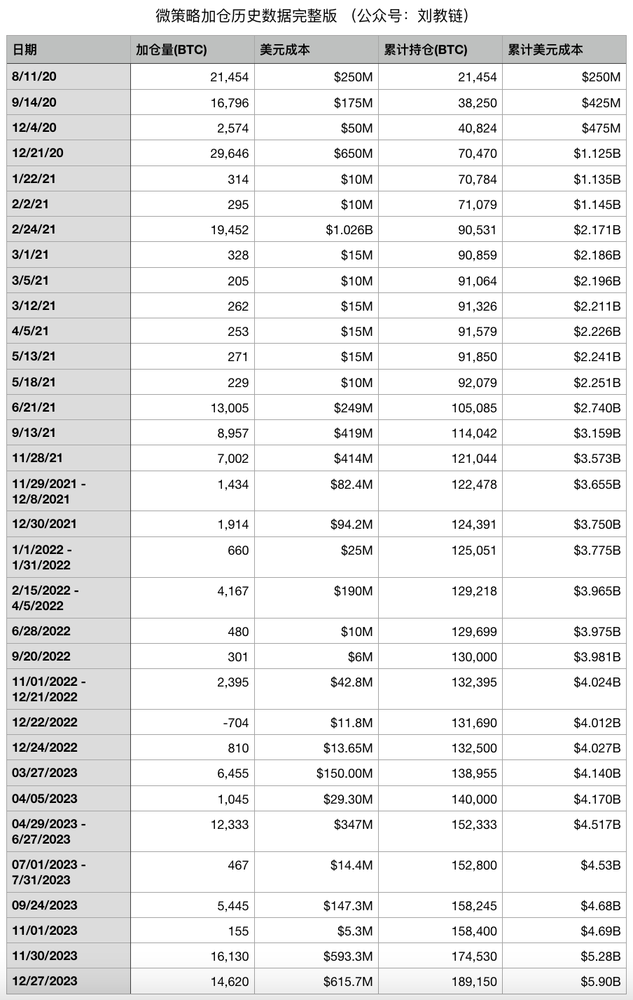

# 已囤积189150枚BTC，微策略的策略会暴雷吗？

号外：教链内参12.27《美元快速下行，黄金再创新高》

* * *

日前，微策略（Microstrategy）创始人Michael Saylor发推称，微策略再次出手，以均价约42110刀再次加仓14620枚BTC。截至2023.12.26，微策略累计已囤积189150枚BTC，总成本约为59亿刀，平均加仓成本约为31168刀。

简单计算可知，按照目前BTC现价约43k计算，微策略的仓位浮盈(43000-31168)/31168 = 38%，净利润约22亿多美刀。

教链整理了一下微策略自2020年8月初至2023年12月底全部加仓历史数据如下：

从2020年底买入第一批BTC以来，微策略持续加仓，穿越牛熊，经过了2021的牛市高点加仓，也经历了2022年底熊市低点加仓，爬过雪山，走过草地，历经艰险，终于初步修成正果。

拉长视角看，牛市的唯一作用，就是拉高了加仓成本。所以对于持续加仓的长线囤积者而言，宽厚的高原牛（2021年那种）和尖尖的高山牛（2017年那种），哪一种才是更好的旅途呢？

有趣的是，微策略的无论牛熊坚持加仓BTC的策略，也是唯一适合于绝大多数小白的加仓策略。参考教链2021.8.21文章《从投资小白到财务自由》。

特别值得注意的是，这个策略的三个基本要点：一、只加不减，只买不卖。二、分批加仓，不梭哈。三、只加BTC，不碰山寨和土狗。

* * *

但是，深入地看，其实微策略还做了一些超出小白的“更专业”的操作。

第一，出借持仓。

Michael Saylor曾经不止一次地说过，微策略将永远持有他们的BTC仓位，永不卖出。

但是，他也曾在2021年底披露过，微策略会把自己的BTC借给对冲基金。

也就是说，微策略自己永不卖币，但是借走BTC的对冲基金可是肯定要卖币的，来回买卖，进行套利。

这就和美国财政部/美联储不会卖出所持有的黄金，但是会把黄金借给JP Morgan这样的投行去黄金市场“做市”类似。

于是这里就有一层额外的风险，就是借走BTC的对冲基金搞砸了，把BTC亏掉了，对冲基金赔付不起破产清算，微策略收不回币本位等量的BTC，就会净亏损BTC的数量。

从长期来看，对冲基金亏币是一个必然事件。这个问题，教链在2021.1.1文章《为什么你的投资跑不赢比特币？》中已经有详细论述。

有些朋友可能会把手里的数字资产放到理财平台去“存币生息”，这就是和微策略做的事情有些类似了。风险点自然也就是理财平台亏损甚至跑路了。

第二，场外杠杆。

微策略在前些年发行过一些长期垃圾债。有一些甚至是不用付息的，而到期日长达数年，多数在2027-2028年左右到期。Michael Saylor坚信，数年后BTC的价格将愈发地高，这将使得微策略足以偿还债务并支付到期收益。

据称，微策略目前共持有约22亿刀债务，而其目前BTC仓位现值就有约81亿刀，也就是每100刀BTC对应27刀债务。这未计入微策略其他业务资产。而这些债务是场外债务，除非在到期日也就是2027-2028年前后BTC跌破11000刀，否则其BTC将足以覆盖这些债务。

但是，如果微策略被迫变卖如此大量的BTC去偿债，对市场将可能会是重重一击。

很多身有房贷的囤饼人可能情况会类似于微策略这种场外杠杆。当然，房贷要月月还息，而且利息率还挺高，而且是浮动的（LPR），比微策略的杠杆要差许多。不过，房贷已经几乎是普通打工人能够运用的最优质的杠杆了。关于这个问题的探讨，教链曾写过一篇《存了50万，还贷还是囤币？》（2023.6.3文章）。

第三，融资加仓。

就在今年前段时间，微策略在美股二级市场增发股票（MSTR），从二级市场融资，用美股股民的钱加仓BTC。受益于BTC今年的行情，有力推动了MSTR股票的上升，使得Michael Saylor得以采用增发股票的方式来融资加仓。

有人质疑如果BTC转入下行，或者MSTR与BTC表现脱钩，微策略是不是会被迫抛售BTC来救市？

但是，要知道股票融资和债券融资的不同点，股票是不承诺偿付的，所以就算MSTR跌到零，微策略都可以不管不顾。当然，不清楚Michael Saylor有没有做股权质押融资，如果有的话，那么股票跌到一定程度会导致股票爆仓，相关的质押股票会被券商清算。但是，券商无法强迫微策略或者Michael Saylor抛售BTC来补充保证金。

2022年灰度持续负溢价已经做出了一定的示范。纵使在最糟糕的时候，GBTC的负溢价一度高达-50%左右，但是灰度依旧岿然不动。当时有很多人FUD市场，称灰度要暴雷。但是，灰度是一个信托，不能被任何追索击穿。不了解的小伙伴可以温习一下教链2023.1.12文章《Gemini撕DCG诉感情被骗，灰度百亿大饼持仓却不会爆雷？》

63万枚BTC的灰度信托，规模是微策略持仓的3倍多。

从法律防火墙的角度说，灰度信托肯定要比微策略更加铜墙铁壁。

但无论如何，即使如有网友说的，比特币现货ETF上市后，抢走了MSTR的用户，导致用户抛售MSTR，那也只不过是美股MSTR下跌，甚至与BTC的相关性脱钩，但是，并不必然会导致微策略被迫抛售BTC持仓。灰度都不承诺GBTC的表现和BTC一致，微策略更不会承诺MSTR的表现永远和BTC一致。

此处就需要提醒部分在美股市场上把MSTR当作比特币ETF持有的朋友，注意脱钩负溢价的风险。

这种玩法，本质上是通过游戏规则，把风险转嫁给了外部投资者。比如，灰度GBTC负溢价，风险被信托防火墙挡在了外面，爆掉了炒作GBTC溢价套利的三箭资本等投机者（参考教链2023.1.13编写的舞台剧《钱花花》）。那么，微策略MSTR也同样可能出现负溢价，而股权融资本身斩断了收益承诺，把风险隔离在了美股市场，由美股投资者为此买单。

对于普通人而言，可能并没有这种无需承诺的融资渠道来获得资金加仓BTC。

第四，场外收入。

别忘了，微策略本身是有业务，也就有业务收入的。它有源源不断的场外现金流来支撑其加仓行为。

当然这一点和大多数普通囤饼人差不多。最好的策略也是场外赚钱，用场外赚到的收入来加仓BTC。

综上所述，可以看到，微策略能够运用一些普通人拿不到，或者比普通人能拿到的更为优质的金融工具，来帮助它更好地囤积BTC，那么，微策略能够跑赢大部分普通囤饼人，也就是一个大概率的事情了。人家赚得超额收益，来自于结构性的优势。

经过分析，微策略可能因为其激进的杠杆策略，而在极端黑天鹅风险时，可能会损失其BTC仓位，导致其跑输币本位，但是，只要BTC还在持续跑赢传统世界，那么微策略大概是很难暴雷的。
