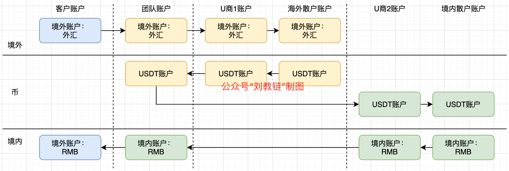

# 赵东团队是如何利用虚拟货币非法买卖外汇的？

号外：教链内参11.27《》

* * *

近日，最高检和外管局联合发布了一系列惩治涉外汇违法犯罪典型案例。其中有两个案例是利用虚拟货币为媒介开展非法买卖外汇的案件。两个案例中的一个就是圈内颇有名气的赵东案。

在该案例中，浙江省杭州市公安局西湖区分局将尤某、赵某等人非法从事资金支付结算业务部分的事实以涉嫌非法经营罪移送起诉。在查办过程中，发现了新的案情，检察机关梳理出赵某团伙聊天记录中与外币兑换相关的成交记录309笔，共计人民币4385万余元。

检方指出，赵某团伙已形成了长期持续的固定模式：在国外收取外币迪拉姆，将人民币转入对方指定的国内收款方账户，之后用迪拉姆购入泰达币，再出售泰达币取得人民币。上述行为表面上是买进、卖出虚拟货币的行为，但实质上利用泰达币为媒介实现了外币和人民币之间的货币价值转换，属于非法买卖外汇，构成非法经营罪。

最高检第四检察厅负责人指出，在我国，虚拟货币不具有与法定货币等同的法律地位，相关业务活动属于非法金融活动。

从检方对案件非法买卖外汇的手法描述中，我们可以梳理出赵东团队利用虚拟货币USDT（即泰达币）开展非法买卖外汇业务的流程图，如下：

赵东团队和三个交易对手方开展业务：

一，与有换汇需求的客户开展非法换汇业务（图中蓝色）。在客户看来，他在海外将外币转给赵东团队，在境内从赵东团队收到RMB，实现了外币换RMB；或者反过来，在境内把RMB转给赵东团队，在海外从赵东团队收到外币，实现了RMB换外币。

只要赵东团队不是通过外管局合法的结汇换汇通道实现上述外币和RMB的双向转换，并从中牟利，那么就会涉嫌构成非法买卖外汇的非法经营罪。

二，与海外的U商1进行外币和USDT的兑换（图中黄色）。这项业务应属于U商1的业务，如果赵东团队自己不做U商的话，那就不属于赵东团队的业务。如果在海外该地区（比如案中的迪拜）此项业务合法，则这个环节是合法的。

如果赵东团队自己兼作U商的话，那么这个外币换USDT的业务，也是赵东团队的业务。如果该业务于所在地合法的话，那么赵东团队在该业务环节的行为属于合法。

三，与境内的U商2进行RMB和USDT的兑换（图中绿色）。这项业务应属于U商2的业务，如果赵东团队自己不做U商，那么就不是他们的业务；否则，如果他们也做这个U商，相当于帮境内散户RMB出入金，那么这环节也是他们团队的业务了。

这个环节就会比较微妙。正如上述最高检相关负责人所指出的，如果把RMB换USDT当成一种营利性的业务去做，那么就属于非法金融活动，会涉嫌非法经营罪。

严格来讲，只有个人对个人的、不以营利为目的的交换行为，不属于商业行为，才不会涉及非法经营的问题。个人作为合法公民，持有和非营利性彼此交换数字资产，是完全合法的。

但是谁会觉得那些包装成个人身份的U商们，就是要做好人好事，买来卖去，只为服务人民群众，而不从中赚一分钱的差价呢？

所以，赵东团队大概在这个环节也碰触到了非法经营罪。事实上，从披露的案情来看，他们甚至和一些跑分平台合作，那问题就更为严重了。

综合来看，赵东团队借助数字货币超国界的特点，通过海外外币转USDT，境内USDT换RMB，帮助客户实现外币转RMB；或者境内RMB换USDT，海外USDT转外币，帮助客户实现RMB转外币，绕过了外汇管制，实现了非法买卖外汇。

