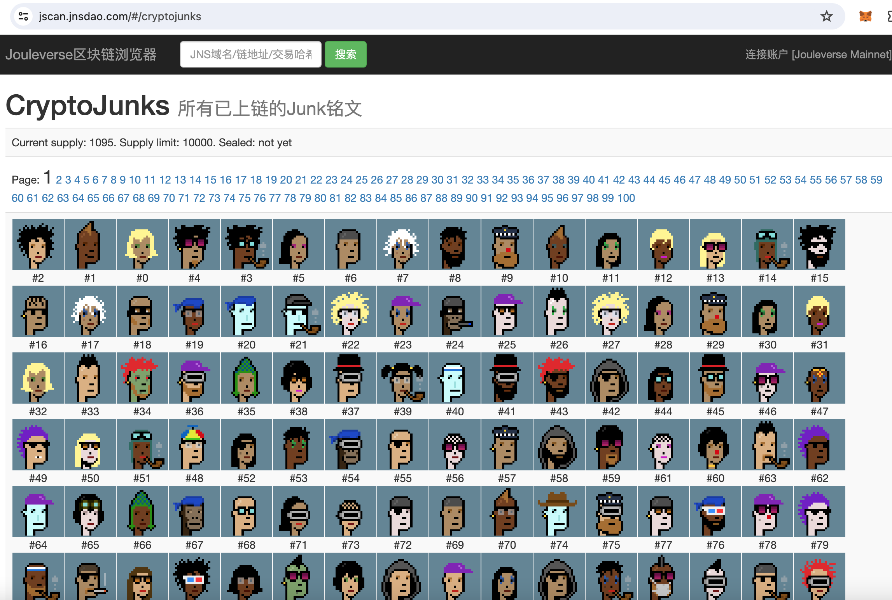

# 铭文是更好的NFT

号外：教链内参12.29《零成本体验打铭文的乐趣》

* * *

如果要给2023年的加密行业选出一个“年度词汇”的话，我觉得可能会是“ETF”或者“铭文”（inscription）。不过，“ETF”实在算不上什么新词汇，而且它本身其实是一个美股市场上的产品，而不是加密市场上的产品 —— ETF是把加密资产包装放到美股市场出售的工具，所以，这个词算不上是加密行业原生词汇。

那么就是“铭文”了。无论如何毁誉参半，铭文这个词，至少已经在华语加密圈席卷起一股时尚风潮，形成了一种文化现象。

哲学家维特根斯坦说过，“语言的界限即是世界的界限。” 同样是数据上链，铭文这个汉语词汇，比NFT这个三字母缩写词，要高明到不知哪里去了。

设想一个圈外人张三。我给他介绍著名作品CryptoPunks。

张三问：这是何物？

我答：这是NFT。

张三问：啥是NFT？

我答：NFT，是Non-Fungible Token的首字母缩写，全称「非同质化通证」。

张三吐血：啥是“非同质化”？啥是“通证”？啥是…… 能说人话不？

如果我换用「铭文」一词的话……

张三问：这是何物？

我答：这是铭文。

张三问：啥是铭文？

我答：永久铭刻、永远铭记的数字艺术品、数字收藏品称之为铭文。

到这里张三就懂了。如果他继续追问，用啥技术实现的。我就可以继续回答他说，用区块链技术。那么至于啥是区块链技术，展开之后就是一个很大的话题了。

与之对应的，相关的动词也相应发生了变化。NFT上链叫mint。铭文上链叫“铭刻”（inscribe），甚至于略显拗口的“铭刻铭文”被更加顺嘴的“打铭文”所取代。

更加朗朗上口的口语化表达，使得铭文得以成为更具渗透力的文化现象，如见面问候，都可以从“吃了么？”变成“今天打铭文了没？”

具有超低认知门槛的可传播性以及超低门槛的可学习性，才会成为复制性超强的模因（Meme）。恰似俗不可耐而又风靡全球的舞蹈《科目三》。

可以说，每一种文化现象的底层驱动力都是模因。

仅仅从语言和词汇的表面上来讲，铭文就比NFT更好，更适合传播，更有杀伤力。

铭文起源于Ordinal协议的作者Casey Rodarmor。他把比特币聪按照一个定义方法人为编上序号，称之为ordinal（序数）。然后把ordinal关联到铭刻在链上的数据，也就是铭文（inscription），这个关联的动作，叫做铭刻（inscribe）。

Casey Rodarmor最初的想法，其实就是用比特币的链去铭刻一些数字艺术品，他称之为digital artifact（数字工艺品）。（参考2023.3.9教链文章《与比特币一同永存》）

只不过，很快，把艺术变成炒币的BRC-20横空出世，以其简单、免费（除gas外无需付费）、公平发射震动了人们麻木已久的神经。（参考2023.5.4教链文章《模因之王BRC-20》）

很快，BRC-20模因币铭文的铭刻就占据了统治性的比例，极大拉高了比特币链的使用成本，并制造了数以万计的碎片交易，引起了开发者的批评。（参考2023.12.26教链文章《铭文杀死比特币》，2023.12.7文章《他想要杀死铭文》）

比特币的链，应当服务好BTC这个资产。而Casey Rodarmor关于数字工艺品「概念直观」、「完整上链」、「永恒不变」的思想，确实抓住了NFT未能解决的痛点。

从NFT到铭文 —— 我指的是作为数字工艺品、数字艺术品、数字收藏品的铭文，无疑是一种进化。虽然，它也许并不适合于铭刻在比特币的链上，而适合放在其他侧链承载。毕竟，铭文藏品的价值，比BTC这个电子黄金更分散而不足，也许不值得浪费比特币链上如此寸土寸金的存储空间。

而就是那样难以解释、充满缺陷的NFT，都在上一个牛市，屡屡登上世界顶级拍卖行。（参考2021.3.12教链文章《6935万美元！佳士得首次拍卖区块链NFT艺术品大获成功》，2021.4.10教链文章《佳士得要拍卖加密朋克NFT》）

教链早自2021年起就多次撰文，表示NFT是一个具有潜力的方向。典型文章比如：

2021.1.28教链文章《NFT的核心精神是数字物品的物理化，而非原子物品的上链》

2021.3.16教链文章《NFT是下一个比特币级别的机会》

2021.3.23教链文章《NFT的真正本质是价值载体》

2021.4.3教链文章《朋克教链：我把自己NFT了》

2021.8.29教链文章《NFT成为社交地位的新符号象征》

2022.3.18文章《无聊猿猴登上巅峰》

一种文化现象可能会流浪，但却很难消亡。

从染色币、counterparty到cryptopunks，从比特币到以太坊；从NFT到铭文，从以太坊又回到比特币；从比特币铭文到万链上铭文齐发 —— 铭文是宣传队，铭文是播种机，把比特币的精神，把数字艺术品、收藏品的思想，播撒到各条链的世界，播撒到人们的心中去。

