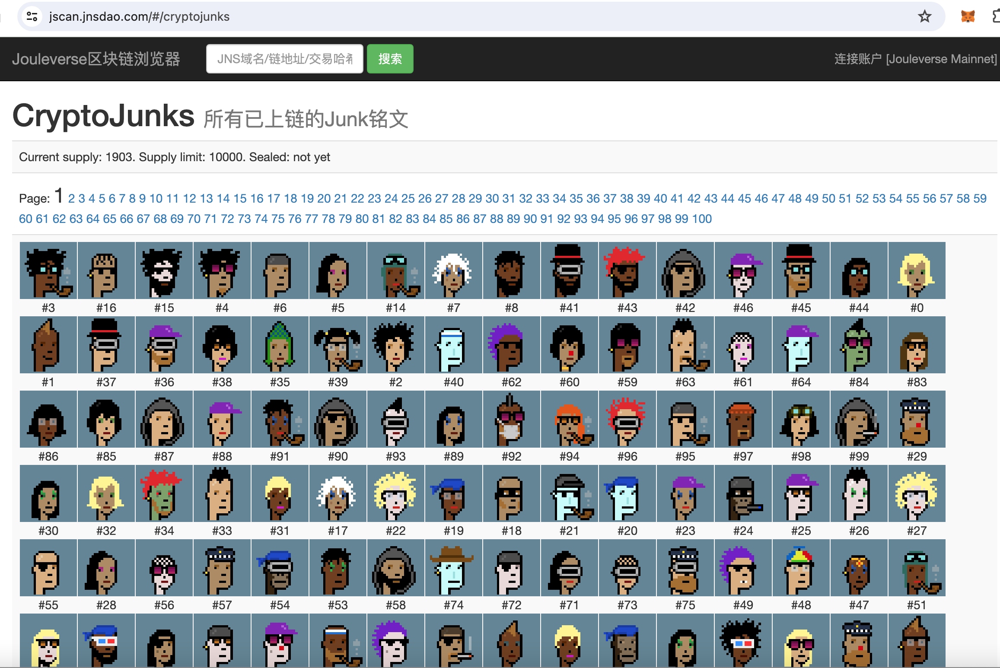
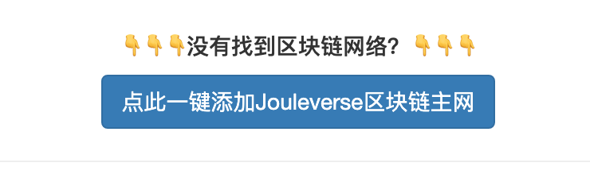

# 小福利：迎元旦，CryptoJunks铭文免费打

号外：教链内参12.30《重仓土狗须谨防洗盘风险》

* * *

不知不觉间，我们已经站在了2023年和2024年的交界点上。2023年的最后一天即将过去，2024年的元旦就要到来。新的一年又要开始啦！

恰如教链内参12.29《零成本体验打铭文的乐趣》中所说的，2023年的加密行业热词当属“铭文”（inscription）。

这个词，也需要拨乱反正。铭文不是模因币，也不应该是模因币。铭文的本意是链上收藏品，是数字艺术品。炒币终将输光，而艺术才能永恒。（参考阅读：教链12.30文章《铭文是更好的NFT》）

铭文也不应该生长于比特币链上。让比特币的链归比特币，让其他链归铭文。让上帝的归上帝，让凯撒的归凯撒。

比特币的全节点们应当采纳Luke Dashjr的补丁，将铭文数据过滤删除，以推动铭文运动向其他链的迁移。其他链，包括比特币的侧链、L2，也包括以太坊及其L2，也包括其他所有公链甚至联盟链和私有链。

加密世界应该只有一个货币，那就是比特币。除了比特币，其他的数字资产都是铭文，是商品，而不是货币。货币，由此而与商品二元对立，产生交换和流动。

比特币的链上只有货币，而没有商品。它是中央银行。其他的铭文链上没有（自己的）货币，而只有商品（注意：gas不是货币）。它们是生产企业。中央银行发行货币。生产企业生产商品。

在这样的未来图景下，比特币一统天下（加密世界），铭文百花齐放。

* * *

于是，CryptoJunks铭文收藏品，便作为一种解构主义的反讽应运而生，恰似当年dogecoin对加密货币文化的解构和反讽一般。对铭文文化的解构是极好的。因为解构，可以祛魅，让人们拨开云雾看清真相。

1. 什么是CryptoJunks？

据我所知，CryptoJunks是把有“NFT界的比特币”之称的著名加密IP CryptoPunks（加密朋克）重铸为铭文藏品的一个运动，是一项集体行为艺术。J是Jouleverse链的首字母，也是gas的单位焦耳。以J取代Punks的P，得名CryptoJunks。其中暗含的文化解构之隐喻，笔者便不再加以点明，留给读者朋友们去细细品味了。

教链只是觉得，嗯，这很朋克！

注：与CryptoPunks图不在链上不同的是，CryptoJunks的图片是完全保存在链上的，也就是“完整的”（integrity）。总量10000个，打满之后就会自动“封闭”（seal），不能再销毁重打，将被永恒固定下来。

2. CryptoJunks的项目方是谁？

这是一个完全符合铭文文化中公平发射精神的所谓项目。其合约代码是headless的（没有owner），一经部署上链，便失去了任何人的控制，去中心化自主运行。任何人都可以自己动手，免费铸造铭文（只需要一点儿上链的gas费用）。谁铸造的铭文归谁全权所有和控制。当然，打坏了也完全是自己的问题，自己负责。因此，可以说CryptoJunks没有所谓的项目方，或者说每一个铸造并持有该铭文的人，人人都是它的项目方。JNS DAO出品了一个打CryptoJunks铭文的小教程，在这里：《CryptoJunks：如何在Jouleverse区块链上打朋克铭文|教程》。

3. 想打，没有gas怎么办？

教链给各位关注刘教链公众号的新老读者准备了一个小小福利：在评论区留言，留下你的链地址（0x开头）；教链个人会送你一点儿gas (J)，大概够打1-2个铭文。通过亲自实践，提高web3动手能力，免费体验一下打铭文的乐趣。

如果还想打更多，或者动手时遇到问题想交流，或者想加入CryptoJunks社区和大家交流，那么请翻到本文下方评论区置顶留言，教链在那里留下了个人微信号，添加教链（备注“铭文”）后，教链会拉你进相关的铭文群。

没有Jouleverse链地址的读者朋友，可以安装小狐狸（MetaMask）App或浏览器插件，在小狐狸的web3环境下打开区块链浏览器（比如 https://jscan.jnsdao.com ），点击首页下方按钮，一键添加Jouleverse区块链主网。添加好网络后，把你小狐狸中的链地址（0x开头）复制粘贴按上述方法告知教链，等待教链送gas即可（等不及就加教链微信）。

* * *

打铭文，应该是快乐的，而不是焦虑的。收藏是快乐的，而炒币是焦虑的。要发扬和传递快乐文化，而不是焦虑文化。

过年过节了，多打几个送给亲朋好友收藏、把玩，可能也是一个不错的主意呢。烟酒伤身，古玩字画又占地方又不好保管，还不能装在手机里出门随时随地掏出来给别人观赏，铭文藏品作为礼物，颇有其独到的价值主张。

亲爱的读者，你还能想出来铭文藏品什么有创意的应用场景吗？欢迎留言互动。
