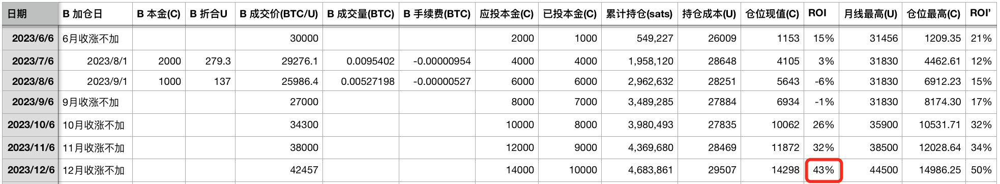

# 教链的2023：写了190余万字，投资收益率143%（十年之约#13）

号外：教链内参12.31《狗庄送出断头铡》

* * *

新年快乐，各位关注刘教链的新老读者朋友们！在2024年的元旦，教链祝大家新年大吉、诸事顺遂！

在经历过2022年底部的再次磨炼之后，2023年跌跌撞撞地终究是走出了一个稳步复苏。一些老朋友掉队了，但更为可喜的是，坚定同行的老朋友们还在。这一年，更是多了很多新朋友，这尤其令人高兴。

教链在2022年就更加深刻地认识到，区块链最重要的不是资本，不是技术，而是人。所以做区块链的事业，就是做好一点，把朋友搞得多多的。区块链的本质，就是人与人之间的生产关系。

从教链的这个理念出发，当今行业之种种乱象，都是魑魅魍魉。比如发币，比如做局，比如喊单，比如收割，这些个“一将功成万骨枯”的做法，本质上都是竭泽而渔、杀鸡取卵、饮鸩止渴，很快就会把自己搞到被收割大众的对立面上去，成为人民公敌。

基于此，教链确立了对行业有所贡献的三条路线：第一，践行以BTC为基石的价值投资。第二，参与到真正去中心化的项目中去，亲自动手，践行去中心化的非雇佣工作模式。第三，持续输出得自于亲身实践的真知灼见，不遗余力地普及知识，和广大读者一起识破假象，去伪存真。

雇佣制是资本主义的发明。它给雇佣者和被雇佣者都带来了束缚和压力，从而导致了资本主义的过度生产，以及对劳动力的过度耗费。2018年教链在高校演讲时，就提出区块链将革除雇佣制的理念。2023年，教链得以初步践行这一理念，摆脱和扬弃雇佣制，探索超越雇佣制的、基于区块链的新型生产关系。

唯心主义哲学、主观主义经济学、资本主义生产关系，三位一体，构成了牢牢捆在打工人身上的枷锁。教链认为，打破这三位一体的“铁三角”，就要借助于划时代的技术工具——区块链。生产力的发展呼唤对旧生产关系的淘汰，这个过程中必然需要并导致对人的解放。对于被解放的渴望，深深埋藏在每个人的心底。只是需要一点儿光，便会唤醒久久压抑这一渴望的灵魂。

教链想弄明白的只有一个问题：这光是什么？

而得到正确答案的最好、最快也是必须的办法就只有一个，那便是实践。知从行中得，行是知之始。

教链左手写文章，右手写代码。努力做这行业写文章的里面最会写代码的，写代码的里面文章写得最好的。这便胜在一个“文武双全”，哈哈。

密码朋克的老前辈Eric Hughes在1993年《密码朋克宣言》里就指出：「密码朋克写代码。」故文不可疏，而武不可弛。

作为Jouleverse的一个节点，教链为其核心及生态贡献了一些代码。2023这一年编写的部分代码包括：链上治理工具；nostr加V上链；包裹资产合约；escrow合约；多签钱包合约；节点部署包；NFT合约；合约工具；以及相关的UIUE，等等。年底，教链又自掏腰包，送读者gas免费打铭文，迎新年，庆元旦，传递快乐，为生态发展贡献自己的绵薄之力（参考阅读教链12.31文章《小福利：迎元旦，CryptoJunks铭文免费打》活动还在持续进行，点击查看详情）。

同时，作为一个冲浪多年的加密投资者，教链的主力仓位在2023年也恢复了元气。按2023年度收盘价计算，综合收益率143%，其中BTC 175%，ETH -10%，UNI -33%。5年CAGR 19.4%，其中BTC CAGR 22.4%。另有零成本小仓位的L2 ARB（Arbitrum）、OP（Optimism）以及Memecoin SHIB（Shiba Inu）。（风险提示：不构成任何投资建议）

在6月份，教链启动了一个公开实盘见证，叫做“十年之约”（参考教链6.7文章《八字诀·十年之约》），迎接BTC的下一个十五年大周期。目前该实盘收益率43%。今天应该是12月B份加仓点，按八字诀12月收涨不加。见下图。

投资之余，教链笔耕不辍。2023年一年，公众号发表约113.5万字，星球内参发表约75.7万字，年终报告约2万字，几项加和，总计约190多万字。

记得2021年教链曾说，要用十年写1000万字。按照目前这个速度来看，大概率用不了十年就能实现目标。

分享，就是一个随缘。千里有缘来相会，无缘对面不相逢。我没有什么助人情节，不荐币、不带单，也希望诸位读者不要把分享当成建议，高兴就看，不喜不阅，自己判断，自己负责，这样大家都彼此轻松。

其实2023年一年过去，最高兴的还是朋友又多起来了。自我清心寡欲，无拘无束，解放了生产力，提高了效率，心想事成，乐在其中，生活充实，财富增长，脚踏实地，工作和生活取得了更好的平衡，各个方面都在向着心中的目标进步，自然万物，生机勃勃。

2024年，一定会更好。也祝各位朋友，越来越好！
