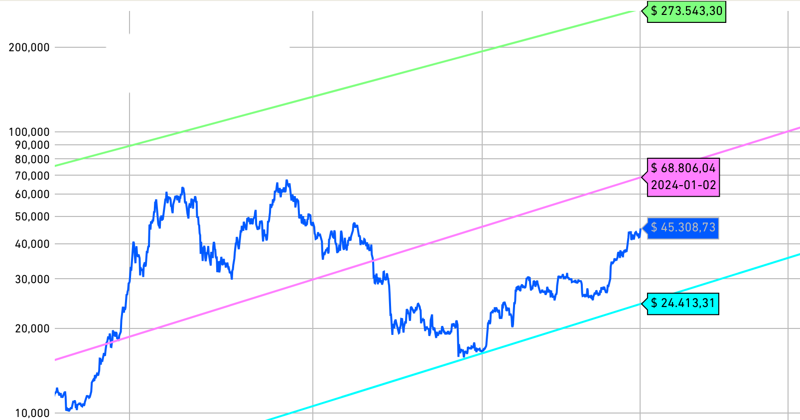

# 大饼突破4万5

号外：教链内参1.1《二级操作的本质：与大众为敌》。《教链内参2023年12月合订本》已做好。

CryptoJunks铭文免费打活动仍在进行中，目前进度：3877 / 10000，【点击此处免费领gas】。

* * *

隔夜大饼（BTC）迎来开门红，从MA30 42.5k附近骤升至突破45k，给元旦假期后开工的人们送上了新一年的开工利是。

不得不说，这很东方。ETF的事情，SEC那边没有什么口风，贝莱德们也是守口如瓶。这预期就还是高涨了。

有的人，还在空仓苦等两万刀的大饼。只可惜，两万一去不复返，白云千载空悠悠。

要知道，就连双对数价格走廊的“铁底”，都已经提升到接近两万五了。

目前45k的位置，已经回到了2022年3月份，LUNA宣布增发买大饼，回光返照，拉盘所致的局部高位（2个月后，LUNA/UST暴雷）。那一次对45k确认阻力位之后，BTC迅速暴跌至20k。

就在2022年3月28日，教链在文章《比特币突破45000刀》中写道：

「无论黑夜多么漫长，终有结束的时候，到那个时候，“太阳还会升起”。只要你我心中有此信念，我们就能身处黑夜而无所畏惧。无所畏惧，故而能坚持逢跌加仓。」

从45k，到16k，再回到45k，1年零8个月，这一段优美的U形曲线，是囤饼人逢跌加仓八字诀摊低成本的良机，也是送走很多意志不坚之人的万人坑谷。

现在45k的这个位置，也是2021年9月份，经历了“519”崩盘和底部wyckoff积累后，第一次反弹回调的支撑确认点。那一次对45k确认支撑位之后，BTC迅速拉升至65k。

教链在2021年9月21日文章《大饼打折，中秋快乐》中，忠实地记录了当时市场、宏观、情绪、以及心态。当时教链在文章中写道：

「一切的结局，都早已写在了开头。」

2年零3个月，大饼跑了个折返跑，很多人的仓位，却没了。

这一轮的大饼，温柔似水。它没有像2017-2018年那样走出一根穿云剑，而是在2-6万之间反复震荡。2021-2023，一轮大横盘，给了入场者三年时间从容建仓。而在45k下方的时间点，显然是多于在45k上方的时间点的 —— 也就意味着，八字诀，大概率是盈利的。（参考阅读教链2021.7.22文章《菜鸟入门：八字诀买买提比特币》）

而很多人，却辜负了年华，辜负了大饼。

于是就不妨常常回顾回顾，《比特币从不辜负每一个不辜负它的人》（视频版）。

