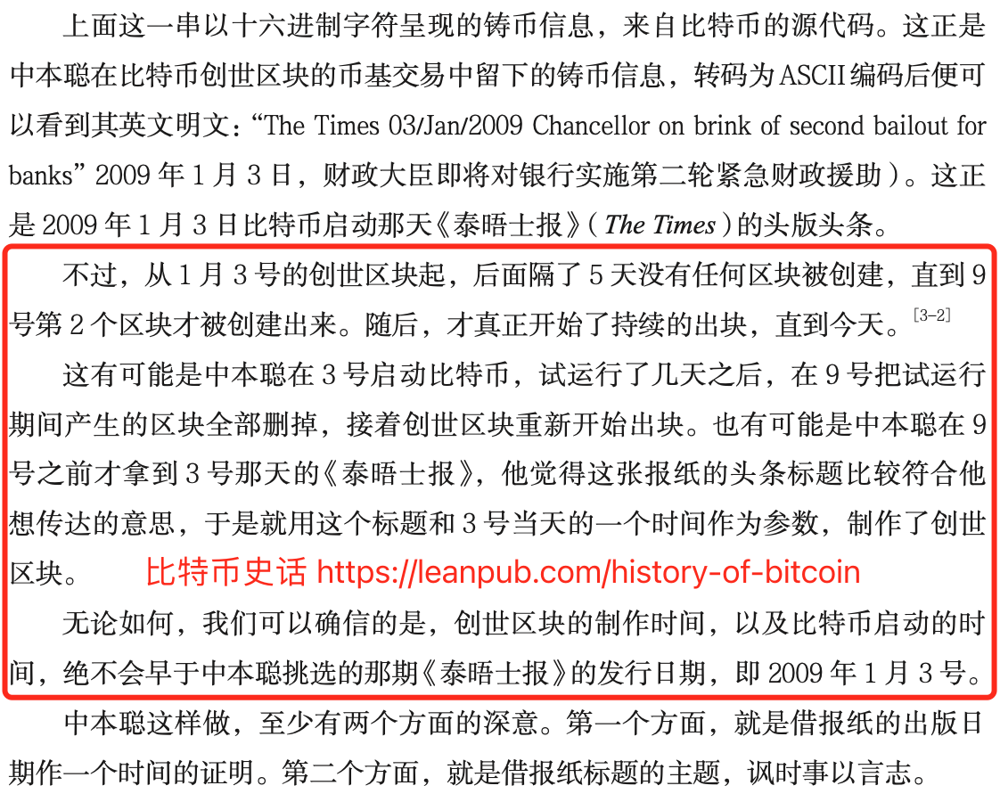

# 比特币因珍贵而有用

今天是2024年1月3号，比特币15周岁整的日子。让我们先祝比特币15周岁生日快乐！

媒体上常规的故事讲法是，15年前，2009年的1月3号，中本聪在芬兰赫尔辛基的服务器上启动了比特币。

不过，据教链的考证，其实事实真相更有可能是，中本聪在那一年的3号到9号之间拿到了1月3日的泰晤士报，试运行了几天之后，9号正式启动了比特币。

上图出自刘教链《比特币史话》第3话《泰晤士报》https://leanpub.com/history-of-bitcoin

但是，无论如何，中本聪选择了1月3日那张泰晤士报的出版日作为创世区块（Genesis Block）的时间戳，因此，人们也就把2009年1月3日作为了比特币诞生日。

15年，真的是弹指一挥间。

今天，比特币从一文不值，已经成长为一个具有8862亿美元市值的、超越马斯克的特斯拉公司以及巴菲特的伯克希尔·哈撒韦公司市值、跻身全球十大资产行列的、独具一格的全球资产了。

今天，比特币ETF通过在即，全球资管巨头如贝莱德、富达等都已经纷纷入局，向美证交会SEC提交了比特币ETF的申请书。

有人却仍然还在观望，质疑，嘲讽。从看不见，到看不懂，到看不起，最后就只能是跟不上。

比特币是试金石。刘教链在2021.1.10文章《断币识人》中写道，「对待比特币的方式，便足以刻画一个人的本质。」「一个执币人的比特币持有史，便是其最强的人格折射。没有什么可以掩盖这种光芒，也没有什么可以伪装这种光芒。这是一个人真实个性的最佳写照。」「对每一个执币人而言，这个世界上只有两种人，一种是持有比特币的人，另一种则是没有比特币的人。对于后者，我们秒识别出这些人还不是合格的伙伴。」

如果一个财经大V到今天这个时候，还在红口白牙、颠倒黑白地告诫你远离比特币，不管他是搬出阴谋论，还是意识形态大棒，这样的大V，奉劝你早日远离。毕竟，天天朝自己脑子里灌低智、弱智和反智的浆糊，脑子早晚也会变成浆糊。

比特币桃李不言，行无言之教。它教给了我们太多太多东西，无时无刻不在深深的冲击着我们的观念，震动着我们的心灵。

与之切磋日久，便在潜移默化之间，提高了我们的思维层次和认知水平。

且举一例。比如，众所周知，比特币的获得必须通过PoW工作量证明，耗费算力，也就是计算机硬件以及电力能量。即便是在比特币还百无一用的早期（当然，直到今天可能仍有很多人觉得它毫无用处），每个人也都需要通过付出这般的代价来获得它。

比特币教给了我们有关“珍贵”和“有用”的道理。

珍贵的迟早会有用，但是有用的却不一定珍贵。

化学元素周期表，几百种元素。很多在它们被发现的时候，根本没人知道这玩意儿有啥用处。比如稀土元素在工业革命前没啥价值，但是科学技术一旦发展了，这些珍稀的元素就有了大用处。

而馒头和空气，对我们人类十分有用，不可或缺，但却不会有谁认为它们十分珍贵。

传统行业，包括传统互联网（所谓web2），做事情的出发点都是“有用”，所以互联网讲的最多的是“用户需求”、“应用场景”。我只要做出来有用的东西，卖给用户，就可以赚钱啦。

比特币，包括区块链（所谓web3），出发点却是“珍贵”。也许现在没人知道这东西有啥用，但是关键在于要让人付出代价（且无法作弊）才能获得，由此而使人珍惜、珍视它。

物品会因珍贵而有用，但未必会因有用而珍贵。区块链不同于传统行业、传统互联网的地方恰恰就在于这个逻辑的不同。

逻辑不同，因此思维和方法论就完全不同。出发点不同，因此做事的顺序也就完全不同。

从根本上讲，因为人是具有主观能动性的。他们会自动自发地为珍贵的拥有物寻找用处。

所以，什么是价值的来源？

主观价值论说是需求，而劳动价值论说是劳动。这一经济哲学也可以归于对“有用”和“珍贵”的辨析：

使用场景决定了对“有用”的感觉，获得的代价决定了对“珍贵”的感觉。

教链在早年从事互联网的时候，曾痴迷于主观价值论，把一本《人的行为》翻来覆去看了五六遍。但当教链与比特币切磋，深入区块链实践之后，却越来越认识到劳动价值论的厉害，开始把《资本论》反复研读。

《资本论》说的明明白白，生产力的提高会造成价值的下降。越高效，价值越小。比特币PoW效率很低，所以，价值很大。其他的链都在追求更高的效率，那么它们其实是在追求更低的价值。（题外话：AI同理。）

如果这样抽象的讲，你会觉得反常识的话。那么教链可以用最近送gas打铭文的例子来说明一下。（参考阅读刘教链2023.12.31文章《小福利：迎元旦，CryptoJunks铭文免费打》）

这10000个铭文藏品，有几种打法：

第一种，效率最高的。写个爬虫，把10000个头像下载下来。然后写个脚本，几个小时就能全部上链打完。分毫不差，快速高效。

第二种，效率居中。把头像下载好，编码生成好。再开发一个“一键开打”的网页，让人只需要点点按钮就快速完成了上链。由于人做的动作很少，不需要人工输入，所以几乎不会打错数据。

第三种，效率最低。只有一个链上合约，其他的都需要用户自己动手完成。需要手动下载头像图片，需要手动用encode工具编码，需要手动复制粘贴到合约交互工具里，需要手动核对输入正确，需要手动完成钱包安装、添加网络，需要手动发地址索取gas，需要手动和合约交互完成上链。这一套动作下来，时间不短，辛苦不说，还有一定概率会打错、打坏。

以上三种情况打完10000个，哪一种方法得到的结果价值最高呢？我想这是不言而喻的吧。

从“有用”的思维出发，这图片打上链，有啥用处？想破脑袋也想不明白。但是换个角度，从“珍贵”的思维出发，自己劳动汗水的结晶，被区块链铭刻，属于自己的铭文藏品，不可再造，每次翻出来看看，心里就美滋滋。“重要的不是图片，重要的是这我亲手打的。” 理性是有限的，而感觉不会骗人。这便是王阳明说的“内心光明”。

试想，如果中本聪2009年1月份，直接在代码里发行出来2100万个比特币，那么比特币到今天价值几何？

中本聪偏不。他就是要让全世界这么多人都被调动起来，耗费那么多人力物力、能源土地，还要花上一百多年的时间（大约到2140年），才能把这2100万个比特币全部生产出来。

效率不可谓不低。

价值才不可谓不高。

你说不用PoW，用其他方法，比如设定规则的方法，也可以人为制造出限量和稀缺呀？但是人定的规则，人就可以打破。中本聪不相信，人能够在巨大利益诱惑面前守住底线。不是他不愿意相信人，而是他不能够相信人。毕竟，中本聪在比特币白皮书里就如此写道：「我们需要的是一个基于密码学证明而非（对人的）信任的电子支付系统」。

只有充分昂贵的代价，才让人足以信服，比特币的珍贵。

只有比特币足够的珍贵，它才会被人们不断发掘和发现其有用之处。

比特币因珍贵而有用。

