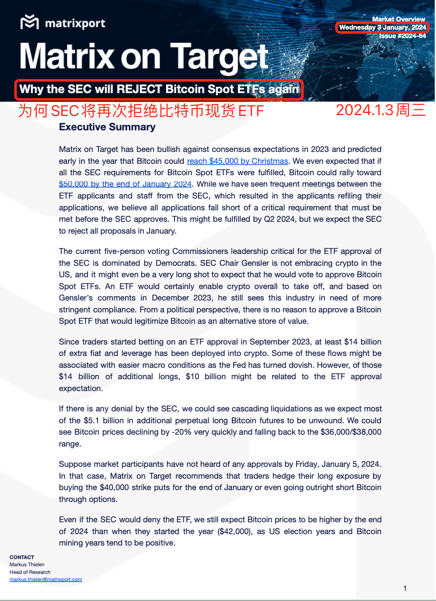
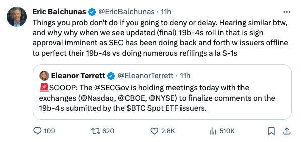

# 昨夜爆多急如雨，飞流直下三千尺

号外：教链内参1.3《该如何计划减持》

* * *

昨晚8点，从傍晚6时就开始脱离45k横盘阵地的BTC，到达了向下跌落的最快加速度。短短2个小时，便从45k插针到接近40k。

看那三千尺，飞流直下的，不是银河，而是血色。

猝不及防的多头被打的溃不成军，仓皇之间，手忙脚乱地组织力量进行反击。

正有在控盘拉升中途的山寨（如MKR、ARB等），做市商没想到空头会忽然呼叫远程火力饱和式打击，一时之间守军全部覆灭，做市深度被瞬间击穿，形成了长长的下影线（俗称插针）。

这多头正在阵地上吃着火锅唱着歌，坐等己方强援SEC 10号到场，打出一波「新年攻势」，送空头去如来佛祖那里过年，却没想到空头不讲武德，提前出手偷袭，派出曾经硬分叉BTC失败的原矿霸吴忌寒掌舵的新公司送上了远火覆盖，两个小时就把阵地上的多头全部送去吃席。

你没有看错，公开出来的报告只有这么一页短短的“执行摘要”（附加一页免责声明），而且是英文的。

写的是英文摘要，却在华语市场搅动风云。这就是远火打击的精髓。

从炮制、放出英文摘要，到行业中文媒体和KOL、大V联动，纷纷翻译、转发、推送，配合操盘手出货，消息和砸盘，几乎是同一时间，像瓢泼大雨一般，倾泻如注。雨水刹那饱和充满每一寸空间，地面瞬间水流成河。

比远火更迷的是，身为老板的吴忌寒居然亲自站出来公开讲，俺们的分析师是独立的，不受管理层约束和影响。言下之意，他们的分析师可以随意公开发表各种观点，利用公司的影响力影响市场（也许还能“恰巧”配合某些操盘手一通翻云覆雨），公司却不为他们造成的后果负责。

这就和一个包养者在公开的镜头前面大讲被包养者的人格独立一样魔幻了。

吴忌寒折戟BCH、黯然离开比特大陆之后成立的Matrixport，一直以来在行业内默默无闻，经此一役，也算是制造了巨大的声量。让韭菜们亏钱亏到刻骨铭心，也就在心底记住了它的名号！

Matrixport的核心观点很简单、清晰：

一、这都快到1月份的截止日了，SEC还在频繁地找申请者们开会，那肯定是申请还有需要修改的关键问题。这个问题不改，SEC很难办。短期肯定是来不及了。估计1月份这次要全拒掉，等2季度再批。

二、SEC的投票委员会5个人，民主党占多数（3:2）。SEC主席Gary Gensler并不支持加密货币。他12月份还在重申，加密行业需要更严格的监管。从政治角度看，没必要批准这么一个产品，这会让BTC成为一种合法的价值存储替代品。

三、从去年9月份押注ETF获批以来，流入加密市场的资金和杠杆有至少140亿美刀之多，刨除一部分押注美联储降息的，至少还有100亿美刀是押注ETF获批。如果ETF被拒绝，估计有51亿美刀的杠杆会被清算。这会让BTC迅速跌落20%，回到36k-38k一线。

四、建议投资者买入1月底40k put以对冲多头仓位，甚至使用期权工具做空BTC。

五、长期来看，即便SEC拒绝ETF，仍然认为2024年底BTC将有望超过年初开盘价42k。

（风险提示：以上五点为Matrixport报告观点，不代表本文作者观点，也不构成任何投资建议）

看起来，说得还是挺有鼻子有眼的。只不过，硬伤也很明显，即推理的全部起点皆是基于猜测：看他们频繁开会，估计是有问题没商量好呢吧？

很快，Bloomberg分析师迎战，发推表示，频繁会商是为了快速完善材料，而不是有关键分歧没谈妥。

此刻，已是东八区子时。

市场短时回升到43k。并在此处重新建立了震荡区间。

这真是：

操盘叟，喊单狗，翻云覆雨咸湿手。江湖恶，欢情薄。一篇猜测，爆仓几何。错、错、错。

