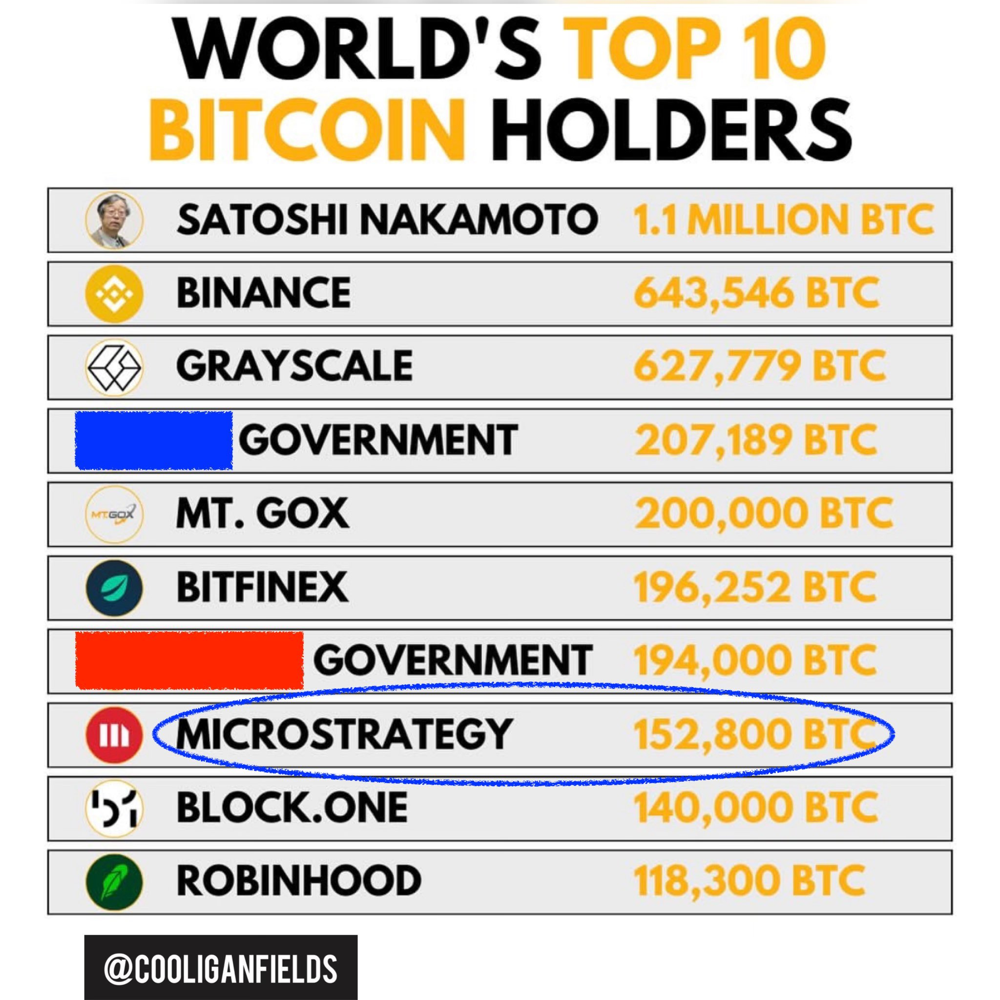
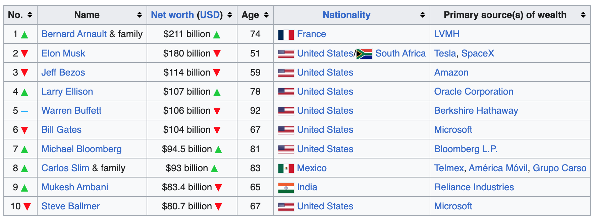
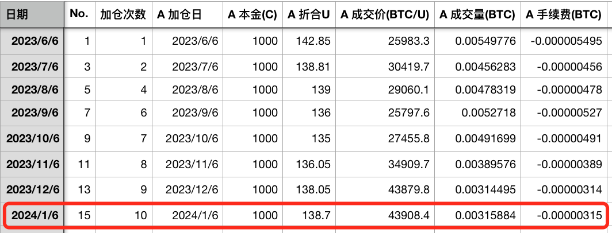
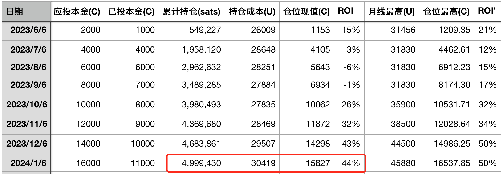

# 如果BTC达到100万刀（十年之约#15）

号外：教链内参1.5《发行人透露SEC下周批准ETF，真的吗？》

* * *

在目前活跃的BTC市场领导者中，当属方舟基金（Ark Invest）的木头姐（Cathie Wood）给出的目标最为大胆：2030年BTC 138w美刀。（参考教链2023.10.15文章《方舟基金预测2030年BTC或达最高148w美刀》）

四舍五入取个整，就是1 BTC = 100w刀。

木头姐的论证，是偏向于基本面的方法。列举了可能的可触达市场，并逐一估算规模和渗透率。然后各项相加，得出相对科学的估计结果。这种方法比较符合科学主义的审美观。思维范式比较偏向于由外而内的，更侧重于外因。

而与之相反的一种方法，则是纯技术面的分析。从历史价格中寻找规律，并相信未来会重复这个规律。典型的比如教链曾多次介绍的，双对数价格走廊模型。根据该模型，BTC中性地达到100w刀的时间是2032年10月，而鲁棒地达到100w刀的时间则是2037年4月。这种就比较由内而外，更侧重内因。（参考教链2021.7.24文章《比特币的价格走廊》，教链内参2023.12.24《年度私董会干货总结》）

其实还有与上述两种都不同的方法，来估计BTC达到某个高度的可能性。这办法就是：人心的称量。

这个办法不需要你去调研，了解其他人的心里是怎么称量BTC的。而只需要反求诸己，扪心自问一下，如果BTC达到100w刀，各方各面的人或机构是否衬得上。

咱们有个哲学，德须配位。

假设你现在持有X枚BTC。那么便不妨在心里设想一下，如果BTC达到100w刀，自己现在的各方各面，能否配得上持有X百万刀的财富。

如果有难度，那么往前走只有三种可能：

一、BTC达不到100w刀。

二、BTC达到了100w刀，但你手里的BTC数量减少了，从X减小到了(X - y)，从而使得(X - y) x 100w刀就是一个你配得起的财富。

三、你持续修炼，和BTC一起快速成长，待到BTC 100w刀时，你已经成长到配得起X百万刀的财富了。

我们还可以把一些打明牌的典型囤饼者拉出来，称量称量。

注：图中数据并非最新

比如号称永不卖饼的微策略创始人Michael Saylor。在他的领导下，微策略目前囤积了大约18.9万枚BTC，当前总价值约为43k x 18.9w ~= 81亿刀。（参考教链2023.12.28文章《已囤积189150枚BTC，微策略的策略会暴雷吗？》）

如果BTC增长到了100w刀，那么这一仓位的总价值将上升到惊人的1890亿美刀。大概相当于中国移动或者阿里巴巴目前的市值，在全球资产排行榜里能够排到70名以上。

其实不算太惊人。美股第一名苹果的市值那可是13.795万亿刀。

即便BTC增长到Hal Finney早年曾设想过的1000w刀，微策略的仓位价值也不过区区1.89万亿刀而已，仅相当于苹果的十分之一强。但足以跻身前五，超越谷歌。

有趣的是，微策略公司的美股溢价几乎很小，公司总市值基本和它持有的BTC总价值相当。目前微策略美股总市值也只有86.3亿刀而已，比BTC持仓价值的81亿刀仅多了5亿刀。

所以，别说100w刀的BTC，就是1000w刀的BTC，看起来都不算太离谱。

另外一个案例是Winklevoss兄弟。这俩哥们就是那个和Facebook的扎克伯格打官司赢了6500w美刀赔偿的，他们牛逼的地方在于，拿到赔偿后，发现了当时仅有100刀左右的BTC，于是果断大手笔买入，前后花了1100w刀，据信买入了大概1%也就是约21万枚BTC（非明牌，无法精确得知其具体持仓数量）。

这个规模和微策略的持仓量半斤八两。你可以参考上述测试，掂量掂量这俩兄弟是否配得上这泼天富贵。

最后，我们以早已隐退江湖的聪哥——中本聪的持仓再来衡量一下。据后人根据链上开采模式分析，推测大约有110w枚BTC乃是中本聪开采。他将其留在那里，岿然不动，矗立成一座精神丰碑。（参考刘教链2022.9.30文章《中本聪的传奇宝藏》）

这110w枚BTC，按照当前44k左右的现价计算，约相当于484亿刀。

根据维基百科，现在世界首富是卖LV包包的Bernald Arnault家族，约为2110亿美刀。紧随其后就是特斯拉的老板Elon Musk，1800亿美刀。第10名是微软的联合创始人Steve Ballmer，800亿美刀。

中本聪的传奇宝藏，也仅仅相当于鲍尔默的一半多点儿而已。

如果BTC 100w刀，那么中本聪留下的这份财富将价值1.1万亿美刀。如果这份财富属于中本聪个人，那么这将使他成为地球上最富有的人，身价将会是当今世界首富的5倍。

如果BTC 1000w刀呢，那么这笔财富将价值11万亿美刀，比肩苹果公司——当今地球上最成功的科技公司的市值。

所以，为什么中本聪从一开始就明白，自己必须隐退，也必然隐退。因为今天的世界，不容许任何一个个人，独立担起如此巨大的财富重担。

只有一个没有历史、没有过去、也没有未来的拟人的化名、代号，一个留在人们心中的传奇，一个不具有现实存在性、也无法被打倒的“神”，才能无惧这可敌一国的富贵加身。

人人都是中本聪。

今天又到了《十年之约》实盘见证的加仓点。本次是第15次记录，第10次加仓。以市价单无压力加仓。加仓价43908.4刀。

加仓后，累计持仓约500w聪（sats）。持仓成本30419刀。浮盈44%。

向上走，总归是轻松的。越走天越亮，谁都会有信心。

