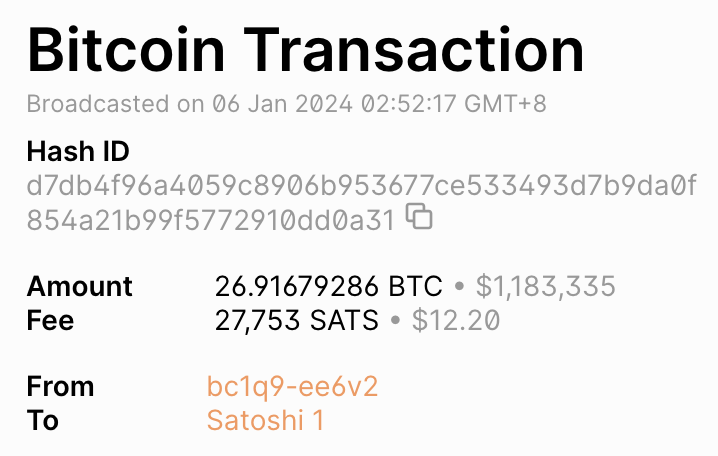
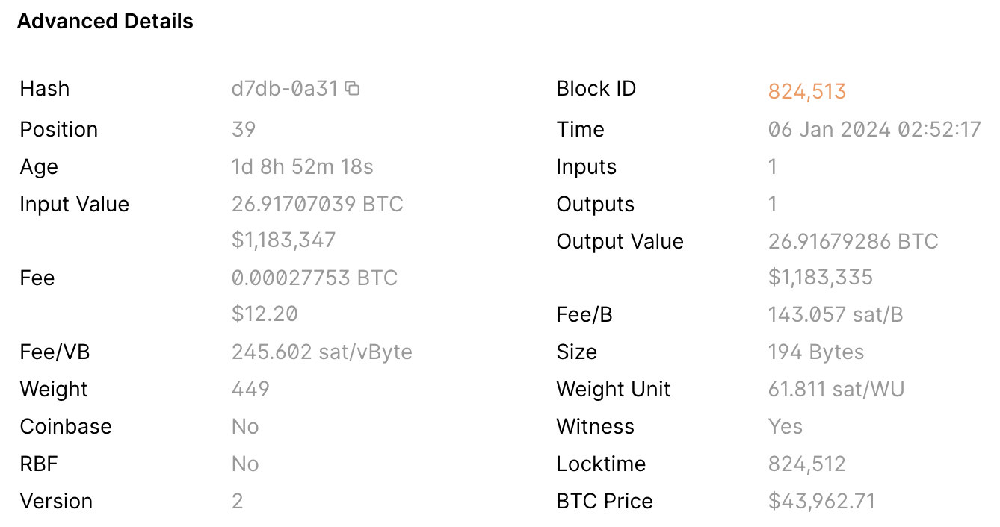
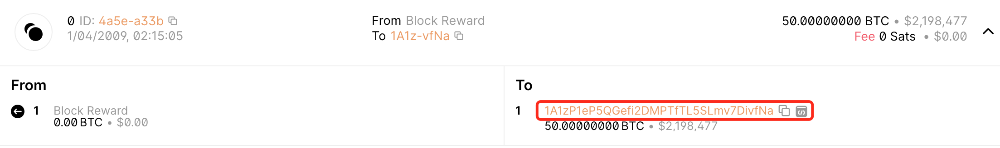
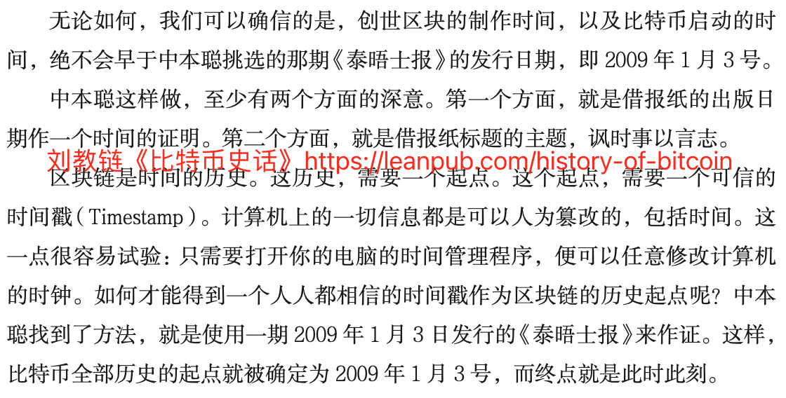
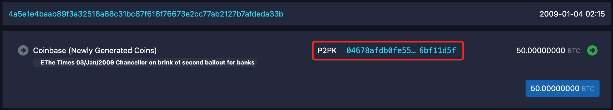
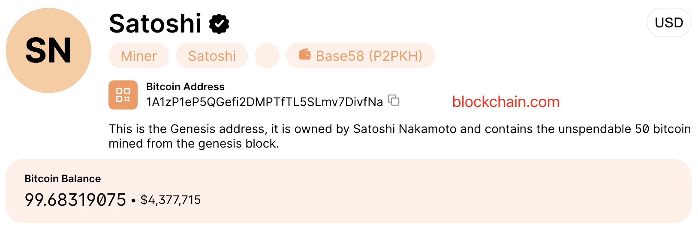
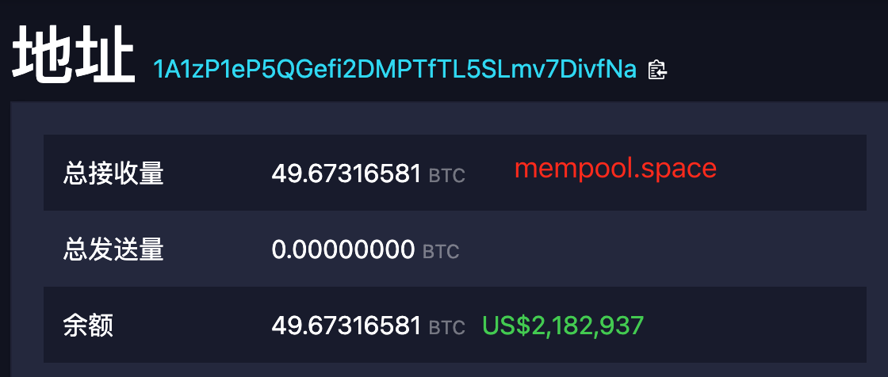
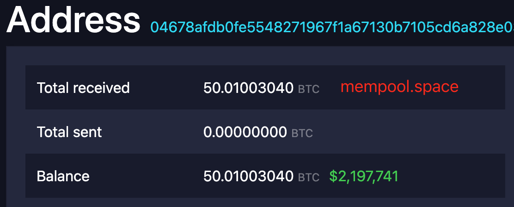

# 中本聪收到26.9+ BTC的大额赞赏

号外：教链内参1.6《贝莱德称其BTC现货ETF将于下周三获批》

* * *

昨天，地址 bc1q9z82prqdknpv4ku3haargeu7c0h67yrpree6v2 成功引起了人们的注意。

原因是它给中本聪的比特币地址“赞赏”了26.91679286 BTC。一笔时价折合100多万美刀的打赏！

交易哈希值是d7db4f96a4059c8906b953677ce533493d7b9da0f854a21b99f5772910dd0a31。交易时间戳是1704480737 (Fri Jan 05 2024 18:52:17 GMT+0000, Sat Jan 06 2024 02:52:17 GMT+0800)。

这个bc1q9z82开头的地址，据了解是Binance平台的提币地址。

那么，我们是如何确信他赞赏的对象是中本聪呢？

因为交易转账的接收地址是著名的 1A1zP1eP5QGefi2DMPTfTL5SLmv7DivfNa。

这个地址，正是著名的比特币创世区块，即区块0中的第一笔币基交易（铸币交易）的目标地址。

币基交易的时间戳为1231006505 (Sat Jan 03 2009 18:15:05 GMT+0000, Sun Jan 04 2009 02:15:05 GMT+0800)。

这是人类历史上第一笔铸造出来的50个BTC。2009年1月3号格林威治时间下午6点15分。让我们永远记住这个日子。

为了让人们铭记比特币创世的日子，中本聪特意在创世区块的这笔币基交易中，永久刻入了2009年1月3日《泰晤士报》的标题：

The Times 03/Jan/2009 Chancellor on brink of second bailout for banks

泰晤士报 2009年1月3日 财政大臣正处于再次出手拯救银行的边缘

教链在《比特币史话》（https://leanpub.com/history-of-bitcoin ）第1章第3话中对此进行了解读。而后，书中写道：

「此时此刻，恰如彼时彼刻。

「彼时彼刻，中本聪正踌躇满志，完成比特币最后的设计，以一己之力将其发布。彼时彼刻，中本聪正心怀密码朋克宣言之愿景，向着充满人为操纵、货币超发、 劫贫济富的金融系统吹响了战斗的号角。彼时彼刻，中本聪正冷眼注视着那场由美国次贷大骗局崩盘所造成的全球性金融危机，把《泰晤士报》报道和见证的危机缩影镌刻在了比特币的创世区块中，随比特币的存在而永恒，时刻警示着后人。」

值得注意的是，在中本聪刚刚上线比特币系统的时候，还没有开发P2PKH交易类型，因此，严格地讲，中本聪最早构造的50个创世BTC并不是P2PKH即支付到公钥哈希地址 1A1zP1eP5QGefi2DMPTfTL5SLmv7DivfNa，而是P2PK即支付到公钥地址 04678afdb0fe5548271967f1a67130b7105cd6a828e03909a67962e0ea1f61deb649f6bc3f4cef38c4f35504e51ec112de5c384df7ba0b8d578a4c702b6bf11d5f 。

因此，在mempool.space的区块浏览器上，它呈现的就不是后来才引入的公钥哈希地址，而是最原始的公钥地址。

也因此，不像很多工具，把这两者合并，显示总余额为99.68+ BTC。mempool.space把两者分开显示，P2PK地址的余额目前是 50.01003040 BTC，而P2PKH地址的余额目前是 49.67316581 BTC。

由于这个地址是中本聪构建创世区块时采用的，所以毋庸置疑，它肯定是属于中本聪的地址。

自中本聪2010年底激流勇退，隐于江湖之后，这些年来，为了向中本聪致敬，经常有人不时发送小额BTC到这个地址来表达对中本聪的感谢。

但像这次这位一笔如此大额赞赏的，还真挺不多见的。

不过，每每有这样的事件被我们看到时，它就常常会唤起我们对于比特币历史的记忆，以及对于密码朋克去中心化货币的初心的反复思考。

