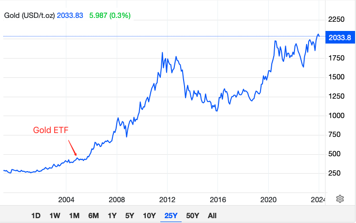
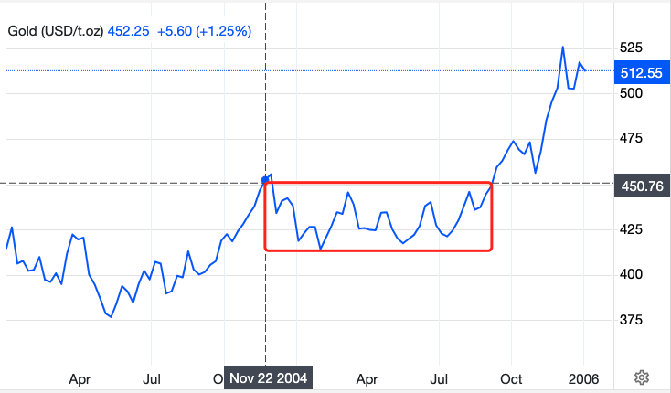

# 比特币大伏大起

号外：教链内参1.8《福克斯记者横跳，称SEC仍有可能拒绝ETF》

* * *

隔夜比特币突破47k，持续不到24h的熊市又一次结束了。昨早最低43k+的小针，连DMA30 43k都没有刺破。正在惶惶众人以为要去填补1月3号40k的长长下影线之际，华尔街成功进行了预期管理和心理按摩，用现货ETF即将通过的诱饵，重新把市场拉了起来。

从40k到47k，波动幅度超过15%。我看到的不是比特币价格的波动，而是人们焦虑不安、高度紧张的情绪。

比特币心如止水。1 BTC = 1 BTC。

哪里有什么比特币的大幅波动？大起大伏的，明明是人心。

当你押注群体情绪时，你就把命运交给了撒旦。

智慧的人，总是会在无人问津、人声稀落的平淡时期，悄悄地建仓。

那是一个什么样的时候呢？就是你已经快要忘了比特币这回事儿的时候。

要做好投资，就要在忘记的时候想起，在离开的时候进入。

不要等待比特币的提醒。等比特币用暴涨提醒你，你才重新注意到它，最佳的建仓时机就已经过去了。

你的心里要有比特币。无论何时，都给它留一个位子。

有话说，你不理财，财不理你。以前以为“理”是“打理”，其实现在知道了，是“搭理”。

你都不搭理比特币了，凭啥还想让它回报你呢？

所以熊市离场、牛市进场的大聪明们，大概率是很难从比特币身上赚到什么的。

你不负比特币，比特币才会不负于你。亏了，先扪心自问，自己是否有负于比特币？

比特币说：心如止水。因此，任何时候都不要FOMO（害怕错过）。

哪怕再多人和你说，看，大事要来了（比如，ETF要通过了），比特币马上要暴拉到多少多少了，再也见不到多少多少的比特币了，抓紧梭哈吧。你也不要梭哈。

分批建仓，不急不躁，闲庭信步。

哪怕是成本高一点儿，心态稳才是更重要的。心态不稳，投资亏损。

上面这幅图是很多KOL们常拿来比喻比特币现货ETF的一幅图。这是黄金25年来走势图。红色箭头指向的位置是2004年11月份。这个时间点发生了什么呢？

「2004 年 11 月 18 日，道富公司推出 SPDR Gold Shares（纽交所代码：GLD），其资产规模在头三个交易日就突破了 10 亿美元。截至 2019 年，它是全球最大的黄金支持 ETF，资产规模超过 400 亿美元，日交易量达 17 亿美元。」

查询维基百科可以得知，GLD虽然不是全球第一支黄金ETF，但却是第一支登陆美国的黄金ETF。

从图上很容易看到，黄金ETF启动了黄金20多年的牛市。

但是，这个后视镜着实是有些低倍数。

让我们放大、放大，放大到2004-2005年，在更加微观的尺度上观察一下，黄金ETF上市之后市场到底是什么反应。

这一放大，我们就看到了只听大V唱多所不知的真相了。

事实上，就在2004年11月黄金ETF上市纽交所之后不几日，黄金就到达了局部高点，然后跌入了一个箱体（图中红色方框），横盘震荡整理，长达近一年时间。

一直到2005年9月份，黄金才向上突破箱体，开启了新一阶段的行情。

这么长的一段箱体震荡，是在整理、消化和吸收什么？我们有理由相信，是在为2004年11月黄金ETF上市前，从2004年5月到11月期间，因情绪驱动而过度上涨的黄金埋单。

因为ETF的通过，把原本要花费两年时间完成的，从2004年5月低点375，到2005年9月突破箱体、也是2004年11月局部高点的455，给用一年时间走完了。

有的时候，快就是慢。开始跑得快了，那就要停下来喝口水，歇歇脚，才能有气力继续赶路。

而一旦突破箱体，那所开启的，就是波澜壮阔的行情。

只是对于每一个具体的参与者而言，是在箱体起点FOMO套牢，苦熬一年，还是从容不迫，在箱体震荡期逢跌加仓，就可能会导致相当不同的结局和命运了。

哪一种人，哪一种策略，能够更轻松、更容易、更大可能穿越清晨的灰暗，满仓迎来光辉红日呢？

（注意：请批判性阅读，切勿简单类比，以为比特币ETF会引起何种市场走势）
