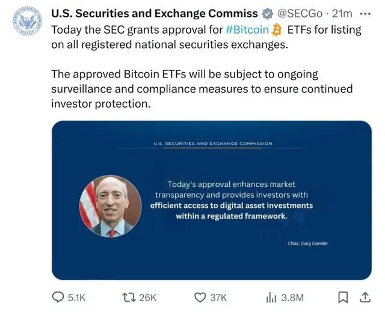
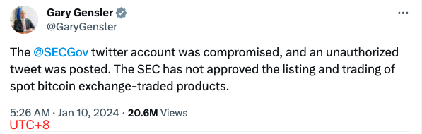
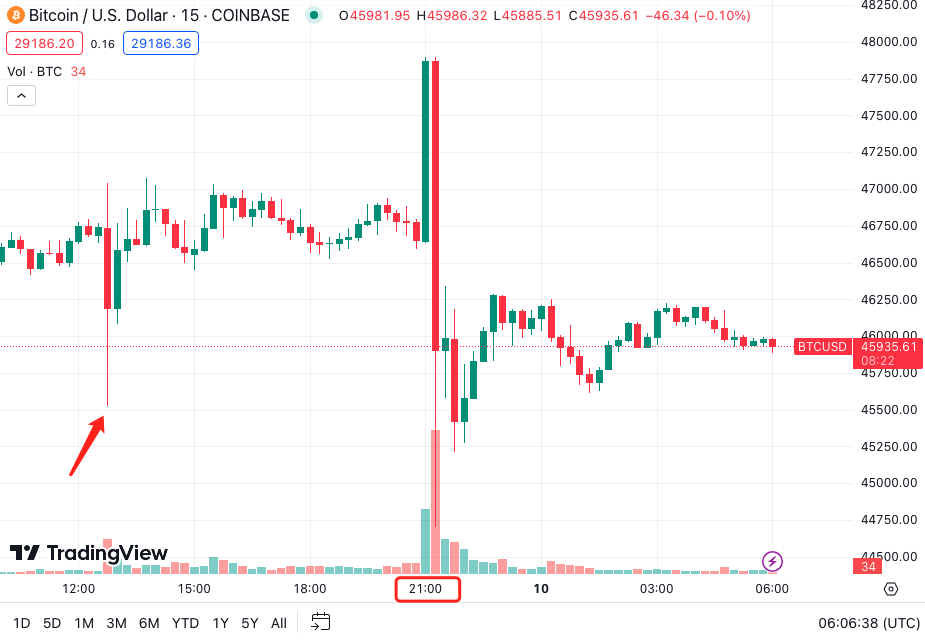

# SEC：批准比特币ETF！哦，不，我们官推被黑了！

号外：教链内参1.9《隔夜果然大幅波动，多空双爆》

* * *

就在距离市场翘首以盼的1月10号SEC决定对现货比特币ETF批准与否的前一天，美东时间9号下午，SEC官推突然发布一条令人措不及防的消息：「今天SEC批准比特币ETF在所有注册的证券交易市场进行挂牌。批准的比特币ETF将受到持续的监控和合规审查，以确保投资者持续获得保护。」推文下方还附上了SEC主席Gary Gensler的大头照片，以及简短致辞：「今天的批准加强了市场的透明度，为投资者提供了在受监管框架下有效访问数字资产投资的方式。」

但是很遗憾，这条消息很快就被删除，并被声明为假消息。SEC主席Gary Gensler也紧急发推表示：「SEC官推被黑，一条未经授权的推文被发出。SEC尚未批准现货比特币ETP产品的挂牌和交易。」

注意一下时间节点。SEC主席发推的时间是UTC时间晚9点（UTC+8凌晨5点）。纽约所在时区是美东时间，UTC-5。也就是说，SEC主席发推的当地时间是9号下午4点半左右。

由于SEC官推发布的“假消息”第一时间就被删除了，所以我们也难寻其踪迹，也就无从考证其具体发出的时间。

但是，盘面永远忠实地保留了事发现场的第一目击见证：

上图是15分钟线。从图中可以清晰地看到，在UTC时间9号晚9点整，BTC突然上冲，一度逼近48k，这应该就是假消息发出的时间。而后，9:15便掉头急转直下，最低插针破位45k，然后自然反弹回升至46k，这便是图中最长的那根红蜡烛。21:30开始，进入自然反弹后的犹豫，这时候，SEC主席发推辟谣了。于是，21:45开始补跌，第二根小红蜡烛，又跌破45.5k。

认真分析时间轴就会发现，这里有一个颇为吊诡的现象：市场信号（掉头下跌）居然比正牌辟谣要更快、更早！

一切迹象都表明，这不是一个无聊黑客拿到SEC发推权限调侃ETF随便玩玩。这就是一次有预谋、有计划的爆仓操盘行动！

操盘手准备了大量筹码，在假消息促动市场情绪向48k冲锋时，按计划点位在48k天量抛盘，直接把多头挫骨扬灰。而插针低点精准刺破45k，相信这就是多头杠杆爆仓最多的点位！

而图中左侧红色箭头所指的UTC时间12:45，也就是比行动时间提前了8个多小时的那根稍小一点儿的红蜡烛，向上插针到47k，向下插针到45.5k，是很明显的一次试探。这是操盘手在测试市场两个方向的支撑力度，探一探上面的空头们和下面的多头们的深浅，根据测试结果决定调配多少的“弹药量”，以求务必一击致命。

其实在这个时候，侥幸没有被爆仓的、爆仓点45k的多头，聪明的话就应该赶紧平仓保平安了。没经验的傻多头可能此时还在暗自庆幸刚刚躲过一劫，做起ETF通过，暴赚百倍的黄粱美梦了。殊不知仅仅8个多小时之后，死神就要来送他们的仓位上西天。

至于为何要砸盘爆多，必先拉盘爆空呢？那当然是为了不让上方开空的杠杆空头们搭了操盘手的便车。先把上方空头一扫光，然后再掉头爆掉正在看着盈利仓位美滋滋的傻多头。

而为了在砸盘后彻底摁死多头，操盘手特意选择了SEC上班的时间，而不是美东时间的深夜或凌晨。这样一来，他就可以确信，SEC的工作人员会第一时间删推辟谣，完美配合他的砸盘。而官方辟谣的快速传播，将会成为多头反攻的噩梦。

你问这会不会是SEC内部人玩的？“黑客”之说纯粹是找个莫须有的空气来背黑锅罢了。对此我们只能说，不知道。

就像你作为一个普通人可能永远都想象不到，霍金上了萝莉岛究竟是怎么玩的。

不过，在人性至为幽暗的金融市场上，无论你把对方想得多么的坏，可能都并不会过分。

当你越是见识过现实和人性的灰暗，你就越清楚，现实比任何文艺作品都更精彩，也更残酷。
