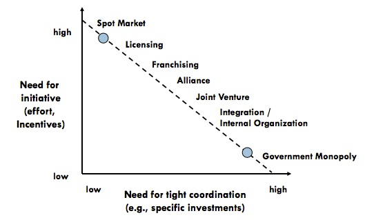
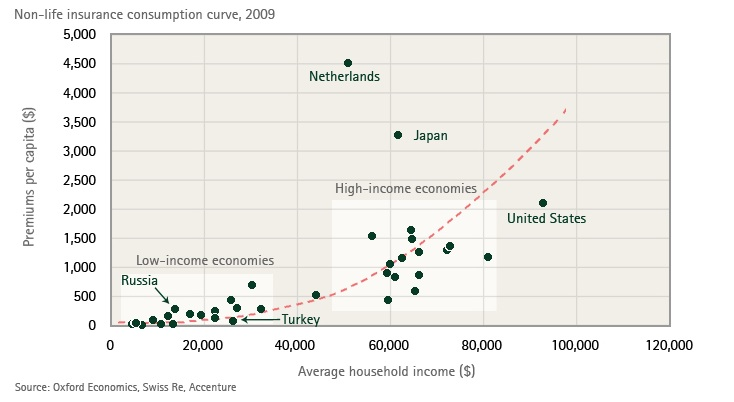

# 工作和储蓄都是干革命

号外：

* * *

文 | Pierre Rochard. Working and Saving are Revolutionary Acts. 2012.12.24.

政府之所以存在，是因为它事实上是提供司法和国防服务的均衡解决方案。这种均衡是意识形态、高交易成本和资产强专用的结果。要改变这种均衡，我们是应该努力说服人们我们的意识形态是正确的，还是应该努力降低交易成本和削弱资产的专用性？

下图直观地说明了某一商品或服务的市场结构是如何受内生性制约因素影响的：

作为自由主义者，我们的目标是将经济活动从政府垄断转向专注于在现货市场做买卖的公司。值得庆幸的是，这种转变会随着社会资本存量的增加而自动发生，与政府干预或政治活动无关。新资本的形成推动了两个趋势的发展，这两个趋势将所有行业的均衡推向分散的市场：技术的日益成熟和劳动分工的不断深化。

公司和个人如果没有储蓄或资本来从事或资助投机性研究，就无法开发新技术。技术一旦商业化，就会降低搜索和信息成本（谷歌、维基百科）、议价成本（亚马逊、eBay）和执行成本（Visa、Paypal）。技术还通过印刷机、枪支、计算机、照相机和加密货币等新工具削弱了政府机构的资产专用性。

保险业的分工对自由主义者尤为重要，因为保险公司专门处理与生命、合同和财产有关的风险。资本积累带来的分工是如此之大，以至于保险业从 17 世纪的只提供海上保险发展到涵盖从宠物到政治风险的所有领域。下图展示了保险业的发展与社会财富的关系。

保险和再保险公司拥有越来越多的资源，专门用于防止风险发生和在风险发生时减少损失。其中包括消防、安保和风险管理等服务。随着保险公司规模的不断扩大，它们与有效的私营公司进行交易的动机和能力也将不断增强，以获得传统上被认为是政府提供的服务。保险公司已经参与了私人仲裁，因为它比政府法庭更省钱省时。保险公司的影响力迟早会催生一个完全私营的司法系统，而政府则会失去其主要的竞争优势：对法律的垄断。

对这一乐观观点的反驳是，政府也将拥有更多的资源和技术；这将抵消私营部门的任何收益，也就是说，经济增长会助长国家的发展，我们都应该成为盖尔或农业主义者。这种反驳忽视了政府完全不可持续的财政/货币做法，以及政府倾向于以足够低的税率征税以实现经济增长。前者导致国家的自我毁灭，而后者则确保了私营经济的持续增长。

既然从长远来看，私法社会不可避免，那么年轻的自由主义活动家还能做些什么呢？

如果你喜欢政治，那就请继续倡导终结美联储和降低福利支出。只是要明白，你的努力与白玫瑰的努力如出一辙；虽然高尚，但在大局中却无足轻重。游说、助选以及在街头巷尾大喊大叫也是有机会成本的。

一种更健康、更充实的方法是通过以下方式最大限度地形成资本：

1. 在自己热爱并能创造实际价值的专业领域发展事业
    1.1 不参与政治活动
    1.2 不参加多层次传销
    1.3 不做学者
2. 尽可能多地储蓄自己的收入，并为自己、亲人和财产投保
3. 投资于创新创业，无论是在公司内部、自己创业还是与合作伙伴一起创业

这种方法会带来个人繁荣、社会资本存量增加、技术进步，并加速政府垄断的必然消亡。最重要的是，它让你在节日期间不必把你尖锐的政治观点强加给亲朋好友。

