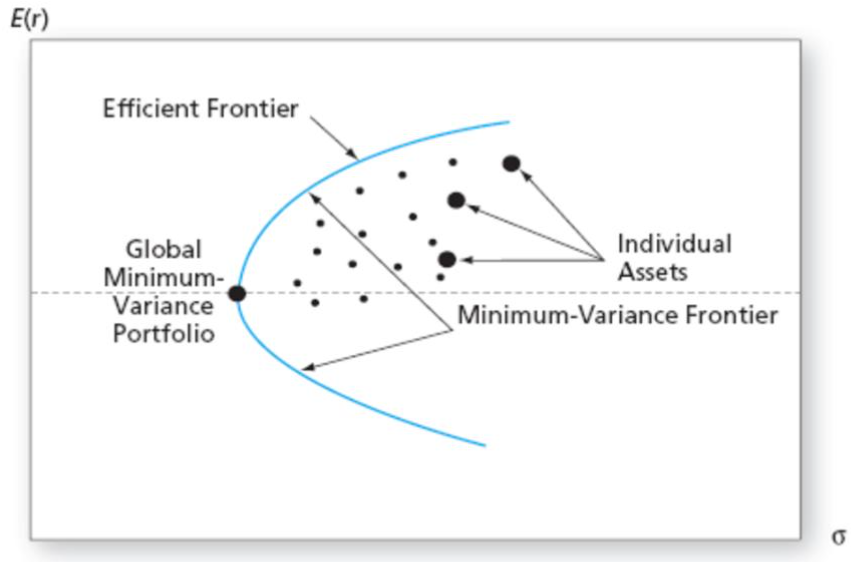

# 配置BTC跑赢美股的稳健策略

号外：教链内参1.12《教链的星球是市场的领先指标》

* * *

比特币ETF的上市使得BTC从此可以更加便利地被基金经理们作为资产组合的配置项了。那么，华尔街的基金经理们很快就会意识到，BTC可以作为一个非常有效的增强因子。只需要添加少量到其资产组合中，便能显著提升整个资产组合的夏普比率（Sharpe ratio）。

夏普比率（英语：Sharpe ratio），或称夏普指数（Sharpe index）、夏普值，在金融领域衡量的是一项投资（例如证券或投资组合）在对其调整风险后，相对于无风险资产的表现。它的定义是投资收益与无风险收益之差的期望值，再除以投资标准差（即其波动性）。

大家都知道，收益与风险成正比。但是，承担等量的风险，有的投资可以带来巨大的回报，有的投资却差强人意。简单来说，承受单位风险的回报，就是夏普比率。这个指标描述了，一项冒险的投资是否值得。

在现代投资组合理论（Modern Portfolio Theory）中，假定投资者为规避风险（Risk Averse）的投资者。如果两个资产拥有相同预期回报，投资者会选择其中风险小的那一个。只有在获得更高预期回报的前提下，投资者才会承担更大风险。

换句话说，如果一个投资者想要获取更大回报，他（她）就必须接受更大的风险。一个理性投资者会在几个拥有相同预期回报的投资组合中间选择其中风险最小的那一个投资组合。另一种情况是如果几个投资组合拥有相同的投资风险，投资者会选择预期回报最高的那一个。

这样的投资组合被称为最佳投资组合（Efficient Portfolio）。[wikipedia]

二级市场的风险就是价格的波动性（volatility）。波动性的平方就是投资组合的方差。或者说，方差开根号就是波动性。

1952年，美国经济学家马科维茨（Markowitz）首次提出投资组合理论，并因此而获得诺贝尔经济学奖。

他的理论包含了两个重要内容：均值-方差分析方法和投资组合有效边界模型。

在马科维茨的模型中，所有最佳投资组合（Efficient Portfolio）的集合被称为马科维茨效率前缘（Markowitz Efficient Frontier）。下图中的天蓝色曲线就是马科维茨效率前缘，在该曲线上的投资组合是最佳投资组合。

马科维茨模型前缘包括了所有的最佳投资组合。夏普比率（Sharpe Ratio）是每一个资产组合提供的额外的回报（高于无风险收益率的回报）除以它所带来的风险（以标准差衡量）的比率。夏普比率越高，每一个单位的风险带来的回报就越高。马科维茨效率前缘曲线上拥有最高夏普比率的最佳投资组合称为市场投资组合（Market Portfolio）。

教链了解到的一个配置策略是用大比例的现金（比如98%）和小比例的BTC（比如2%）组成的投资组合，去对比美股比如标普500指数的表现。

初步研究发现，以4年为周期，任意截取时间窗口，该投资组合都高概率大幅跑赢标普500指数。

用马科维茨的模型计算，有同学动动小手，算了几个简单结论：

如果要稳健，承受最低的波动性，那么BTC配置比例不要超过2%。

如果要最高的风险回报率，即夏普比率，那么BTC配置比例可以提高到6%。

如果要在不承受超过标普500指数的波动性的前提下，获得最好的投资收益率，那么BTC配置比例可以继续提高到10%。

（注：这不是我算的。有兴趣和动手能力的朋友，可以拿出马科维茨的公式来验算一下。）

当很多小白投资者还在羡慕美股收益率的时候，马科维茨已经告诉我们，跑赢美股其实很简单，只要添加一点儿BTC就够了。

不要梭哈。一点儿就足够。稳。

延伸阅读：
- 刘教链2021.8.21文章《从投资小白到财务自由》
- 刘教链2023.1.5文章《论文导读：哈佛博士论证央行囤比特币的意义和建议》
- 刘教链2023.12.17文章《BIS：各国央行自2025年起将获准配置不超过2%的比特币》

