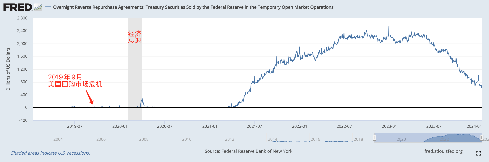

# 美国回购市场危机会在春季重演吗？

号外：教链内参1.15《USDT倒挂或值得警惕》

* * *

乌云压城城欲摧，山雨欲来风满楼。

据纽约联储官方数据显示，2024年1月12日，美联储隔夜逆回购（ON RRP）资金池中的资金余量已降至6000亿美刀。这距离去年（2023年）3月份的相对高点2.4万亿，已减少了三分之二。

在2023.12.10刘教链文章《美联储的“真相”》以及2023.10.4文章《美联储世纪大裁员》中介绍过，美联储操控市场利率的手段，主要就是通过隔夜回购和逆回购这两个工具。

比如我们在美联储最近一次议息会议（FOMC）的执行纪要中通常可以看到这样的三段话：

* Undertake open market operations as necessary to maintain the federal funds rate in a target range of 4-1/4 to 4-1/2 percent.
* Conduct overnight repurchase agreement operations with a minimum bid rate of 4.5 percent and with an aggregate operation limit of $500 billion; the aggregate operation limit can be temporarily increased at the discretion of the Chair.
* Conduct overnight reverse repurchase agreement operations at an offering rate of 4.3 percent and with a per-counterparty limit of $160 billion per day; the per-counterparty limit can be temporarily increased at the discretion of the Chair.

翻译一下就是：

* 采取必要的公开市场操作，将联邦基金利率维持在百分之4-1/4至4-1/2的目标范围内。
* 进行隔夜回购协议操作，最低出价利率为 4.5%，总操作限额为 5000 亿美元；总操作限额可由主席酌情临时提高。
* 进行隔夜逆回购协议操作，出价利率为 4.3%，每个交易方的每日限额为 1,600 亿美元；每个交易方的限额可由主席酌情临时提高。

金融术语很容易把脑子绕晕。这里的“回购”和“逆回购”是以“美债”为对象、站在美联储的立场上进行表述的：

所谓“回购”，就是美联储印美元，把美债从银行手里买回来，所以叫做“回购”——往回买。当然了，次日就卖掉——其实也就是银行从美联储手里再把美债买回去。所以这叫做隔夜市场。

显然，“回购”的目的就是给银行临时放水。你说这银行得有多渴？没有这一夜的水，就要渴死了。

那么请回答：回购的隔夜交易，是谁给谁付利息？就比如上面12月的回购利率4.5%，是谁付给谁？

你先想着。我们接着说逆回购。

所谓“逆回购”，自然就是反向操作了：银行手里钱太多，放手上烫手，就拿去美联储那里全都买成美债。换到美联储的立场看，就是抛出美债，回笼美元。相当于收水。当然这个次日也要再把美债买回来，把水再放出去。也是隔夜市场。

那么同样的问题：逆回购又是谁给谁付利息呢？

上面的“买”“卖”并不是买、卖，而是借钱。这样一来就很容易得到答案了，且非常符合直觉：谁拿到钱（美元），谁付利息。也就是，谁借钱，谁付利息。

所以，回购是银行借走美联储的钱，银行给美联储付利息（4.5%）；逆回购是美联储借走银行的钱，美联储给银行付利息（4.3%）。

倒过来说也一样：回购是美联储借钱给银行，向银行收取利息（4.5%）；逆回购是美联储向银行借钱，给银行支付利息（4.3%）。

因此，我们就明白了，回购相当于是美联储提供给银行的一个资金成本封顶（4.5%）的贷款产品，而逆回购则相当于是美联储提供给银行的一个收益保底（4.3%）的理财产品。

我们再回看一眼本文上面的逆回购蓄水池里的美元流动性图线，就会生出一个蛮大的疑问：从2021年年中，到2022年年中，一年时间，2.5万亿美刀，这个逆回购蓄水池中为啥流进来这么天量的资金呢？

这个问题的答案，也许早已写在教链2023.8.21文章《人造繁荣：财富大转移》中了。

可以猜测的是，这部分钱并不是银行可以轻易挪用的钱，而市场上也没有更好的投资出路，所以也就在美联储提供的这个4.3%无风险保底收益的理财产品里面呆着了。

从2023年初开始，这个蓄水池的资金量开始减小，这显示了资金的流出，流到了其他地方去。这对应了部分股市的一路走高，对应了比特币的一路走高。这一走就是一年。

若按照这个速度继续衰减下去，把剩下的600多亿美刀耗尽，也就是3、4个月左右的时间。

大约在春夏之交。

恰巧在比特币减半的前后。

市场押注美联储启动降息进程的时候。

当逆回购蓄水池耗尽最后一滴水，银行会因为陷入极度口渴而争相借钱，从而触发回购市场的危机吗？

2019年9月17日，用于金融机构间短期贷款的隔夜附买回协议利率突然发生井喷。美国衡量隔夜回购利率的担保隔夜融资利率9月16日还只有2.43%，9月17日就暴涨至5.25%，交易日利率一度攀至一成。金融机构间的无担保贷款利率同样受到影响，衡量此类利率的有效联邦基金利率超出美联储所定目标范围。

纽约联邦储备银行紧急干预，9月17日向回购市场注入750亿美元流动资金，此后每天早上都投入750亿美元直到周末。美联储联邦公开市场委员会9月19日降低银行准备金利率，结合纽约联邦储备银行的措施终于令市场恢复平稳，利率9月20日回归稳定。此后纽约联邦储备银行继续定期向回购市场投入流动资金直至2020年6月。

虽然危机成因尚无定论，但有经济学家经过分析认为，9月16日是缴纳季度公司税的最后期限，而且美国新发国债，共同导致金融系统临时短缺现金，银行体系准备金额度下降令局面加剧，共同导致利率大幅上扬。[wikipedia]

教链翻了一下美联储开会的日历。2019年9月17号，恰好是美联储那一年9月份议息会议的第一天。这危机爆发的时间点，真的是太巧了，巧的仿佛就是大写的“死给你看”。

此前一次7月份议息会议的利率区间设定是2%-2.25%。9月份这么一闹，美联储乖乖地借坡下驴，把利率区间下调到了1.75%-2%。

行文至此，脑海中不由地浮现出农村大妈敲着脸盆围堵在村政府门口闹事的场景，华尔街这番大闹美联储的景象，彼此并无二致。心中感到一乐。

紧接着半年之后，2020年初，就发生了著名的大熔断，经济陷入了衰退。（参考：2020年4月4号教链音频讲座《在新冠大疫情和美股大熔断背景下谈谈比特币的历史和未来》）

时光如梭。转眼已是4年。

2024年1月11日，Redburn Atlantic首席经济学家Melissa Davies公开指出，在目前5.25%-5.5%高基准利率水平，以及美元QT紧缩周期的情况下，如果银行储备不足导致流动性问题，恐将令2019年回购危机重演，而这会迫使美联储停止QT量化紧缩；特别是，当美联储ONRRP隔夜逆回购资金枯竭时，对冲基金们将面临基差交易亏损，这回迫使其抛售美国国债，进而诱发流动性挤兑。

不知道这一次，美联储主席鲍威尔会不会吸取教训，提前出手，防患于未然呢？
