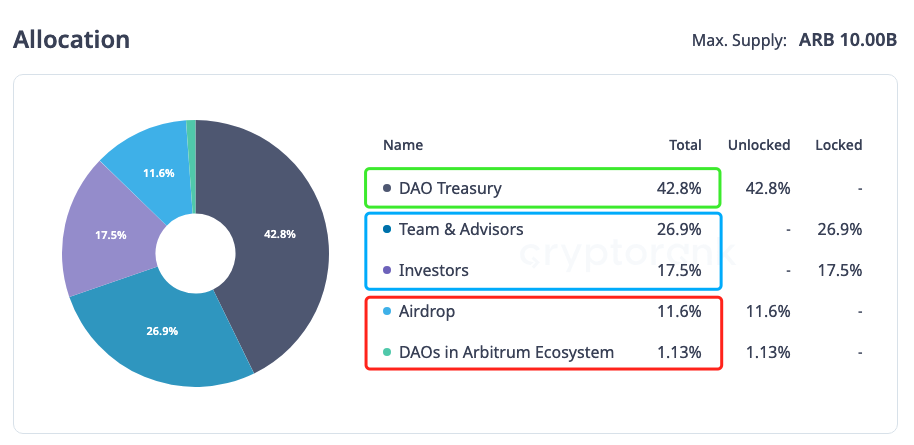

# 略论Arbitrum的代币经济模型

号外：教链内参1.17《木头姐的明智清仓》

* * *

众所周知，Arbitrum是和Optimism齐名的以太坊二层网络（L2），二层网络的领跑者，乐观Rollup技术流派的代表。

本来，学术背景的Arbitrum，相比起与以太坊创始人Vitalik Buterin玩得更近、尿到一个裤子里的好基友Karl Floersch联合创立的直接竞争对手、另一个乐观Rollup的领头羊Optimism而言，开始并不被看好，至少，没有对后者Optimism那般看好。

但是，阴差阳错，因为在2021年抢上L2的速度竞赛中，Optimism一开始并没有搞定EVM全兼容，导致一系列重要DApp例如Karl Floersch的好基友Hayden Adams创立的DEX龙头Uniswap无法无缝迁移至Optimism，让Arbitrum意外抢跑了一个身位。

就那么短短几个月的时间差，生态格局就足以翻天覆地。比如，关系最铁的Uniswap也在DAO的压力下，不得不放弃“关系户先上”的思想，决心不再等Optimism做出EVM全兼容，先上了Arbitrum。可想而知，其他生态应用也都纷纷首发了Arbitrum。

如果你对上面这一堆的复杂关系感到烧脑的话，那么看下面这张照片就清楚了。照片最左边是L2网络Optimism技术负责人Karl Floersch，中间是以太坊创始人Vitalik Buterin，右边是DEX龙头Uniswap的创始人Hayden Adams。

正所谓一步快，步步快。自此，Arbitrum在乐观Rollup这个赛道里，就始终压Optimism一头。而在L2技术赛道里，乐观Rollup在实用性和落地方面又显著胜过听起来更牛逼的零知识Rollup。这是实用主义胜过完美主义的万千案例之一。

不知为何，教链在2021年玩DEX的时候，也是用Arbitrum更多。

这样一来，待到去年（2023年）3月下旬Arbitrum终于发币空投的时候，教链也雨露均沾，领了一些。

考虑到整个市场的复苏进程已经开启，为了把空投收益最大化考虑，就不急于在第一时间抛售清仓。于是便决定分批逢高减持，也就是逆八字诀。在过去近一年时间，减持了两波。一波是在刚上所的时候（后来年中跌破1刀又抄回来了），另一波就是前段时间创新高之前。教链内参1.3《该如何计划减持》便探讨过减持的策略问题。

于是便开始关注Arbitrum (ARB)的代币经济模型（tokenomics）。

早在2023年7.19教链文章《更稀缺的是提出正确问题的能力》中，就曾简单地拿Arbitrum (ARB)和Uniswap (UNI)的经济模型做过对比：

「从tokenomics上看，Uniswap今明两年就解锁完毕了，Arbitrum才刚刚开始。分配模型，二者不说是半斤八两，也简直是一模一样：

1. 团队+VC：40% (UNI) vs. 44.4% (ARB)
2. DAO（社区）：43% (UNI) vs. 42.8% (ARB)
3. 初始空投：15% (UNI) vs. 12.7% (ARB, 11.6个人用户空投 + 1.1生态项目捐赠) 」

ARB的总量是100亿。而UNI的创世总量是10亿。

图中，红框框起来的Airdrop + DAOs就是初始空投，加起来12.7%，11.6%投给了个人地址，1.13%定向赞助了生态里的优秀项目。12.7%就是12.7亿枚。这部分可以视为已经全部进入流通了。

蓝框框起来的Team & Advisors + Investors就是团队、顾问和投资人，可以认为是项目方。这部分呢，现在都在锁定中。和很多发币项目项目方和社群一起解锁不同，Arbitrum不知是为了彰显格局，还是为了“等牛市养肥了再杀”，反正项目方承诺第一年不解锁，从2024年3月16号再开始线性解锁，为期3年。

下面这张图清晰地展示了各框部分解锁的时间线：

绿框框起来的DAO Treasury就是社区金库了。这部分虽然名义上立即可用，但是由于是锁在智能合约里，必须由社区投票治理才能动用，所以说，社区花费这部分预算的共识度越高，就越容易更快速地把这部分给释放到市场上来；否则，则更不容易流出到市场上来。

因此，可以认为，目前真正进入市场流通的量，就只有初始空投的12.7亿枚ARB。

如果我们去看一些数据网站比如cmc，也能看到类似的数字：

教链内参1.17《木头姐的明智清仓》中介绍了，Arbitrum DAO日前刚刚投票通过了一项“长期激励试点计划”。按计划会在12个星期（约合3个月）的时间内，分发4181.5万枚ARB，用于激励生态项目。

简单粗算一下就知道，这会让现在的市场流通量增加约3.3%弱。

而这个时间窗口，恰好选在了项目方解锁之前。

这是要测试一下市场的承压能力吗？

等项目方解锁开始之后，每个月的解锁量就高达1.2亿枚。时间则从2024年3月一直持续到2027年3月。

从常理上讲，项目方也会趁着牛市，适时释放利好，制造逢高出货的契机的吧？

