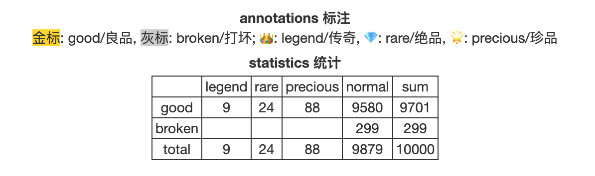
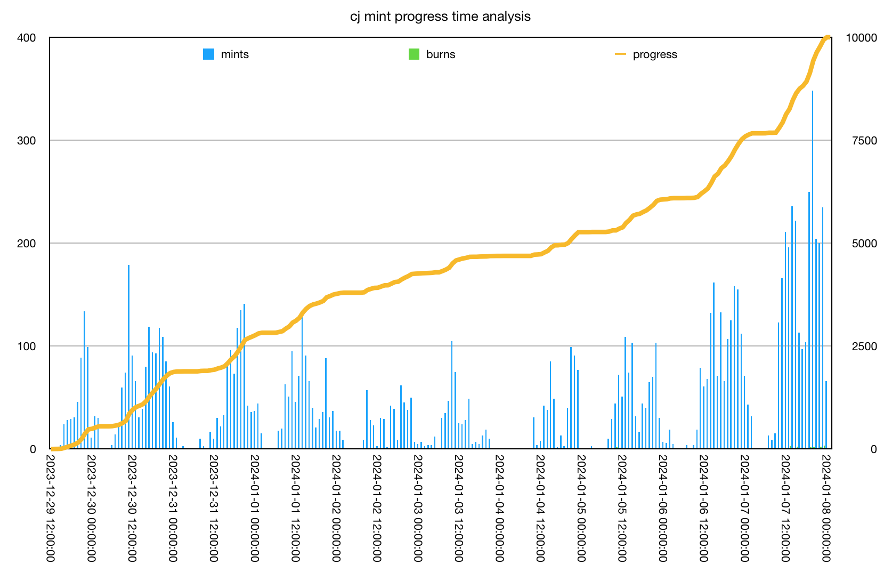

# CryptoJunks：一次群体行为艺术实验

号外：教链内参1.20《没有消息就是好消息》

* * *

在2024年元旦前后，具体的，从2023年12月29号傍晚，持续到2024年1月8号子夜，历时10天零一夜，一次发生在Jouleverse区块链上的群体行为艺术实验，完成了。

几百人，自发自动，用简陋的工具，把互联网上公开可下载的朋克像素图，二次编码，铭刻到区块链上，形成完整不可分割、不可改变的10000个链上“数字艺术品”（Digital Artifact）。

人们把这些铭刻到区块链上的“数字艺术品”称作“铭文”（inscriptions）。

按照Ordinal作者Casey Rodarmor的定义，铭文数字艺术品具有以下鲜明的特征：

1. 它可以被拥有。一个数不是数字艺术品，因为没有人可以拥有一个数。
2. 它是完整的。把链上token所确立的所有权，与链外存储的关联内容相分离的NFT，不是数字艺术品。
3. 它是无需许可的。转手它不需要经过任何他人的同意或批准，也不需要被强制征收版税（royalties）。
4. 它是抗审查的。中心化数据库中的条目可以被随意更改，而数字艺术品则不能被删除。
5. 它是不可变的。没有NFT那样可升级的后门，数字艺术品恒久不变。

行为艺术本身的意义和价值，不在于其材料（图片），而在于其行为。群体行为艺术的艺术性，则来自于其群体行为。

就像比特币挖矿，成千上万人，成千上万的机器，耗费巨大电力，寻找一个“毫无价值”的哈希值，这本身也是一种大规模群体行为艺术。

一个哈希值，与一张像素图片，本质上并无二致，都是一个大于1而小于葛立恒数的自然数而已。在上帝看来，每一个自然数都是平等的，它们和1、2、3、4、5、6、7、8、9、10一样平凡，并没有任何特别之处。

意义根本就不在材料里，而在于人的眼睛和脑袋里，或者说，在人心里。心中有佛，所见即是佛。心中有魔，所见即是魔。

铭文都是Junks。Meme都是Junks。山寨币都是Junks。甚至比特币，也都是Junks。在世界首富巴菲特、摩根大通CEO吉米·戴蒙的眼里，还有千千万万诋毁、鄙视、谗言者的嘴里，比特币可不就是Junks么？

10000次上链，10000个铭文，10000个Junks，在一万个人眼中，那就是一亿个哈姆雷特。

即便是那因操作错误而打坏掉的错版铭文，也是一种独特的存在。

据统计，打坏的299个，皆为凡品。9个传奇，24个绝品，88个珍品，都完好无损。

从链上数据分析可以看到，整个上链过程呈现出明显的尾部加速特征。活跃时间多集中在中午、下午、晚间，并持续到子夜。

一次群体行为艺术实验成功完成了。全部10000个铭文藏品（数字艺术品）被封印在链上，永世不变。这项行为艺术留给我们的回味，悠远而无穷。每一位参与此次行为艺术演绎的人，都值得历史铭记，并随着链上铭文的存世流传，而必然被铭记。

* * *

最后，抽个奖。CJ社区的朋友们赠送了我一些上文所述的CJ铭文藏品，数量不多，二三十个，我准备拿出来陆续送给各位读者，祝大家新年快乐。文末评论区留下你的Jouleverse链地址（如何创建链地址请参考阅读2023.12.31文章《小福利：迎元旦，CryptoJunks铭文免费打》），等抽奖（截取本文发文时间48小时之内留言的有效地址）。本篇会抽出1位，获赠1个CJ铭文（款式随机）；未抽中者，也将获赠gas fee若干（所以是100%中奖哈）。请注意：如果你已经有CJ铭文了，那就会重抽。

