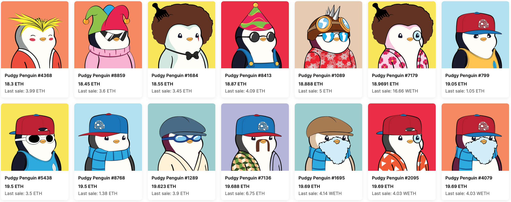

# 又到了鱼尾行情？

号外：教链内参1.21《美联储继续缩表》

* * *

北国的冬，这几天愈渐地寒冷了起来。清晨，阳光初升之前，竟降到了零下11度的寒。

这市场终究还是支棱不起，躲到了30日均线的下边趴着，就像冬日的小猫咪躲到太阳勉强射入的墙角下，乖巧地趴着。

我打开了社交媒体 —— 嗯，这个类别词在简中互联网上似乎专指那个网站 —— 游逛了半天，都是些有一搭没一搭的无聊的话，实在是令人提不起兴致。

看看手机上那些过去几个月狂飙猛进的铭文币，MA7刚刚下穿MA30，让人不免觉得，这市场的颓势，还要延续的更久一些。

网上有人打趣儿，说，铭文币这东西，买的时候是币，卖的时候是NFT。

在市场中追风逐浪，最需要的其实是等待。极具耐心的等待。在建仓后等待胜利，在减持后等待机会。

最近不到一周的时间，就听到了一些令人隐隐担忧的信号。

一是听说，胖企鹅（Pudgy Penguins）支棱起来了，据说售价超过了1 BTC。

二是听说，有人向朋克#2491的持有人出价近240万美刀（969 ETH）求购，被拒绝。

还有人给朋克#7804出价400多万美刀，同样被拒绝。

凡在这市场里穿越过牛熊的，大多都知道，这NFT往往是市场板块轮动的最后一棒。

原因倒也没什么，就是因为轮动轮动，被割被割，热钱越动越少，无力撑起体量较大的板块，就只能转移战线，去流动性更差的赛道里面去比拼。

NFT好玩就好玩在它是非同质化的，各个不同，就会惜售。

惜售，就自然减少了换手率。

NFT支棱起来的时候，往往行情已近尾声。

犹记2021年春，Beeple的画拍出天价。而后，“519”矿难，加密市场大跌。

2022年初，数藏市场火爆，opensea成交额创出新高。6月，BTC彻底破位3万刀，带动整个市场进入熊市。

知不易，行更不易。行难，止更是难上加难。

善于行者有勇气，善于止者有智慧。

毕竟，冬雪过后，又一春。
