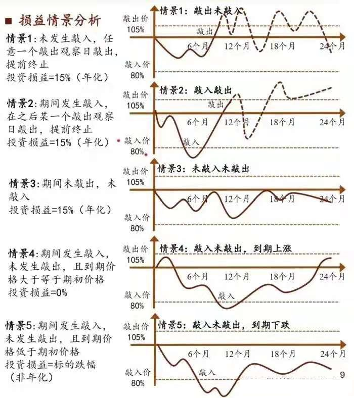

# 雪崩

号外：教链内参1.22《果然破位4万刀》

* * *

最近看到股圈议论纷纷的一个话题，就是一种叫做“雪球”的结构化理财产品大规模爆仓，场面堪比雪崩。

有人就在那里议论，这究竟是什么力量，和国家鼓励资本市场发展的大政方针对着干，把大A给踩成这个样子，就冲着把这一堆雪球给爆仓而去的吗？

市场不好，左派大V骂骂美帝，右派大V怪怪政府，但不过是找个出气的筒子罢了。真正翻云覆雨的力量，大V们又怎能知道，知道了又怎敢提起？

金融市场，冷酷无情。杀人父母犹可恕，挡人财路不可活。

亏损了，别指望从公开发表的帖子里找到真相。真相就在每个人的心里。稍微动动脑子，就知道到底哪个，才是真正的罪魁祸首。

刑侦学上讲，寻找杀人线索，就是要想一想，这人死了，谁获利最大？

简单学习了一下这个因为2021年牛市而红极一时的结构化理财产品。

从技术上来讲，这个东西的本质就是一个场外期权。

更具体的，是一个看跌期权（put）。

再进一步，是卖出一个看跌期权，即所谓的“卖put”。

如果要再附加一点儿补充说明的话，那么应该是一个带止盈（比如15%）和杠杆（比如4倍）的卖put。

说实话，这么复杂的产品，能有那么多人冲，真得佩服高净值人群大赌大赢的勇气，以及销售人员舌灿莲花的能力！

那么，是什么话术，打动了如此多人，慷慨解囊，躬身入局的呢？是雪球结构表面光鲜亮丽的高获益概率：

如果市场上涨，你会止盈。涨的越快，止盈越快。复投越快，年华暴增。如果再配上4倍杠杆，啧啧，数钱数到手抽筋不要不要的。

如果市场不涨不跌（箱体震荡），那么拿到期满，券商会返还你的本金，并附上与止盈同等收益（即15%）的“借款利息”，作为理财期间（比如过去2年）占用你资金的对价。

如果市场在期间下跌，跌破了行权价格（雪球产品里叫做“敲入价格”），那么只要期满时市场反弹回到箱体（期初价格~止盈价格）并进而涨破箱体导致止盈，那么你仍然会赚到15%收益。

如果市场在期间下跌，跌破了行权价格（“敲入价格”），那么只要期满时市场反弹回到箱体，但没有涨破箱体导致止盈，那么你将可以足额收回本金，而没有任何损失。

只有当市场在期间下跌，跌破了行权价格（“敲入价格”），且直到期满都没有再回到箱体，那么此时本金就会发生亏损。如果带了杠杆，那就是加倍的亏损。亏没了保证金，那就是爆仓。

如果这个结构，用到一个大概率不怎么会下行，而大概率会上行的标的上，比如某某指数，那么，你会不会感觉，赢面超级大？是不是就要上头？是不是就要上杠杆？

可是这出人意料的事就是发生了。在过去一年，全世界都涨出了很高的风险，唯有某A稳步走出了高性价比的黄金折扣。

雪球们也就滚不动了，而是一头撞上南墙，雪溅当场。

可是为什么？雪孩子表示死不瞑目。

因为这本来就是一款表面光鲜，实则风险收益比极其糟糕的产品。

很多人都知道，段永平喜欢卖put。他是把卖put当作买入现货的替代操作。跌到位，他就心甘情愿买入现货，然后长期持有获得无限空间的上行收益。跌不到位，他也能小赚一笔权利金。

对于买put的人，put就好比是一份“保险”。如果市场跌破行权价，他可以锁定价格卖出现货，以更低价格买入现货，从而赚到差价；如果市场没有跌破行权价，他可以放弃行权。这样，他就对冲了市场下行风险。而他为此支付的代价就是他买put所付出的权利金。因此，权利金就可以比作“保费”。

那么对于卖put的人，他心里想的恰恰相反。他本来就准备要买入现货，但是现在价格有点儿高，于是他就在一个更低的价格上卖个put，先把“保费”收了。如果市场跌破行权价，那么他就以行权价买到了现货；否则，他买不到现货，但仍然赚了“保费”。这就比挂个限价单等着成交，要高明那么一丢丢。

通过这个put，买家把市场下行风险转嫁给了卖家。而卖家之所以敢于承接这个风险，肯定是因为他更有耐心和信心，长期看涨现货。

但是，同样是卖put，雪球结构理财的投资者，和段永平玩的，却是天壤之别。

在雪球结构里，把长期截取成了短期（2年），把上行收益空间无限通过止盈限制为15%封顶，把下行损失有限且具回弹性通过上杠杆变成了刚性可爆仓100%损失本金。

通过巧妙的参数设计，硬生生把一个卖put的妙招，变成了赢面不大、亏面不小的对赌。

暴涨了，你拿15%，剩下的都归券商。

暴跌了，你爆仓，券商没啥损失。

不涨不跌，券商倒贴你收益。

买这理财的人，就是在赌，一个市场，可以在2年时间内，既不大涨，也不大跌。你觉得他的赢面有多大？

承担了亏光本金的风险，却只换来封顶15%的或然收益，还沾沾自喜以为自己是赚了便宜，这样的韭菜，只会成为，群狼的盛宴。
