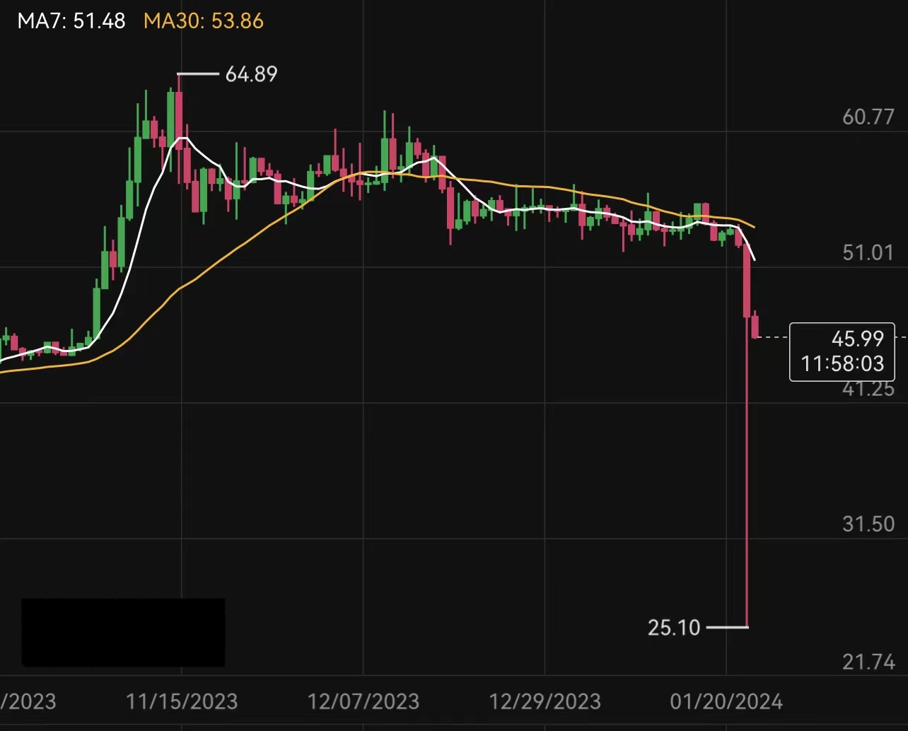

# 突然，借贷被强制平仓

号外：教链内参1.23《加密市场继续承压的内因和外因》

* * *

昨日是惨烈的一日。

虽然BTC只是短暂地向38.5k努了努力，距离11号局部高点49k不过低了21%，但却触发了山寨的广泛崩溃。

山寨之王ETH也没绷住，2.2k距离12号局部高点2.7k下降了18.5%。市场仿佛全然忘记了，ETF和坎昆扩容的叙事。

BitMEX创始人黑哥反手做空，买了月底的看跌期权。还亏损割肉了不久前入手的Solana。

慌不择路。真是一个慌不择路。

有句话说得好，上涨时没有人赚到钱，下跌时都在亏钱。

铭文币也好，模因币也罢，如果没有内生消泡沫的法子，也基本上都是一波流。庄家收割完毕，韭菜一波带走。车太重，拉不动。这个盘子从此就算是废了。庄家会务色新叙事、新题材，重新起盘。炒新不炒旧，遂成铁律。一旦被埋在旧盘子里，基本上这辈子就废了。早割早超生。

金融大鳄索罗斯曾经说过：世界经济史是一部基于假象和谎言的连续剧。要获得财富，就要认清假象，投入其中。然后在假象被其他人认清之前，退出游戏。

早在去年年底教链内参12.30就明确提醒，《重仓土狗须谨防洗盘风险》。内中说到：走向牛市的道路绝非坦途。现在大量的人在土狗铭文的诱惑下，高风险仓位已经占到了半仓甚至更大比重，这绝对是极高风险的；而市场也必须无情地进行洗盘，才能继续健康成长。

而转年到了2024年教链内参1.3《该如何计划减持》，对执行减持山寨的举动进行公开见证。

1月9号教链文章《比特币大伏大起》，分享了当年黄金ETF通过后，长达近一年回调盘整的箱体震荡。

在山雨欲来风满楼之时，不是必须减仓，但是必须严格进行压力测试，主动降低风险。

比如杠杆，尤其是场内杠杆，就千万不能托大！

万不可对暴力插针之迅雷不及掩耳之势抱有幻想，亦不可对市场下探之深度心存侥幸。

遥想当年2021年“519”之夜，BTC从5万水平直接跳水，插针3万，就是要定点爆破3万刀的杠杆。教链当时便持有场内抵押借贷的杠杆。虽然在此之前做过多次压力测试，把强平线放到了2万刀以下，但依然被吓了一跳。3万到2万，也就是再向下插个1/3而已。

2万之于5万，是按照跌去60%设计的。在牛市中，这个安全空间也许才刚刚够用，却也并不足够心安。

在加密市场，5倍杠杆很常见，于是跌个20%就是家常便饭。3倍杠杆也不少，暴风骤雨之夜往往就会直冲33%跌幅而去。最后一餐往往是2倍杠杆，不太容易啃到，但是当空头巧借外力，饿虎扑食的时候，短时进攻到-50%也不是不可能而是十分可能的事情。

昨日，就有某平台币短时闪崩，瞬间向下插针近50%，强平了很多抵押借贷者的仓位。

对山寨币而言，70%甚至90%的安全空间，到了极限时刻，往往也不见得够用。

借贷一时爽，爆仓空余恨。日暮乡关何处去，烟波江上使人愁。
