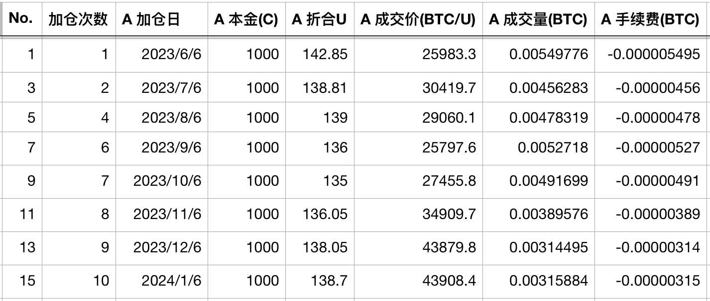
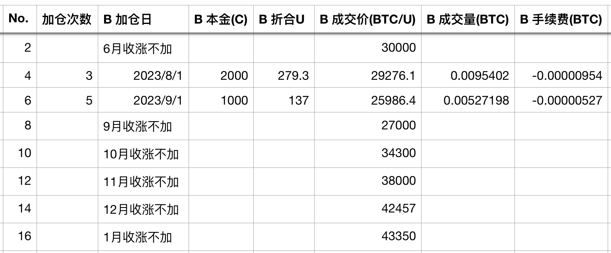
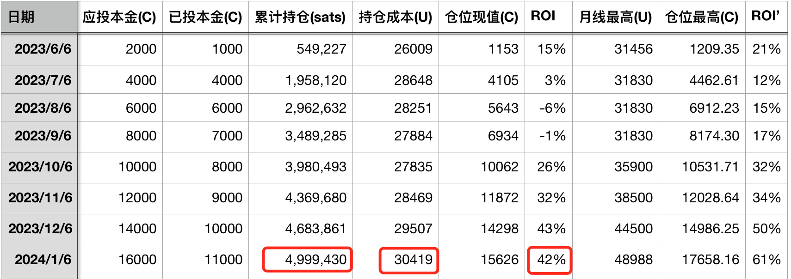

# 十年之约＃16：逢跌加仓不如无脑定投？

号外：教链内参2.1《现货BTC ETF表现超过黄金》
教链内参2024年1月份合订本火热出炉，点此查看

* * *

转眼已是2月。

在美联储1月议息会议结束，放出反击3月降息的言论之后，BTC小幅跳水，一度破位42k。隔夜又修复至43k以上。

刚刚结束的2024年1月份，BTC开盘42.5k，收盘43.35k。1月继续收涨。这已经是BTC自2023年9月收涨以来的连续第5个月收涨。

过去，连续5个月或以上月线收涨的情况不是没有。2020年底至2021年初的牛市启动阶段，连续6个月收涨，从1万刀直接干到了6万刀。

连续5个月收涨，意味着「十年之约」逢跌加仓已经有连续5次未能进行了。眼瞅着这加仓成本就从9月份的27k升高到了现在的43k。

先总体回顾一下十年之约历次加仓的实证记录：

1. 2023.6.7《八字诀 · 十年之约》。启动。
2. 2023.7.2《内参：「十年之约」浮盈29%，B份6月收涨不加》。
3. 2023.7.6《「十年之约」7月实证，浮盈20%，继续加仓》。
4. 2023.8.1《「十年之约」实证＃4：7月收跌，触发双倍加仓，浮盈回撤至3%》。
5. 2023.8.6《「十年之约」实证＃5：八月A份加仓，浮盈转为浮亏》。
6. 2023.9.1《SEC推迟ETF，BTC跌破26k，十年之约＃6逢跌加仓》。
7. 2023.9.6《十年之约＃7，ahr999囤币指标辨析》。
8. 2023.10.1《十年之约＃8：格物致知》。
9. 2023.10.6《十年之约＃9：放长线，钓大鱼》。
10. 2023.11.1《十年之约＃10：桃李不言，下自成蹊》。
11. 2023.11.6《十年之约＃11：积累的力量》。
12. 2023.12.1《【实盘实证】十年之约＃12：熊市坚持加仓可以摊低成本》。
13. 2023.12.6《【十年之约＃13】比特币在呼吸》。
14. 2024.1.1《教链的2023：写了190余万字，投资收益率143%（十年之约＃14）》。
15. 2024.1.6《如果BTC达到100万刀（十年之约＃15）》。
16. 2024.2.2《十年之约＃16：逢跌加仓不如无脑定投？》。本文。

至此，过去半年多时间，已累计积累“真聪”（相比于现在热炒的“假聪”meme币而言）约500万sats。持仓成本约30k，投资回报率42%。浮盈最高一度达到过61%。

可能有细心的读者已经注意到了，逢跌加仓往往会导致在连续上涨面前“石化”，失去低成本加仓的机会。那么，定投和逢跌配合使用，也就是英语圈中DCA (Dollar-Cost Averaging)和所谓的BTFD (Buy The Fxxking Dip)混用，最终效果真的会相比于无脑定投更好吗？

教链于是稍微花了点儿时间，拉出来过去5年的BTC月线数据，从2019年1月份到2023年12月份。然后写脚本回测了一下几种策略的效果如下：

设定每个月2000刀本金。

策略一：无脑定投。以月收盘价无脑加仓。

策略二：逢跌加仓。把本金拆成两份。一份以月收盘价加仓，另一份则留待月收盘价低于开盘价（即本月下跌）时以月收盘价加仓。

策略三：逢跌次月加仓。同样是把本金拆成两份，一份无脑月底加仓，另一份则留待下跌月的次月收盘加仓。

回测结果如下：（未计算交易手续费和提币手续费）

- 策略：无脑定投。总投入额：120000 USD。总仓位：8.4378 BTC。平均成本：14221 USD。
- 策略：逢跌加仓。总投入额：116000 USD。总仓位：8.0342 BTC。平均成本：14438 USD。
- 策略：逢跌次月加仓。总投入额：117000 USD。总仓位：7.9910 BTC。平均成本：14641 USD。

结论很明显：第一，逢跌加仓的最终成本比无脑定投要高。第二，加仓拖得时间越长，最终成本越高。

于是可以得到推论：有钱就全部加进去，比分批加仓要更优。定投的唯一理由是，可投入的资金是逐月获得的。

也就是说，如果现在手头有12万现款，那么全部一次性加仓，会比分成12份，在未来12个月内每个月加仓1万，会有更大的概率得到更优化的结果。

但是如果这12万不是立刻在手，而是在未来12个月内，每个月才会入账1万，那么就只能是在每个月拿到1万的时候立刻加仓。这样，就变成了定投。

但是的但是，对于绝大多数人而言，即便是手头有12万现款，仍然是把它拆分成12份，装作是在未来12个月内，每个月有1万可用，进行分批投入，过程和结局都会更好。

甚至更进一步，把12万拆分成24份，其中12份用于在未来12个月内每个月定投5000，另外12份每份5000则用于每个月灵活投入，会更好一些。这就是八字诀坚持定投、逢跌加仓的由来。

虽然，最终的结果，很可能是一次梭哈优于无脑定投优于逢跌加仓，但是从人的过程心理上来看，一次梭哈之后的漫长等待和惨烈波动，可能会把一个没有经过训练的人折磨到精神崩溃割肉离场，好变成坏；即便是无脑定投，也会遭遇每次定投后的都要下跌，次次加仓高位站岗，把人心理折磨地难以忍受，从而无法坚持，整个过程枯燥乏味，毫无乐趣可言。

只有一手持币，一手有钱，涨了鼓掌，跌了加仓，让这个折磨人的过程，变得相对轻松了一些。八字诀所追求的，是心理和收益的平衡最优解，而不是单纯的收益最大化。再大的潜在收益预期，如果中间拿不住，坚持不下去，就会瞬间归零，化为亏损。

由于逢跌加仓的灵活性，实际上是给了投资者一种对自我命运的掌控感。掌控感在心理上带来了安全感，但是在实际上是带来了更高的风险。也就是说，把本来无差别的收益情况，变成了和投资者个人盘感高低和操作水平有一定关系的分布。有人做得好，跑得赢定投，投出了alpha。有人做得不好，跑不赢定投，就会投出负alpha。

写到这里，教链看了一眼自己的主力仓位中BTC的平均持仓成本，13783.45 USD，勉强跑赢定投一点点儿。不过，由于2021年分散化投资，扩大持有了一些山寨币的缘故，总体仓位折合BTC之后持仓成本就飙升到了15953.89 USD，跑输定投BTC。可见，很显然的，分散化和投资山寨币，给我带来了负alpha的扯后腿的结果。

这个时候，就常常需要再温习一下，《为什么你的投资跑不赢比特币》（刘教链2020.12.31文章）。亦当自勉。
