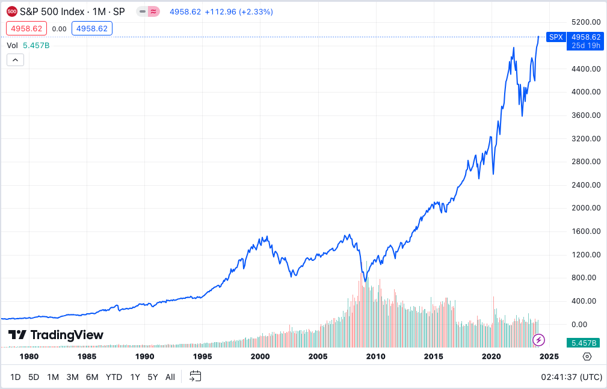
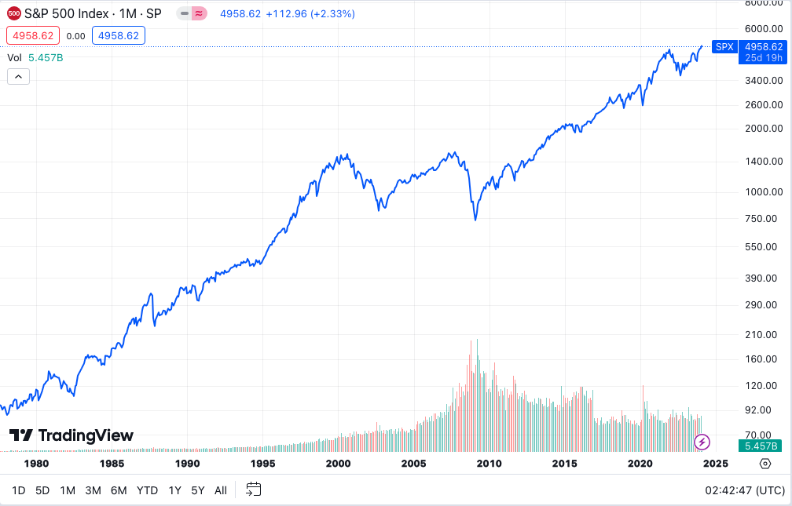
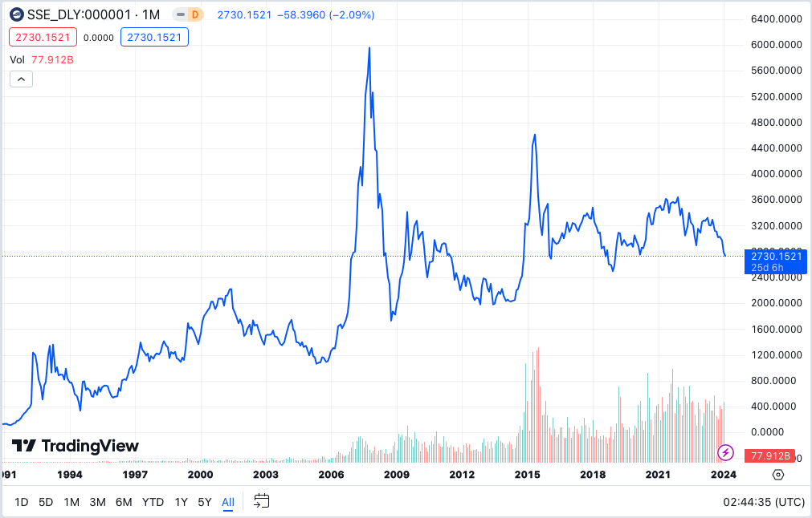
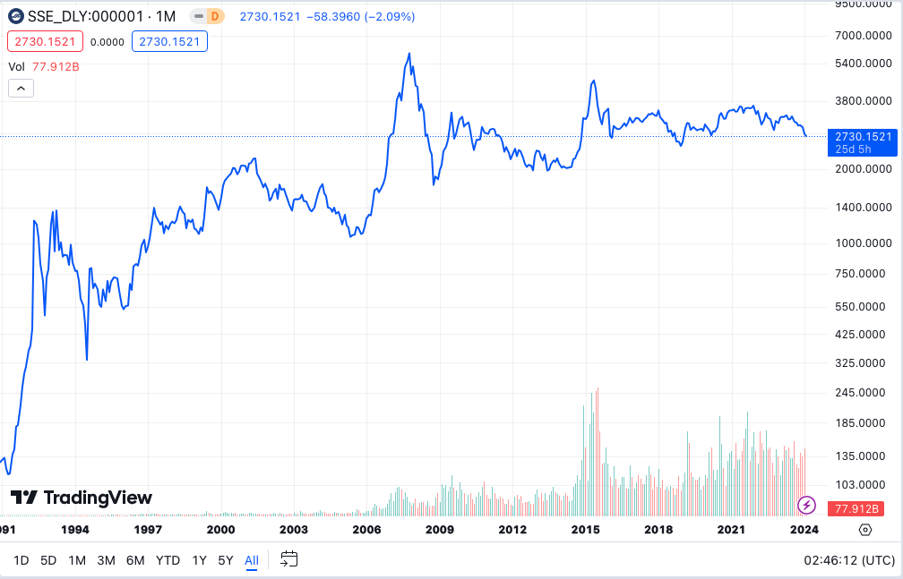
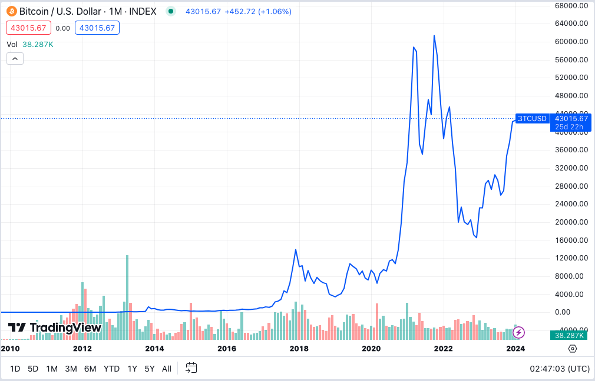
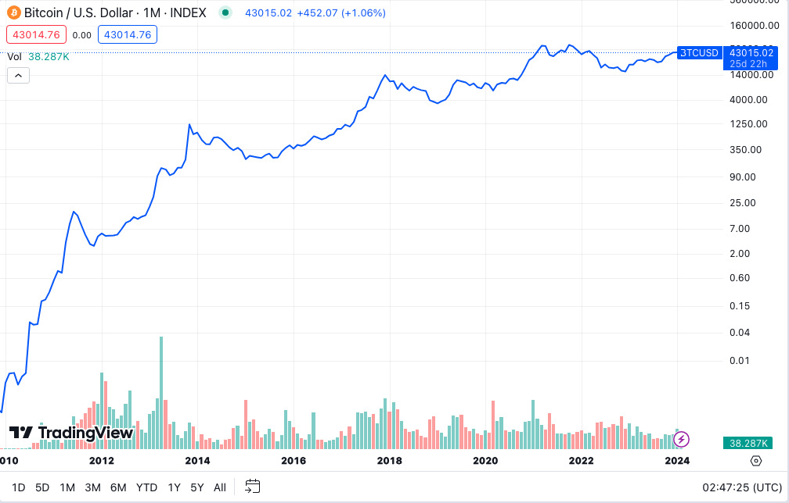

# 比特币从不救市

教链内参2.3《BSV被coinbase下架！》

* * *

先不说话，看6张图。

第一幅图，标普500近40年走势图，线性坐标系。

第二幅图，标普500近40年走势图，对数坐标系(Y轴)。

第三幅图，上证指数近30年走势图，线性坐标系。

第四幅图，上证指数近30年走势图，对数坐标系(Y轴)。

第五幅图，BTC（比特币）近15年走势图，线性坐标系。

第六幅图，BTC（比特币）近15年走势图，对数坐标系(Y轴)。

最后，上述图线是月收盘价连接而成，已经隐去了月内起伏的酸甜苦辣。以BTC为例，图线上2017年12月是13888刀。但是，实际上，当月最高价格曾经一度冲到19800刀。一根长长的上影线，背后不知多少爆仓和高位接盘站岗的可歌可泣的故事，都随雨打风吹去。

金融市场和人类个体的悲欢并不相通。投机标的是生活在对数时空的生物。人是生活在线性时空的生物。对前者而言，从1到10，或者从10到1，不过是相当于后者眼中的从1到2，或者从2到1而已。

掌握了控制增发的终极权力，就背负了稳定市场（救市）的道德责任。坐庄者圈钱，稳赚不赔。投机者赚钱，一旦亏损就呼吁救市。背负救市责任的主体迫于舆论，增发货币救市，本质上就是让包括没有参与金融市场游戏的全民为坐庄者的收割和投机者的利润买单。

美股是激进主义。SEC负责掌握控制证券融资大门的权力，美联储负责背负救市的责任。美股上市企业坐庄，美股投资机构盈利，美联储超发美元救市。看起来都在赚钱，那么谁在亏钱？其实所有圈到钱的上市企业和赚到钱的投资机构，一起收割所有不能参与美股，但是又不能摆脱美元的占全世界大多数的穷人。

比特币（BTC）是保守主义。中本聪放弃了控制BTC增发的权力，并且用PoW（工作量证明）机制确保没有人可以独揽这一大权。因此包括中本聪在内的任何人，也都不背负救市的道德责任和压力。每一次BTC的崩盘，都要在短短一年内跌去70%～90%的超大幅度，动辄爆掉几十上百亿美刀的杠杆，让数不清的炒币者倾家荡产，多少投资数字货币的公司破产倒闭，但是没有人会救他们——中本聪不会救，比特币更不会救。刮骨疗毒，把能爆的杠杆通通爆掉，让能亏的仓位通通亏光，去杠杆越彻底，市场越公平。

张三上了3倍杠杆。李四仅把自己劳动所得投入。市场涨1倍，李四仅赚1倍，而张三赚3倍。凭什么？有人说，因为张三承担了更大的风险，多赚的部分是风险的回报。那么，不能发生的风险算个屁的风险，就像不能打到敌人家里炸死敌军的导弹就是摆设。体现3倍风险的最佳方法，就是市场爆掉张三的仓位。除此之外，都是扯淡。

即使是现货仓位，如果投入了超过自己客观承受力或者心理承受力的资金，那也是一种软性杠杆。当市场跌幅超过客观承受力或者心理承受力，那么就会导致心态崩溃，割肉离场。那么，市场也一定要跌穿最大痛点，让最多人陷入绝望，浮亏变实亏。

从保守主义的视角看，呼吁救市就是耍流氓。中本聪知道，亏钱的韭菜都是巨婴，拼了命也要找个别人来为自己的亏损负责。他们的诉求早就脱离了“冤有头债有主”的正义，他们只关心自己的利润。所以，他们呼吁的救市，是收割更多无辜的人，为他们赌输的亏损埋单。

人之道，损不足以奉有余。人为的救市，本质就是收割更多更穷的穷人，去补贴生活水平远超社会平均水平的金融投资者群体；间接地，是劫贫济富，收割整个社会补贴金字塔顶尖的上市公司控制者群体。

中本聪不救市，比特币不救市。加密市场流传的熊市刮骨疗毒的几个阶段是这样的：

第一步，杀散户。第二步，杀鲸鱼（大户）。第三步，杀机构。第四步，杀矿工（增发者）。第五步，杀交易所。第六步，清杠杆。第七步，再杀一波进场抄底的。然后，确认底部。

如果介于美股和比特币二者之间，一方面要掌握控制市场增发扩容的权力，另一方面又不能承担响应舆论、积极救市的责任，那么可想而知，处境就肯定会比较尴尬。被广大越亏越多的韭菜天天指着鼻子骂，随着市场的下跌愈深，骂得越来越难听，简直一定是必然的。

马克思说过，批判的武器（口号和文件）不能代替武器的批判（拉盘的子弹）。在真金白银的亏损面前，就连头铁的奥派拥趸也要放弃自由市场不干预的理念，呼吁中心化权力机构下场拯救自己的仓位。事实上，几乎所有对自由主义的信奉，都是只想要自由的好处，却不想要自由的代价的伪自由主义。

在金融市场上，只要你不是最强的那个，自由的内涵几乎就等于被收割的自由。

