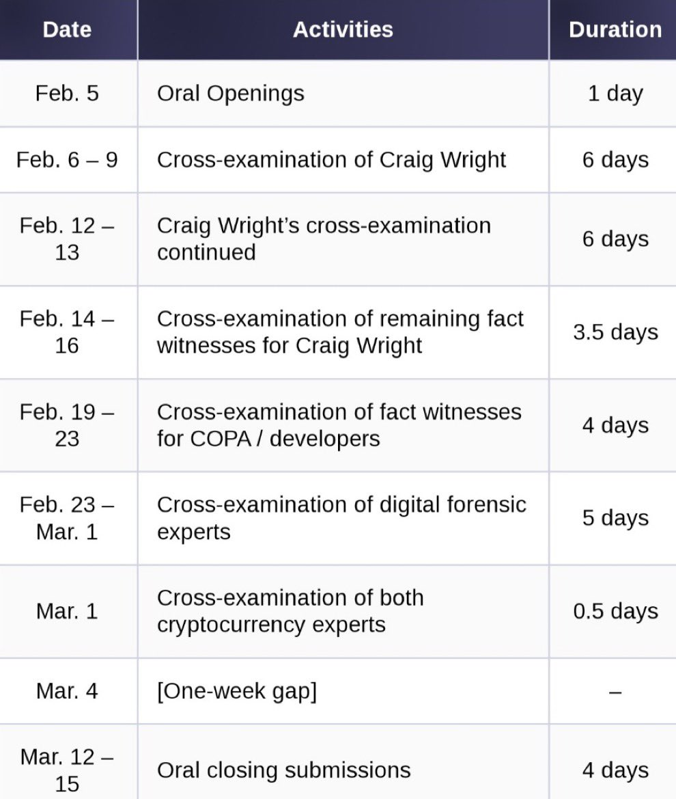

# 是时候结束澳本聪对比特币开发者的骚扰活动了

号外：教链内参2.4《》

* * *

文 | Paul Grewal, coinbase首席法务官. 原文标题：Time to End Craig Wright’s Harassment Campaign Against Bitcoin Devs. 2024.2.1

译者按：在“澳本聪”Craig Wright 自称中本聪并接连动用法律诉讼等手段威胁比特币核心开发人员迫使他们离开比特币的技术维护工作多年之后，业界终于忍无可忍，决定反击。遂组建成立COPA联盟（Crypto Open Patent Alliance，加密货币开放专利联盟），并于2024.2.5与澳本聪对簿公堂。

下面是诉讼进度安排：

月初，COPA联盟成员之一的coinbase交易所首席法务官Paul Grewal在coindesk发表了本篇宣传文章，意在向公众简要阐明为何要与澳本聪斗争到底。

注：澳本聪是中文社区赋予Craig Wright的外号，因其来自澳洲，自称中本聪，故得名澳本聪。澳本聪在2018年硬分叉了BTC的硬分叉BCH，冠名BSV，打着中本聪本尊的名号，吸引了无数人入局BSV，赚得盆满钵满。

副标题：澳本聪（Craig Wright）曾多次对质疑他是中本聪的人提起诉讼，在此过程中伤害了无数加密货币从业者。2 月 5 日，加密货币开放专利联盟（Crypto Open Patent Alliance）将向法院提起诉讼，旨在制止这种行为。

以下正文：

澳本聪自称是神秘的比特币创造者中本聪。他不是。

但是，澳本聪并没有被这一基本事实吓倒，他利用自己雄厚的资金支持，以这一谎言为基础，对加密货币开发者提起了无休止的毫无根据的诉讼，其中许多开发者甚至连最基本的辩护都无力承担。这与 2008 年中本聪白皮书的愿景完全相反。这是对整个加密经济人才和精神的消耗，必须立即停止。

三年前，加密货币行业的成员聚集在一起，成立了加密货币开放专利联盟（Crypto Open Patent Alliance，简称 COPA），这是一个公开分享加密货币创新的工具，也是保护彼此免受虚假知识产权侵权索赔的工具，这种侵权索赔困扰着许多科技行业。COPA 很快就意识到，澳本聪的诉讼活动是对加密货币发展的征税，而他所针对的参与者根本无力独自反击。因此，2021 年 4 月 9 日，COPA 提起了自己的诉讼，要求法院一劳永逸地宣布澳本聪不是中本聪。

下周，从 2 月 5 日开始，此案终于要开庭审理了。但这次审判的意义远不止揭穿澳本聪的妄想。COPA 致力于对抗像澳本聪这样的恶霸，澳本聪的意图是“亲自追捕每一个开发者，直到他们破产、穷困潦倒、孤身一人”。是时候结束他直指我们行业心脏的活动了，并澄清澳本聪不是中本聪，因此不能用虚假的知识产权索赔来阻挠进步。

比特币白皮书和开放源代码的真正精神早就应该占上风了。

## 澳本聪报复性活动造成人员耗费

多年来，澳本聪一直以诉讼为武器，打击任何质疑他的中本聪主张的人。通过大量的诉讼和焦灼的诉讼策略，他试图从经济上消耗以及在精神上折磨他的对手。这其中包括整个比特币开发者社区，他们中的许多人都为比特币生态系统的发展做出了贡献，却从未期望得到任何经济回报。

澳本聪的骚扰行为不仅限于法庭案件。他还向开发者发出险恶的信息，威胁要利用法律系统毁掉他们的生活及其家人的安全和生计。辛勤工作的个人也被迫放弃了重要的比特币开发工作，因为他们有理由担心自己无力抗争的诉讼，或者担心自己和亲人在澳本聪的胁迫下受到深深的伤害。

## 审判：澳本聪缺乏证据、伪造文件和欺诈

尽管澳本聪大张旗鼓地宣传自己的主张，但即使在诉讼中被追问，他也屡屡拿不出任何支持其主张的真实文件。他多次向法庭提供伪造文件。他没有履行承诺，比如用中本聪的密钥签名确认交易。他曾在其他案件中承诺，他将“召集 90 或 100 人”来证明他的说法，但却没有提供一个无利害关系的人。

「澳本聪声称自己是中本聪，这对比特币的存在构成潜在威胁」

如果澳本聪真的是中本聪，他很容易就能毫无疑问地证明这一点。但他做不到。

澳本聪的伪造文件库是 COPA 下周开始的诉讼的核心。事实上，澳本聪自己聘请的两位专家已经承认澳本聪的许多文件都是伪造的。

下周，在法庭上，COPA 将开始指控澳本聪的篡改行为，包括：

一、日期错误的 Word 文档：澳本聪作为证据提供的多个 Word 文档被篡改，看起来像是在比特币白皮书发表之前就存在的。

二、虚假手写文件：澳本聪作为证据的多份手写文件都是写在事先打印好的记事本上的，而这些记事本直到 2008 年真正的中本聪分享白皮书多年后才出现。

三、经过欺诈性修改的 PDF 版本白皮书：澳本聪为此次诉讼提供的多个 PDF 版本的比特币白皮书被故意修改成早期草稿的样子。但其中包含的元数据和字体直到 2017 年才出现。

四、伪造电子邮件证据：澳本聪提供的大量电子邮件伪造了日期，并篡改了发件人和收件人信息。此外，这些邮件中使用的域名直到邮件中显示的日期多年后才被澳本聪注册。

五、伪造硬盘：去年 10 月，当 COPA 案件的证据开始大量堆积，对他的虚假指控不利时，澳本聪说他刚刚“发现”了一个 2007 年的硬盘，里面有他在白皮书发表 15 年后才开始准备工作的证据。上周，澳本聪自己的专家宣布这个硬盘是伪造的，其中一些内容似乎是使用 ChatGPT 生成的。

澳本聪声称自己就是中本聪，这对比特币的存在构成了潜在威胁。如果澳本聪的主张获胜，比特币社区的根基部分就会陷入停滞。我们这些关心加密货币前景和全球金融系统更新紧迫性的人都不能容忍这种情况。必须永久性地阻止澳本聪提出此类主张，以欺诈性的知识产权诉讼威胁开发者和公司，并消耗掉本应用来构建现代金融体系所需创新产品的宝贵时间和资源。

COPA 致力于将这场诉讼进行到底。包括 Coinbase 在内的 COPA 成员明白，我们这些有资源的人必须毫不犹豫地开展这些根本性的斗争。在开庭前的最后几天里，我们非常感谢法庭对我们案件的认真关注，以及对双方提出的证据（在澳本聪那里是“证词”）的仔细审查。

我们很自豪能代表开发者和加密经济的每一位参与者，在今天和明天领导这场指控。在开发者摆脱威胁、耗费和恐惧之前，我们不会停下脚步，因为像澳本聪这样的欺诈者拥有无穷无尽的资金，会对他们和整个加密货币行业的发展造成影响。

