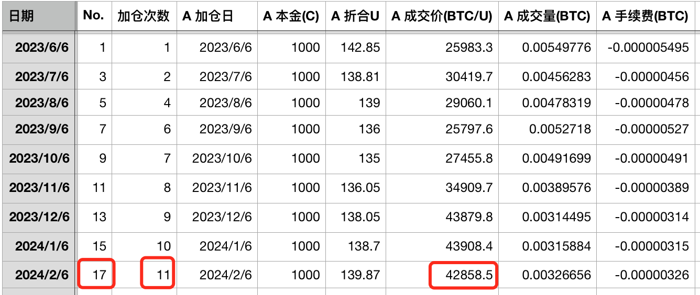
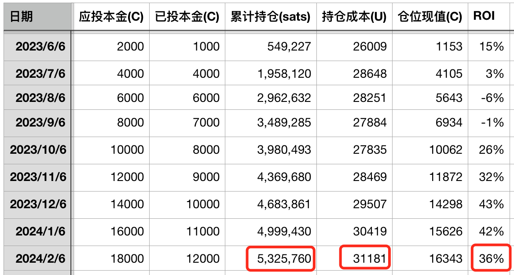
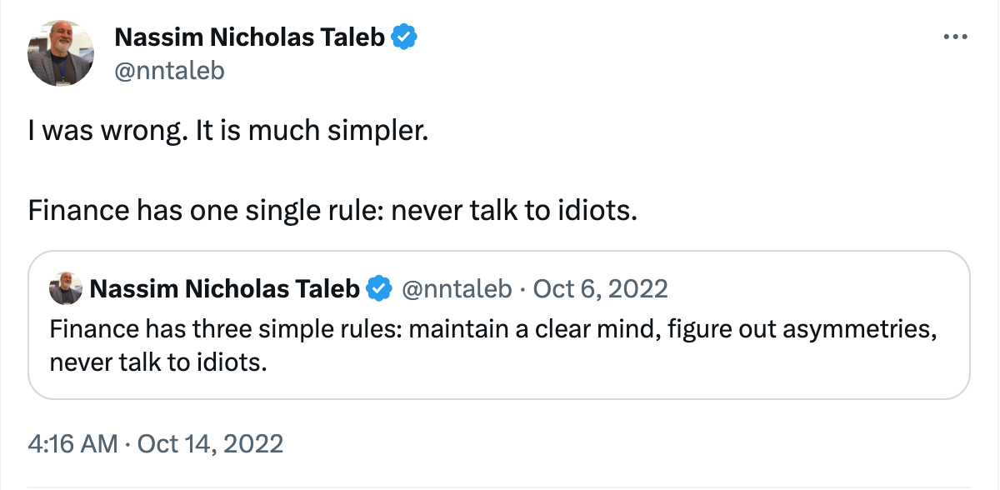
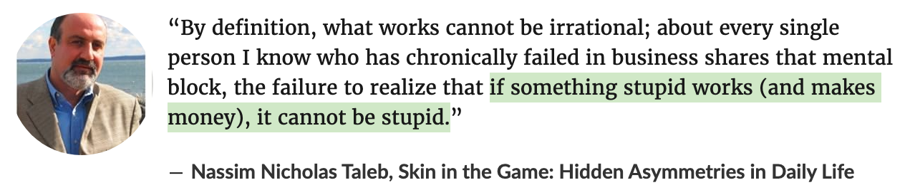

# 加仓！

号外：教链内参2.5《美联储当头浇了市场一盆冷水》

* * *

这是“十年之约”系列的第17篇文章——「十年之约＃17」。

此次加仓是2月首次加仓，计划执行以来的第11次加仓。成交价42858.5 u。投后持仓532万聪，持仓成本31181 u，收益率36%。

尝有人看了实盘记录后，装作一脸惊讶地问，搞半天就加了那么一点儿量啊！

类似于这般愚蠢的言论，总是令人哭笑不得的。狠狠地骂两句吧，根本不可能让榆木脑袋开窍。耐心地解释什么《要关注百分比，而非绝对值》（刘教链2021.1.18文章）吧，又没那个精力。佛不渡无缘之人，何况吾一介凡夫？也许默默地无视，才是对愚蠢的最大尊重吧？

早间看到《黑天鹅》作者塔勒布说：「金融只有一条准则：不要和白痴说话。」

那么，怎么才能检验愚蠢与否呢？塔勒布在他的书里有过另外一句话：「如果一件蠢事能赚到钱，那么这就不是愚蠢。」

所以，蠢人喜欢扯东扯西，聪明人只关注有没有赚到钱，收益率是不是正的。

当然，看似粗浅的道理，其深刻程度往往超出通常的想象。

在关注赚钱的聪明人里，又有一大批会被收割，为什么？第一因为他们自作聪明，无法区分一时赚到钱和一直赚到钱，有何不同。

第二因为他们以为赚到钱，其实只是赚到了上涨的幻觉。

第三因为他们以为赚到的是钱，其实只是镰刀发明出来收割他们的工具。

蠢人也就因此而分成了很多种类。不过无论是哪一种类的蠢人，无一例外都不会承认自己的愚蠢。

笔者不懂什么高深玄妙的学问，只用一条判定标准：一个人的愚蠢程度，与其手中比特币聪的数量增长成反比。

曾国藩识人作《冰鉴》，教链识人用《聪鉴》。

至于那些连真聪、假聪（比如BRC-20 sats）都傻傻分不清楚的人…… 呃，还是再看一眼上文塔勒布的忠告比较好。

假作真时真亦假，无为有处有还无。

“逃顶”清仓，是真正的聪明吗？把手里的BTC“投资”给牛逼项目，是明智的吗？并不是。很可能都是被虚幻梦想自我洗脑、自作聪明的愚蠢。

价格上升，翻了几倍、十几倍、几十倍，你的聪明程度会有所提高，或者说愚蠢程度有所下降吗？并不会。那只是沾沾自喜、贪天之功的自我感觉良好罢了。人一飘，很快就要遭遇迎头痛击。

反之，价格下降，甚至暴跌、腰斩、脚底斩，你有因此而变得更愚蠢吗？并没有。恰恰相反，当你捶胸顿足，懊恼不已，万念俱灰，自己坚信自己就是个白痴、蠢货的时候，恰恰是你最聪明的时候。因为价格的下跌，让你可以用同样的成本，获得更大的BTC数量增长，也就是更快地增加自己的聪明和智慧，更快地减少自己的愚昧和愚蠢。

人的自我认知紊乱，在金融市场上尤甚。

如果能够对自己实事求是一些，再找到一个对的标尺，不求大富大贵的话，在金融市场上小有所成，应该不是一件难事。
