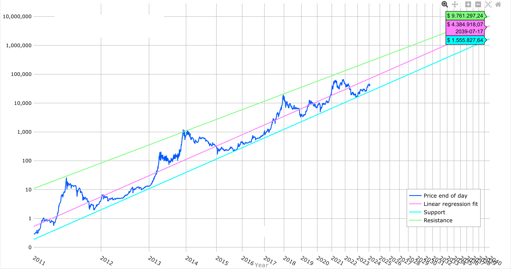

# 从100万到“小目标”

号外：教链内参2.6《微策略1月又加仓》

* * *

隔夜比特币又回升到43k。微策略1月份继续加仓850枚BTC。昨天一篇《加仓！》引起诸多共鸣。大A也触底反弹，不管如何否认下跌针对爆雪球们的杠杆，事实就是雪球们全军覆没之后，白茫茫大地真干净，市场才开始触底反弹。墨菲定律早就说过，能爆的杠杆一定要爆干净。打扫干净屋子再请客。杠杆不死，回调不止。

又看到有人组织大咖分享怎么牛市从100万赚到1个“小目标”的帖子。我翻遍全帖，都没找到和这个主题有关系的段落。那就瞎说两句吧，和原帖无关。

首先“小目标”这个“黑话”的意思，如果没有理解错的话，应该是语出前首富王健林几年前的那句流行语录：“先定一个小目标，比方说，我先挣它一个亿！” 所以，1个“小目标”就等于1个亿人民币。

在大V们的嘴里，赚它1个亿简直就是砍瓜切菜，不费吹灰之力。别说人民币，就是美元，似乎也从来都不在话下。教链在1.31文章就写过另一个例子，《比前首富王健林的胆子还要大7倍！》

大V们动辄就是几百万、几百万地出手，几个亿、几个亿地赚。比特币（BTC）总共9000亿刀的市值，也就6.3万亿人民币。只要有那么几万个大V，这不就把全世界的比特币都给赚到他们兜里去了么？有点儿好奇的是，大V们手里到底赚了几个BTC呢？

100万如果是人民币，换算成美刀大概就是14万刀。按照今天BTC 43k计算的话，大概约合3.25个BTC。

如果是持有这3.25个BTC不动，等其自然增值到1个小目标也就是约合1400万刀（假设汇率不变），那意味着BTC的价值需要增加到430万美刀一枚。

若BTC能够一直按照对数走廊模型发展的话，差不多到2039年左右，就有望达到这个目标。

距离2024年还有15年。

巧的是，2009-2023，是上一个15年。2024-2039，是下一个15年。

2009-2039，30年。现在，此刻，当下，不早也不晚。

上一个15年，BTC增长了1万倍+（4.3刀到4.3万刀）。下一个15年，BTC增长100倍（4.3万刀到430万刀），过分吗？似乎并不算太过分。

也就是说，如果你今年30岁（22-25岁参加工作数年攒下100万可投资本金），借助一个合适的工具，如果能够实现上述增长目标的话，将有望在45岁时实现个人资产达到1个“小目标”。

如果起步晚一些，35岁才起步，那么到50岁，有望实现小目标。

再晚一些，40岁起步，那就至少要等到55岁。

以此类推。

但是必须要明白，不可能所有人都能顺利从起点到达终点。99.9%的人会中途下车，这才是世界的真相。

人到中年，一次长期失业，一场重大疾病，一项突如其来意外，一次投机失利杠杆清算，其中任何一个，都能瞬间击穿你辛苦多年积累的仓位。

90%的人是不想在继续坚持下去。9%的人是虽想继续坚持但已无能为力。0.9%的人是既想坚持又在继续努力坚持，但是市场却不再给任何机会。

想开了，就不会再执著于到达彼岸、实现目标。

人生最美的，并不是终点，而是去往终点途中路边的风景。

认真、仔细地度过这如歌的岁月，远比虚度光阴、飞快地快进到结局，要更丰富、更饱满、更有意义。

你的梦想并不必须等拥有了一个小目标之后才能着手去实现。

今天，此刻，现在，就可以动手开始为梦想努力！

