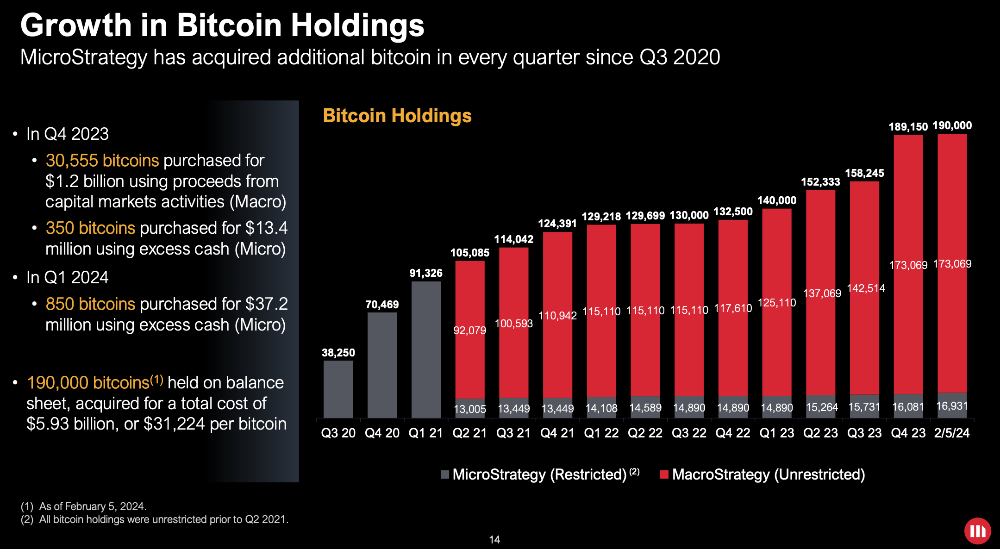
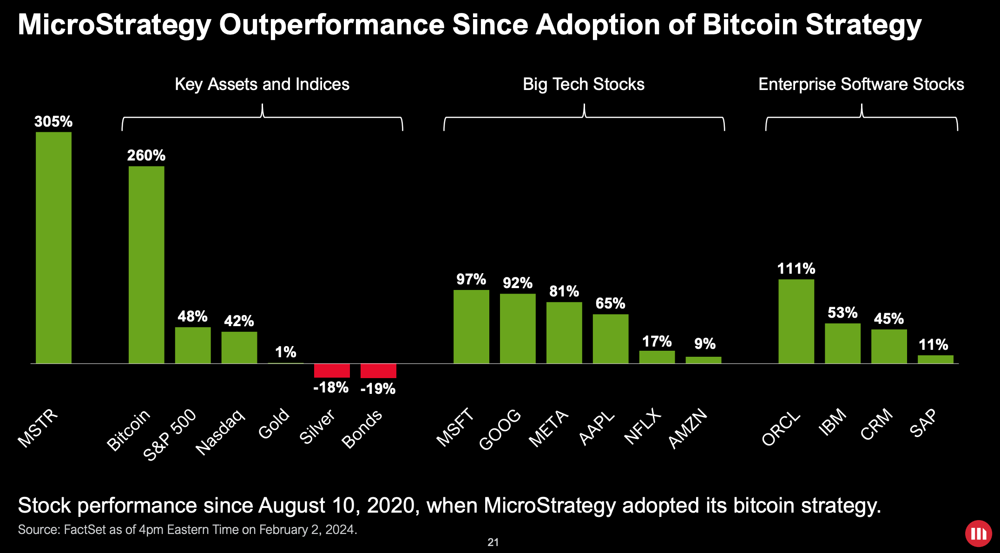
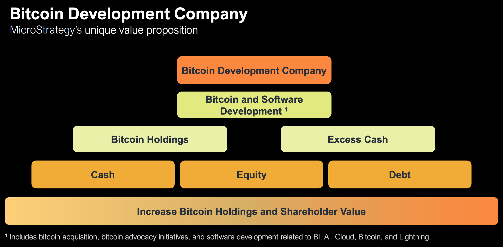
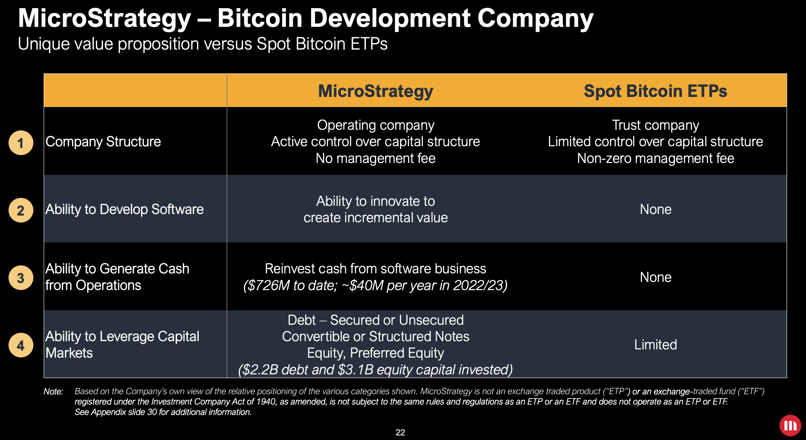
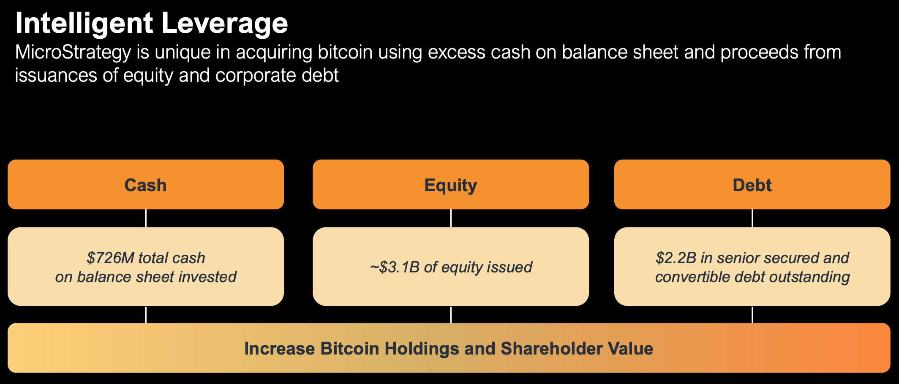
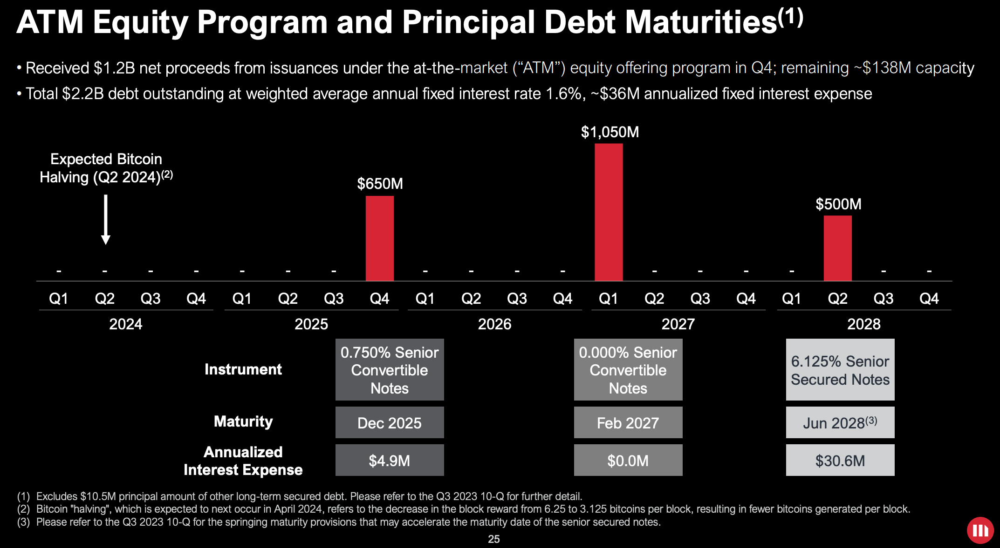

# 微策略爆买3万枚！

号外：教链内参2.7《美股续创新高》

* * *

日前，因囤积比特币（BTC）而知名的美股上市公司微策略（Microstrategy）放出了2023四季度财报。看了这篇财报，才发现在2024年初现货ETF通过之前，自2023年10月份启动的暴拉行情的动力源头，就有微策略的一份不小的贡献。

从微策略报告中给出的持仓增长图表可以看到，2023年三季度还在缓慢地按部就班加仓到持仓15.8万枚BTC的微策略，在四季度突然爆买3万多枚BTC，仓位猛地增长到了18.9万枚！

到了2024年一季度，微策略又小幅补仓850枚BTC，使得截至2月5号，持仓达到了19万枚BTC整数大关。

根据财报披露，19万枚BTC持仓，所用的建仓总资金量为59.3亿美刀，算下来折合平均持仓成本为每枚BTC 31224美刀。根据目前44.5k左右的价格来看，浮盈40%多。

2023年四季度爆买的30905枚BTC，总成本12.13亿美刀，平均加仓成本39262美刀。2024年一季度补仓850枚BTC，总成本3720万美刀，平均加仓成本43764美刀。目前二者都买得不亏。

要知道，整个四季度矿工一共才能生产多少枚BTC呢？按每个区块6.25个BTC的固定产量来计算，一小时6个区块，一天24小时，一个季度90天，那么季度产量就是6.25 x 6 x 24 x 90 = 8.1万枚BTC。

也就是说，仅微策略一家，就收走了季度产量的三成多！

难怪比特币从10月份开盘的27k，一个季度猛地拉升到12月收盘的42.5k，季度增幅57%！

自从囤了比特币，微策略的股价也是溜得飞起。下面这张图，便是微策略老板引以为傲的一张美股增长对比图了。

图中显示，自2020年8月微策略开始囤饼伊始，截至2024年2月初，其美股增幅高达305%，远超美股的几大头部公司的股价表现。

就这，它还不忘捎上“同一赛道”的竞争对手们。但其实，已经很难说微策略还是一家“企业软件开发公司”了。

连微策略自己，也开始标榜自己已经成为“世界上第一家比特币发展公司”。

在报告中，它这样写道：「“微策略公司是全球首家比特币发展公司”

「微策略公司（纳斯达克股票代码：MSTR）认为自己是世界上第一家比特币发展公司。

「我们是一家公开上市运营的公司，致力于通过我们在金融市场、宣传和技术创新方面的活动，持续发展比特币网络。作为一家运营中的企业，我们能够利用现金流以及股权和债务融资的收益来积累比特币，作为我们的主要财务储备资产。

「我们还开发并提供业界领先的人工智能驱动的企业分析软件，以促进我们“智能无处不在”的愿景，并利用我们的软件开发能力来开发比特币应用。

「我们相信，我们的运营结构、比特币战略和对技术创新的关注相结合，为创造价值提供了一个独特的机会。」

有人说，微策略就是一个自带场外现金流和灵活运用杠杆的囤饼代理人。微策略自己也是这么宣传的。

不过，仔细看财报就会发现，这个场外现金流还是略显尴尬的。2022年和2023年连续两年，Non-GAAP运营收入都是负数！其中2022年亏损12亿美刀，2023年亏损4500万美刀。2024年他们预计有希望扭亏为盈。

所以，至少从目前来看，它的场外负现金流反而损害了囤积的BTC资产的账面价值。这使得在目前的会计准则下，微策略持仓的账面价值并不是市场价值81亿美刀，而是成本59亿美刀，减去折损23亿美刀，结果只有37亿美刀。

这大大限制了微策略加杠杆的能力。但依旧不妨碍微策略爆买的主要策略，其实就是上杠杆，俗称借钱！

在微策略的财报里，它说自己用的是“巧妙的杠杆”。

微策略现在资产负债表上有7.26亿美刀现金，以及约31亿美刀资产（注意上文谈到的会计准则问题）。负债则有22亿美刀。也就是说，净资产大概只有7.26 + 31 - 22 = 16.26亿美刀。

常看教链内参的星球会员都知道，微策略公司和老板Michael Salyor，其实都在趁着微策略股票跑赢之际，抓紧减持套现，该囤饼囤饼，该储备弹药储备弹药。（参考阅读教链内参11.30《微策略售股囤饼》，教链内参1.3《该如何计划减持》）

他们虽然嘴上说微策略股票千般好万般好，比现货ETF还要好，云云。但是他们更知道，有花堪折直须折，莫待无花空折枝。靠负债支撑起来的仓位，毕竟不如现货BTC来的安稳、踏实。无债一身轻嘛。

微策略的债务，主要有三笔。客观地讲，已经比绝大多数个人韭菜能拿到的杠杆要美丽太多了。最大的一笔10.5亿美刀，免利息！到期日，2027年2月。

另外两笔，一笔6.5亿美刀，利息千分之7.5（超级低），到期日早一些，是2025年12月；另一笔5亿美刀，利息百分之6.125（比较高），但到期日很晚，要到2028年6月。

从这个债务到期日的时间设置上就能一眼看到微策略的小算盘：它一定是盘算着，2025年底很可能是下一轮牛市的顶点，到时候高位抛售，还掉这笔债务，剩下的都是自己的，美滋滋。

至于最大的一笔债务，则跳过2026年的预期熊市，待到熊市结束开始反弹之际，2027年一季度，再开始还债。我不知道微策略究竟是准备在2025年底牛市高点一气呵成把这两笔债务的偿债成本都给卖出来，还是等到2026年底、2027年初熊市低点再卖饼还债。但是依照常理推测，它很有可能会想最大化自己的利润，所以大概率会选择最充分地利用好2025年底的牛市。

微策略目前囤积的近20万枚BTC，如果在2025年牛市高点倾泻而出的话，会不会有可能成为下一轮牛市结束转熊的重要诱因呢？

